# Looking around
After login, it is just a simple Windows machine. Nothing susupicious on the desktop.

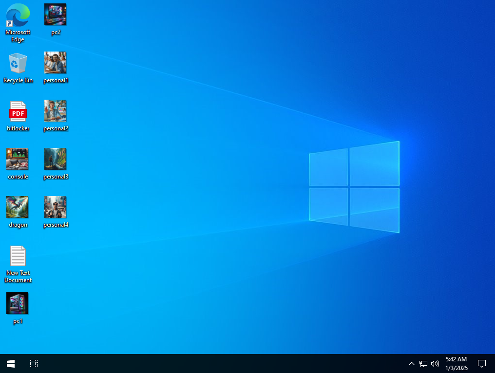

# Files and Logs

There is nothing in the logs, they were emptied out.

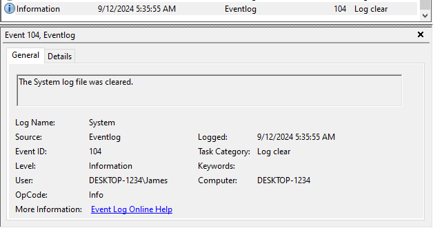

Looking for newer files, there is nothing interesting.

There is nothing suspicious in the recent files either.

# Persistency

Looking at regular places and using [autoruns](https://learn.microsoft.com/hu-hu/sysinternals/downloads/autoruns) doesn't have any results.

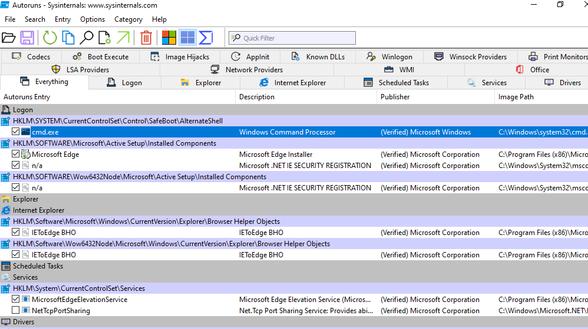

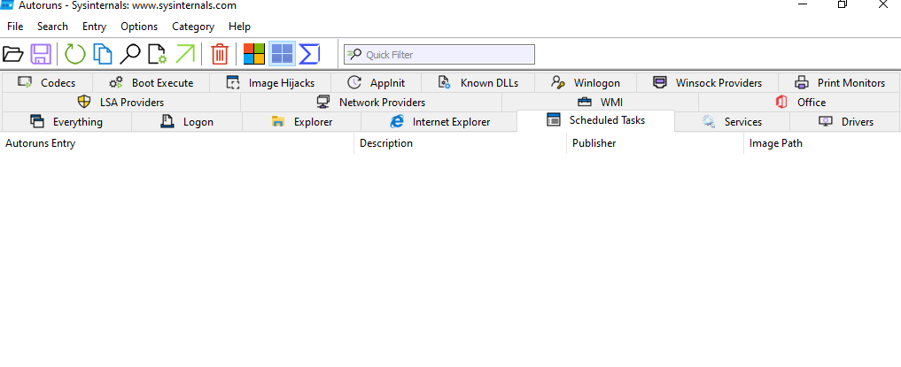

Or is there?

Autoruns doesn't check the `MicrosoftEdgeUpdateTaskMachineCore/UA` properly, maybe it is on whitelist. The `UA` entry should have `C:\Program Files (x86)\Microsoft\EdgeUpdate\MicrosoftEdgeUpdate.exe /ua /installsource scheduler` and not `EdgeCoreUpdate.exe`.

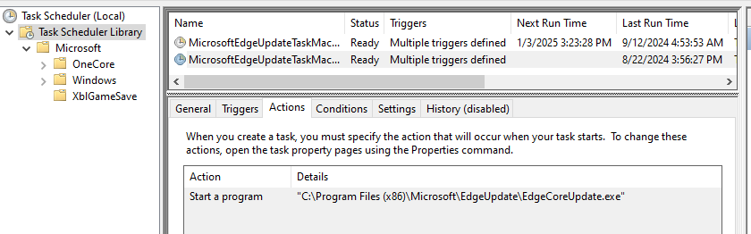

The `EdgeCoreUpdate.exe` is actually a ransomware. See [RansomWareSymm.zip](workdir/RansomWareSymm.zip) (pw: infected) for sample (release one).

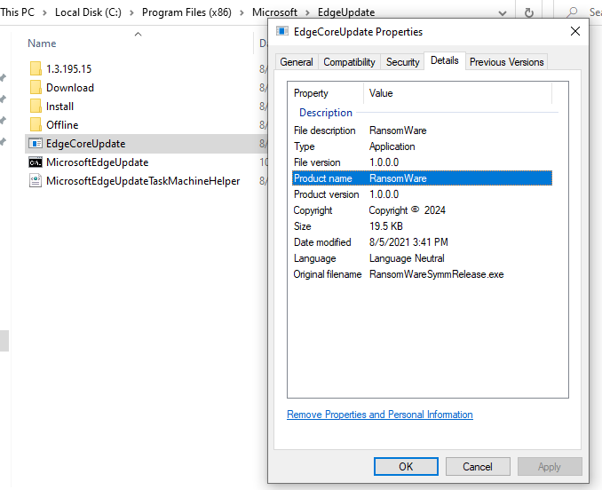

# Ohh nooooo

We ran out of time and our precious files were encrypted and messages popping up on the screen.

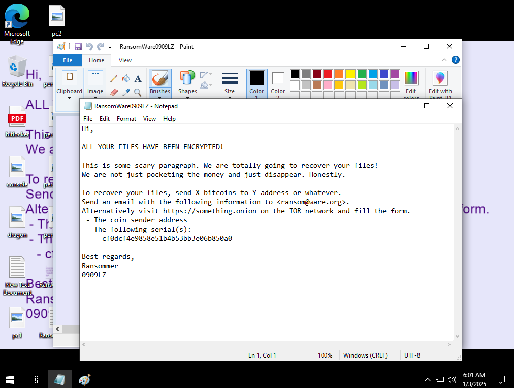

# Packet capture

It is always a good idea to run packet capture in the background for malware suspected machines, it migh have payloads or keys traveling the wire that might help.

Although there was nothing suspicious before the malware got executed.

See [capture.zip](workdir/capture.zip) for the captured packets.

# Snapshots

Another good tip for forensic analysis is snapshots. It is very easy to use a VM to go back and forth between different states. Just be careful, as it might confuse certain endpoint detection and response systems, so you might want to disable those first.

# Reverse malware

The binary is a 32bit `.NET` binary. A mix of static and dynamic analysis can be used.

I recommend using the [dnSpyEx](https://github.com/dnSpyEx/dnSpy/), that is a still mainteined fork of `dnSpy`. There are similar tools as well, but `dnSpy` can run and modify/recompile parts of the code on the fly if you want to make some changes. Use the 32bit variant for this malware.

The classes and functions are perfectly readable.

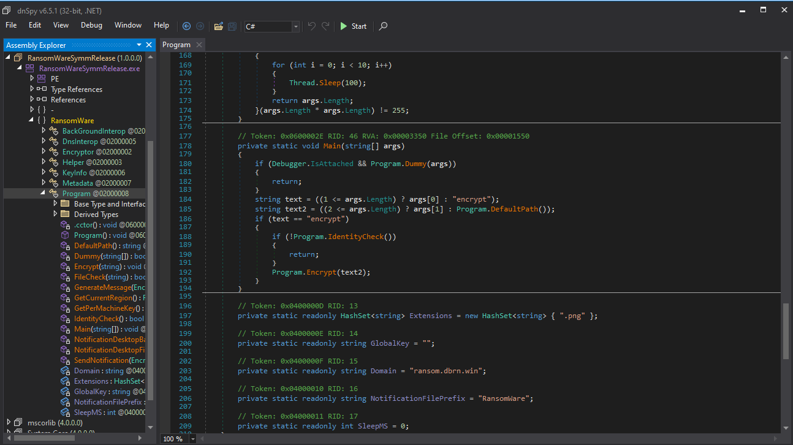

## Protections

There are some anti debug protections (checking for debugger) and an `IdentityCheck` function, basically checking the region and username/computername. *Also acts as a safeguard not to accidently encrypt your own files.*

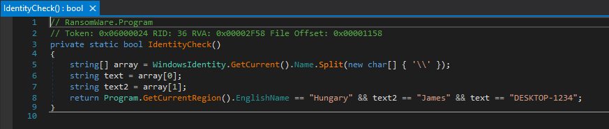

This is where it is very helpful if we can modify the code, Just right click the method and edit. Just return `true`.

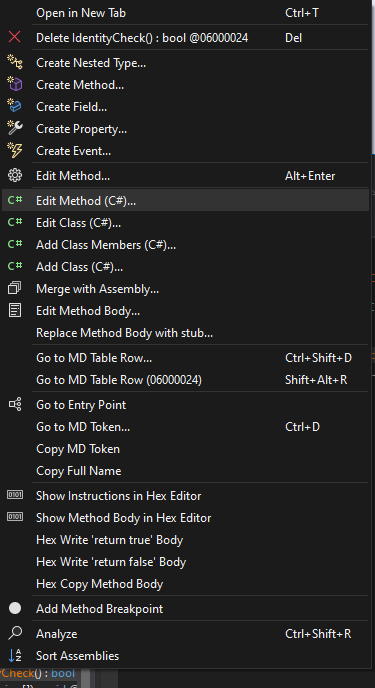

Just don't forget to save after, file and save all.

This way, we can pass the check and continue the dynamic analysis.

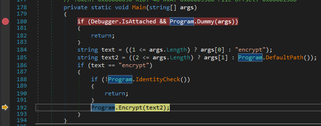

## Encryption

The `Encrypt` function takes a directory as parameter, from the `DefaultPath` function, which is just the user's home folder. 

Grabbing a key with `GetPerMachineKey` from a TXT dns query: `<computername>.ransom.dbrn.win`, splitting at the `=` and using the second part as base64. There is also a hardcoded `GlobalKey`, but it's empty.

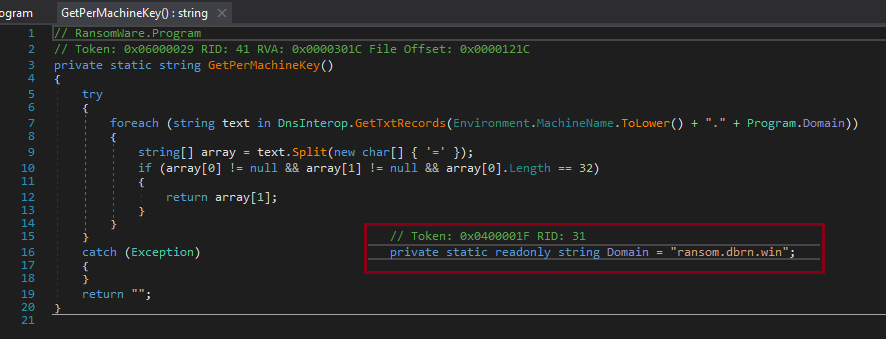

Then calling `Encryptor.Encrypt` recursively for each file. 

This function generates a random key per file. Then encrypting the file (full blocks only) in place with AES with this random key. 

The [encrypted](#key-encryption) random key is saved into some metadata that is appended to the end of the file.

## Key Encryption
The random key is encrypted with the available `GetPerMachineKey` and `GlobalKey` with `Encryptor.EncryptKey256`. The latter was empty and skipped.

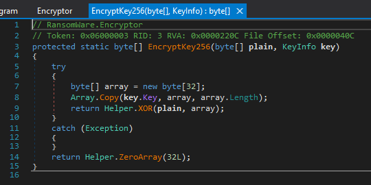

No wonder, as this is just a simple `XOR` with the key. Using a hardcoded key would be pointless.

# Key recovery

This is where the captured packets are really helpful, especially if the key server is not available anymore, or not returning the same key every time.

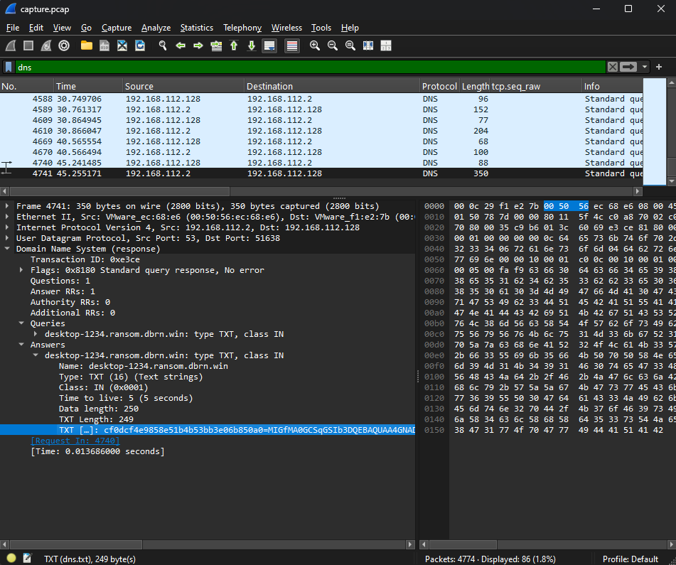

```
cf0dcf4e9858e51b4b53bb3e06b850a0=MIGfMA0GCSqGSIb3DQEBAQUAA4GNADCBiQKBgQCSRYvL8mVcXTOWbosIbZuVyVvKlu1M3kgR1+pZzchnAR2OLaK3WP+f3Uik5fKPpPXNeTm9M1K491F0teG3HJVHCJd+/F+JGlcjB9hly+WZZgKGswECkkw69UP0GdaC3JIbksEmtn2pD/K7oF9sIQjX4clXhXd53sTJeP8G1wOpGwIDAQAB
```

* While this is longer than expected and looks like something else, this is the key used.*

Alternatively, in this case, the TXT record can still be queried. 

```bash
dig TXT desktop-1234.ransom.dbrn.win
```

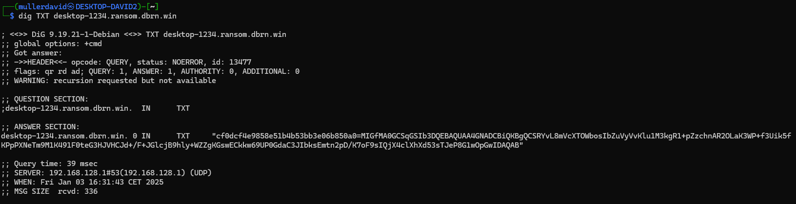

The part before the `=` is the hash/serial of the key used in the metadata to identify the correct key.

# Writing the decryptor

Just revert the encryption routine. Extract the per file key from the metadata, XOR decrypt it with the recovered per machine key and then AES decrypt the file itself.

See the [ransomware source code](../src/src.zip) (pw: infected) for the decryption implementation, or run the debug variant.

```powershell
.\RansomWareSymmDebug.exe decrypt path serial key
.\RansomWareSymmDebug.exe decrypt .\ cf0dcf4e9858e51b4b53bb3e06b850a0 "MIGfMA0GCSqGSIb3DQEBAQUAA4GNADCBiQKBgQCSRYvL8mVcXTOWbosIbZuVyVvKlu1M3kgR1+pZzchnAR2OLaK3WP+f3Uik5fKPpPXNeTm9M1K491F0teG3HJVHCJd+/F+JGlcjB9hly+WZZgKGswECkkw69UP0GdaC3JIbksEmtn2pD/K7oF9sIQjX4clXhXd53sTJeP8G1wOpGwIDAQAB"
```

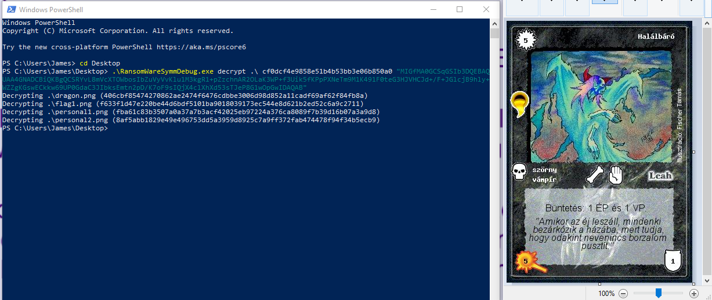

# Flag
The card image itself is the flag.


