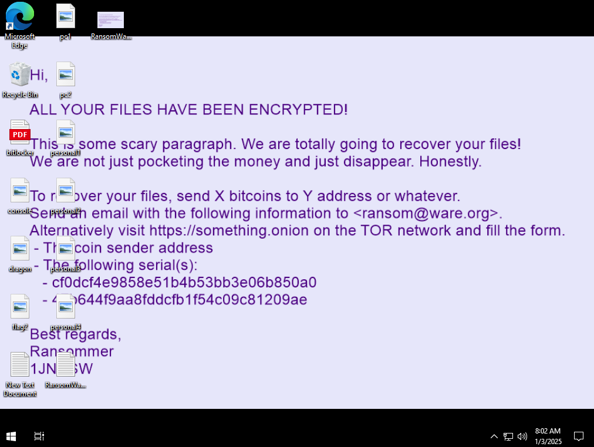
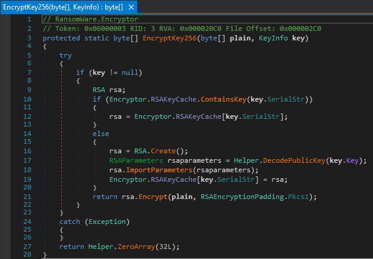
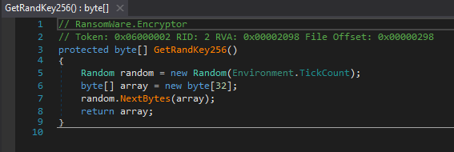
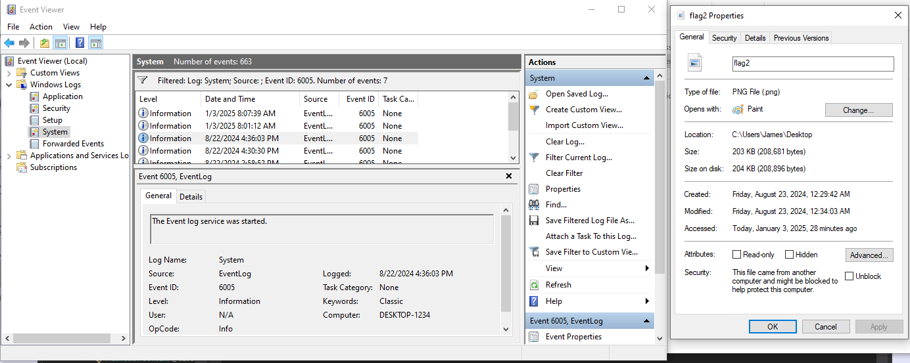
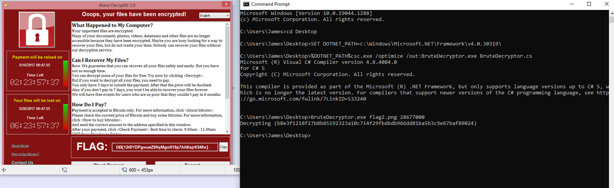

# Ohh nooooo, not again

The machine is already encrypted.



# Infection

The user searched for some photo viewer and downloaded (and executed) the file.


The `TotallyNotRansomWare.exe` is the ransomware. See [RansomWareAsymm.zip](workdir/RansomWareAsymm.zip) (pw: infected) for sample (release one).

# Reverse malware

The malware is almost identical to the first part, see [Exercise 1](../Exercise1/WRITEUP.md#reverse-malware) for more details.

## Key Encryption
The random key is encrypted with the available `GetPerMachineKey` and `GlobalKey` with `Encryptor.EncryptKey256`.

The difference is here. The ransomware is using asymmetric encryption now, encrypting with the public RSA key(s). The attacker can decrypt files with any of the global hardcoded key (works even without internet) or the generated per machine dns query based key.



# Key recovery

Luckily we have both memory dump and pcaps.

```bash
vol.py -f Exercise2-3ffa4eee.dmp --profile Win10x64_19041 pslist
```

Or not. Those are both rabbit holes. The pcap only has the public key, and the memory dump has no per file keys unfortunately.

# Weak random generator

The random is using a predictable seed, the [Environment.TickCount](https://learn.microsoft.com/en-us/dotnet/api/system.environment.tickcount?view=net-9.0): `Gets the number of milliseconds elapsed since the system started`. The 32 bit number wraps around 49 days.




As this is usually not that big number (unless the pc was not turned off for many days), it can be bruteforced from start for crucial files. This is still a slow process.

# Seed approximation

It can be further narrowed with the help of certain timestamps. In this case, the logs have the computer start time (Event log service was started, event id `6005`) and the file modification date for the flag.

```
2024.08.22 16:36:03, System Log, Event ID 6005
2024.08.23 00:34:00, flag2.png Modification Date
```


Calculating the difference.

```python
import datetime
d1 = datetime.datetime(2024, 8, 22, 16, 36, 3)
d2 = datetime.datetime(2024, 8, 23, 0, 34, 0)
(d2 - d1).total_seconds() * 1000
```
The delta is 28677000 ms, but this is not exactly the gettick, but should be close enough.

A more precise approximation could narrow the search space even more.

# PNG

The png files (including the flag) has a well known magic bytes and header signature.

The per file encryption/decryption key can be validated by decrypting only the first block of the encrypted file and validating the header.

# Writing the decryptor

The decryption routine is the same as before, but we only use the per machine key and AES decrypt the file itself, ignoring the metadata. 

With a wild guess of +-200k deviation for the delta and the actual tickcount, we can brute force the key. Decrypting with the generated key from seed, decrypting only the first block and validating it as png. On match, decrypting the full file.

The implementation is in [BruteDecryptor.cs](workdir/BruteDecryptor.cs). It finds the key in ~30s.

```batch
SET DOTNET_PATH=c:\Windows\Microsoft.NET\Framework\v4.0.30319\
%DOTNET_PATH%csc.exe /optimize /out:BruteDecryptor.exe BruteDecryptor.cs
BruteDecryptor.exe flag2.png 28677000
```



# Flag
`DB{12t9YDPgwueZ9NyMgw519p7AA8isjr6SMw}`
