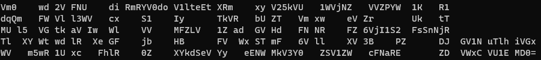
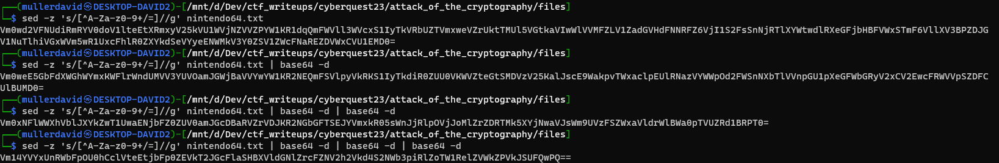
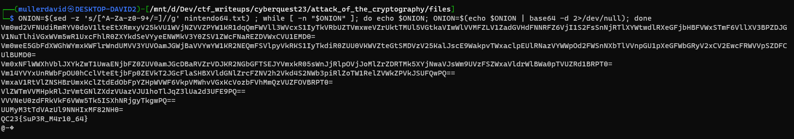

# Peeking the file

The file has some letters shaped `NINTENDO64_`.



# Base64

From the character set, and the `=` character at the end, it looks like a base64 string.

Removing the extra characters results the following string.

```bash
sed -z 's/[^A-Za-z0-9+/=]//g' nintendo64.txt
```
```
Vm0wd2VFNUdiRmRYV0doV1lteEtXRmxyV25kVU1WVjNZVVZPYW1KR1dqQmFWVll3WVcxS1IyTkVRbUZTVmxweVZrUktTMUl5VGtkaVIwWlVVMFZLV1ZadGVHdFNNRFZ6VjI1S2FsSnNjRTlXYWtwdlRXeGFjbHBFVWxSTmF6VllXV3BPZDJGV1NuTlhiVGxWVm5wR1UxcFhlR0ZXYkdSeVYyeENWMkV3Y0ZSV1ZWcFNaREZDVWxCVU1EMD0=
```

# Base64 of Base64 of Base64 of ...

Decoding it gives an another B64 string, and an another...



# Peeling down all layers

Can be done manually or scripted.

```bash
ONION=$(sed -z 's/[^A-Za-z0-9+/=]//g' nintendo64.txt) ; while [ -n "$ONION" ]; do echo $ONION; ONION=$(echo $ONION | base64 -d 2>/dev/null); done
```



# Flag
QC23{SuP3R_M4r10_64}

