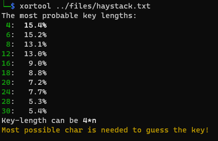

# Encryption

The file has 100 lines with 10 characters in each line, except the first, where it has only 9.

```
iSyORtZHw
nQgDuFbEaR
yWmHp[lZsB
KeG`UaD{Yr
fTvQjLiMoN
RlIuWnPqZt
OhYs[{VzUa
bErDySmNfO
@tQgUwA{Hp
lIoJfZmTvW
...
fNiMtA`WyO
h[rKuMyDsW
```

# Flag format

Notice that the flag format is `QC23` and not `CQ23`!

# Encryption

Stream ciphers work by XORing the plaintext with a long enough or generated keystream.

The ciphertext has only printable characters, which might indicate it is not XOR based one. Frequency analysis and mapping the letters resulted nothing readable though.

# xortool

The `xortool` can be used to check and fiddle with XOR based encryption.

Starting without parameter can guess the key lenth for cyclical keys.



Running the most likely lengths through the tool with those lengths and a known plaintext (flag format).

```bash
xortool -l 4 -b -p "QC23" ../files/haystack.txt > /dev/null && grep -r QC23 xortool_out
xortool -l 6 -b -p "QC23" ../files/haystack.txt > /dev/null && grep -r QC23 xortool_out
xortool -l 8 -b -p "QC23" ../files/haystack.txt > /dev/null && grep -r QC23 xortool_out
xortool -l 12 -b -p "QC23" ../files/haystack.txt > /dev/null && grep -r QC23 xortool_out
```

This results no hits. As a last resort, a 1 length key can be attempted.

```bash
xortool -l 1 -b -p "QC23" ../files/haystack.txt > /dev/null && grep -r QC23 xortool_out
```

Which finnaly finds the flag. The key is unexpectedly short and the message is filled with junk.


# Flag
QC23{K3y!}

