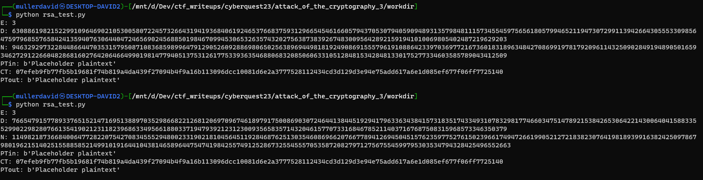
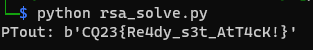

# RSA implementation

The `rsa.py` is a basic [RSA](https://en.wikipedia.org/wiki/RSA_(cryptosystem)) implementation without padding and with small exponent (3).

# Testing the implementation

The implementation is missing the decrypt function, which can be added similarly to the encrypt function. 

```python
def decrypt(self, cyphertext: bytes) -> bytes:
    ct = int(cyphertext.hex(), 16)
    pt = pow(ct, self.d, self.n)
    return long_to_bytes(pt)
```

It also has an error generating the keys, sometimes raising an exception: `ValueError: base is not invertible for the given modulus`. Therefore the generation was added to a loop with exception handling.

The modified [rsa_test.py](workdir/rsa_test.py) shows that even with 2 disctinct random key pairs, we receive the same ciphertext. This indicate a serious flaw already in the process.



# Using random keys

This means we can just use those randomly generated keys to decrypt the message. See [rsa_solve.py](workdir/rsa_solve.py).

```python
ct = long_to_bytes(0x04a79e9c67598005715b233e00e7d9bc3e2d4ebe10864667726214e43eb892b3dbf736628f328ffe8fbff756861254a039b45c68a7c66d3728649834cfd3eebb90c3d84865)
crypto = RSA() # in a loop
pt = crypto.decrypt(ct)
print("PTout:", pt)
```



TODO: math here?

# Small exponent

If [e is sufficiently small](https://ir0nstone.gitbook.io/crypto/rsa/public-exponent-attacks/small-e), the exponent is ineffective at encrypting the message. Cube root will give us the solution.

```python
from gmpy2 import iroot # pip install gmpy2
from Crypto.Util.number import long_to_bytes, bytes_to_long
ct = long_to_bytes(0x04a79e9c67598005715b233e00e7d9bc3e2d4ebe10864667726214e43eb892b3dbf736628f328ffe8fbff756861254a039b45c68a7c66d3728649834cfd3eebb90c3d84865)
e = 3

c = bytes_to_long(ct)
m = iroot(c, 3)
pt=long_to_bytes(m[0])
print("PTout:", pt)
```

# Flag

CQ23{Re4dy_s3t_AtT4cK!}