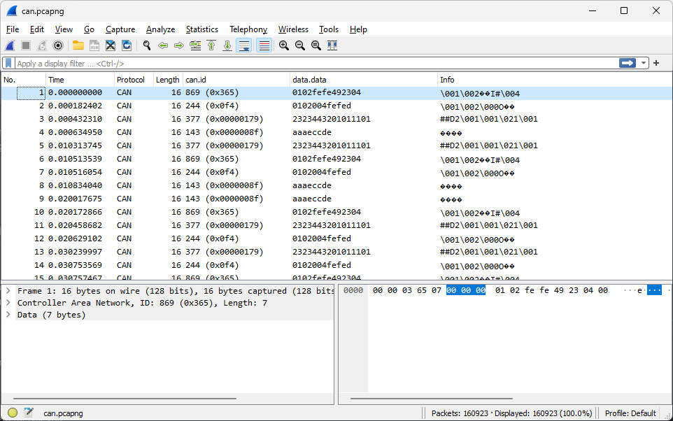
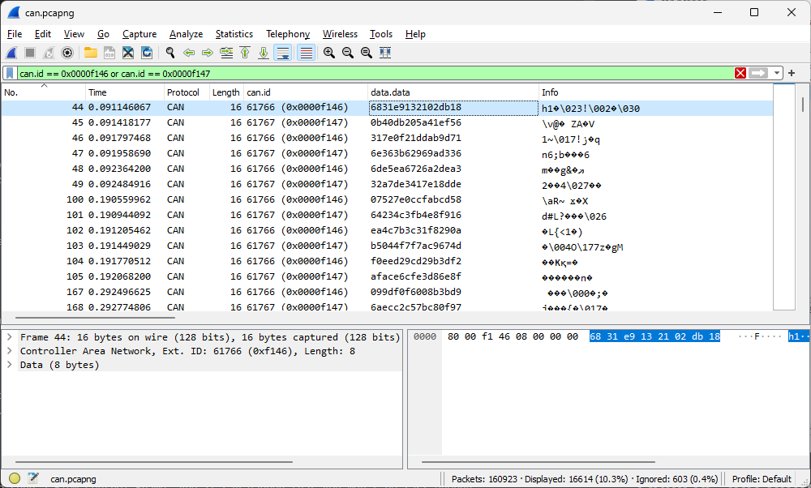
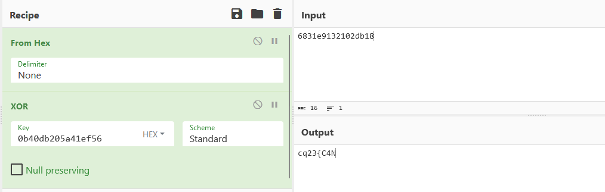
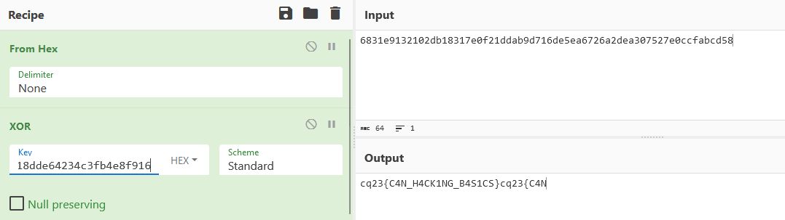

# Capturing packets

Wireshark was used to capture some packets [pcap.zip](workdir/pcap.zip).

# Packets


# Adding CAN related columns

A few settings can be tweaked to view CAN packets better.

Adding data as text can be done at the following location: Edit -> Preferences -> Protocols -> Data -> "Show data as text". This will replace Info column and `data.text` can be used as well.

The `can.id` and the hex data `data.data` is also helpful.



# Devices and hints

Sorting by can.id (and by No. as second) reveals various encoded and plaintext periodic streams, hiding hints.


## 0x00000b64
```
V2UgaGF2ZSBzb21lIHVudXNlZCBtZW1vcnkgc3BhY2Ugc3RhcnRpbmcgYXQgYWRkcmVzcyAweEZGODEwMC4gTWlnaHQgYmUgc3VpdGFibGUgZm9yIHN0b3JpbmcgYSBmbGFnLCBobT8=  
```
Decoding it with base64:
```
We have some unused memory space starting at address 0xFF8100. Might be suitable for storing a flag, hm?
```

## 0x00001337
```
Are you familiar with UDS? Try dropping a message with ID 0x479 to find it out.
```

## 0x0000beef
```
Usually, an ECU supports 10+ diagnostic services per session. Since we are lazy, we've only implemented the ones that you have to use.
```

## 0x0000feed
```
It can happen that you need to send a Flow Control Frame. And it can happen that you won't be fast enough by hand.
```

## 0x00424242
```
The answer to every question is 42. With a twist.
```

# Using the hint
Using the filter: `can.id == 0x0000f146 or can.id == 0x0000f147` reveals some alternating data stream.



Xoring a single pair reveals a flag-like string.



Continuing more reveals the flag.



# Flag
`cq23{C4N_H4CK1NG_B4S1CS}`

# candump 
The tool `candump` can be used to dump the packets in text format which might be easier to process. Might need to enable `can_raw` driver. This variant is in [log.zip](workdir/log.zip).

```bash
modprobe can_raw
candump -l can0
```

This is producing output with format `(timestamp) iface hex_id#hex_data`.

```
(0.000000) can0 365#0102fefe492304
(0.000182) can0 0f4#0102004fefed
(0.000432) can0 00000179#2323443201011101
(0.000634) can0 0000008f#aaaeccde
(0.010313) can0 00000179#2323443201011101
```

To replay the packets from log, a dummy interface can be used.

```bash
modprobe vcan
ip link add can0 type vcan
ip link set can0 up
canplayer -I can.log
```

# Credits

Credits to Alex for the tip.