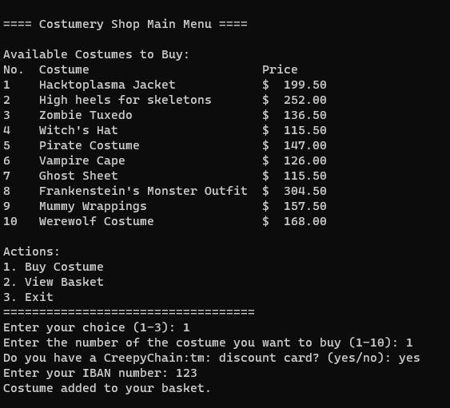
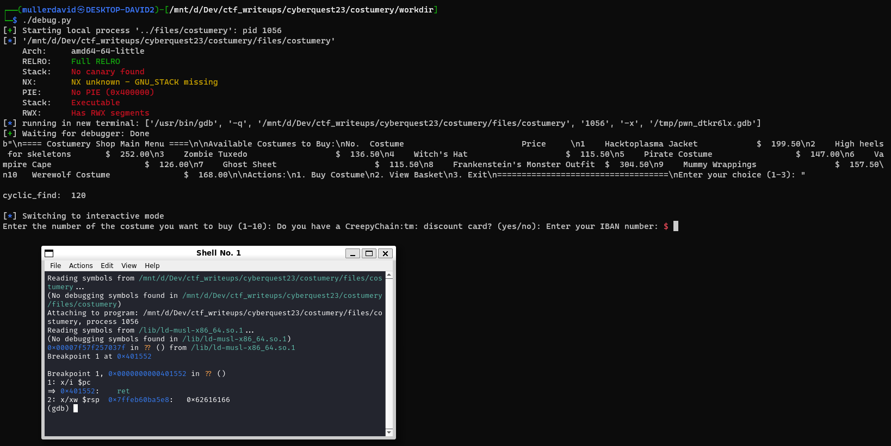

# Getting the challenge

The file is an executable.

Upon running the binary, it has a small shop interface.



# Checking the logic

Ghidra can recover the code ([costumery.c](workdir/costumery.c)) relatively well. 

FUN_00401553 looks like the main function with all the menus. Upon buying something, it asks for discount card with FUN_00401497 and reads your IBAN account with FUN_0040150a.

# The problem

The IBAN reader function can read bigger memory (0x100) than the buffer (0x70), overflowing on the stack. 

```c
void FUN_0040150a(void)
{
  undefined local_78 [112];
  
  printf("Enter your IBAN number: ");
  fflush((FILE *)0x0);
  read(0,local_78,0x100);
  return;
}
```

# Exploit

Pwntools can be used to view protections. There is no stack canary or PIE, or practically anything. Can also be used to generate some cyclic strings to determine the RIP offset. The program can be stopped on returning from the FUN_00401497 to get the offset. See [debug.py](workdir/debug.py).



There is a backdoor function starting shell.

```c
void FUN_00401951(void)
{
  system("/bin/sh");
  return;
}
```

Jumping there on return would result a shell. See [exploit.py](workdir/exploit.py).


# Looking for the flag

There is a flag.txt or similar file, with something like "Where did I store the flage?" comment.

The environment is limited, not many executable is available. To print out the processes without ps, the following snippet can be used.

```bash
for i in `ls -1 /proc/ | egrep "([0-9]+)"`; do echo "$i:[`cat /proc/$i/comm`] `cat /proc/$i/cmdline`"; done
```

There aren't many processes running. In the process with PID 1, the flag can be found hidden in the environment variables.

```bash
egrep -s -H -r cq23 /
cat /proc/1/environ
```

TODO: replace screenshot from live environment

# Flag

TODO: add flag from live env