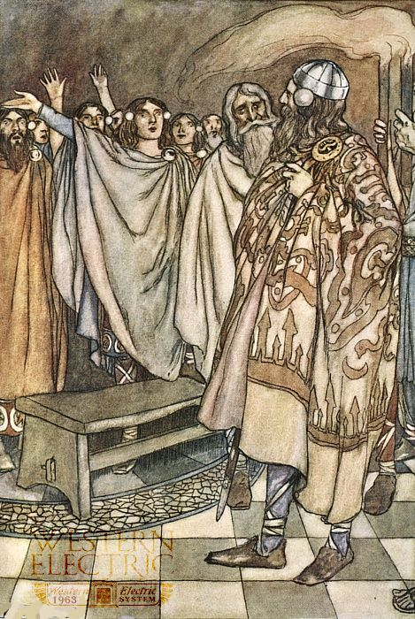

# Challenge

I would like to notify the Director that on the 18th of November Cowbells Duolingtone created some sort of electrical device in the noon crafts lesson. He tried to send some encrypted message on the device to his grandfather. In his mind the noisy, clicky creation can send electrical signals up to 2500 miles to the West. But Director please! Who heard of such a thing!

[1.jpg](files/1.jpg)

[2.jpeg](files/2.jpeg)

[images.jpg](files/images.jpg)

[WE2500Type.pcap](files/WE2500Type.pcap)

# Writeup

[Writeup](WRITEUP.md)
