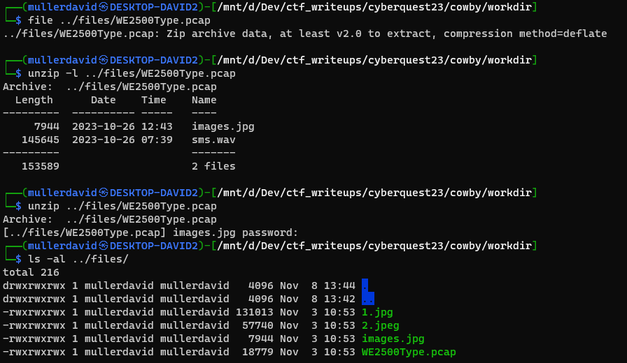
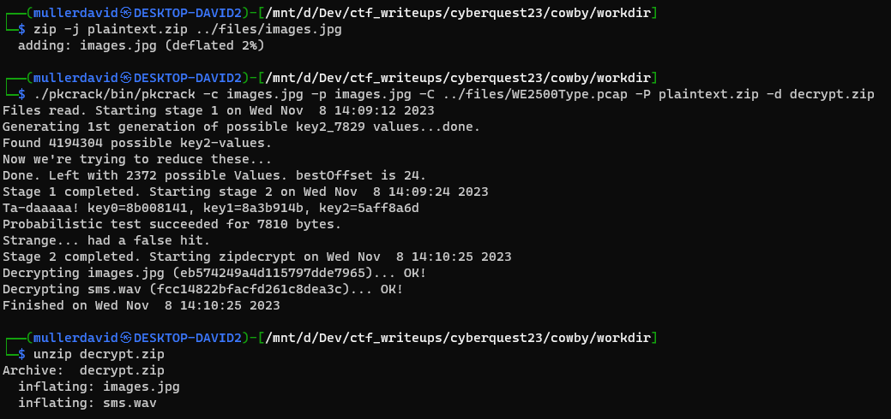
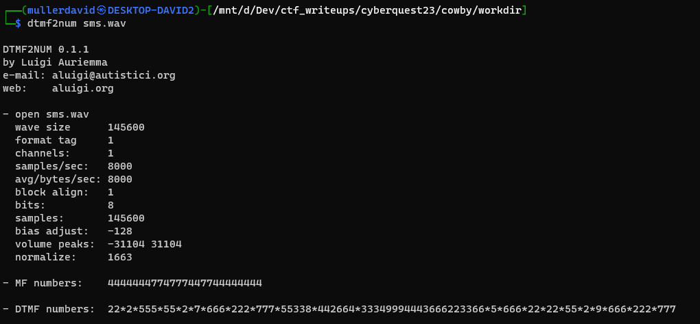

# The files

There are 3 images and a pcap. 

Some images have some extra metadata compared to the original.

The pcap is actually a zip with pcap extension.

# The images

The images has the following coordinates: `47 deg 36' 13.80" N, 122 deg 19' 48.22" W` and other references to Seattle and Western Electric Co.

This was not used to solve the challenge.

# Probing the zip

The zip is encrypted, but the `images.jpg` can be found both encrypted and unencrypted. They have the same name and size (7944).



# Extracting the zip

The used stream cipher is vulnerable to [know plaintext attack](https://math.ucr.edu/~mike/zipattacks.pdf). The [pkcrack](https://github.com/keyunluo/pkcrack) or [bkcrack](https://github.com/kimci86/bkcrack) tools can be used to remove the encryption. The tools expect the plaintext part zipped, as that is the actual plaintext.

```bash
zip -j plaintext.zip images.jpg
pkcrack -c images.jpg -p images.jpg -C WE2500Type.pcap -P plaintext.zip -d decrypt.zip
unzip decrypt.zip
```



# Decoding the sms.wav file

The [sms.wav](workdir/sms.wav) has the tone of phone keypad button presses with [DTMF](https://en.wikipedia.org/wiki/Dual-tone_multi-frequency_signaling). The tool [dtmf2num](http://aluigi.altervista.org/mytoolz.htm#dtmf2num) can be used to extract the information.



`22*2*555*55*2*7*666*222*777*55338*442664*33349994443666223366*5*666*22*22*55*2*9*666*222*777`

Based on the filename, this is how an sms might have been written. 

| keys | string |
| --- | --- |
| 22* |b |
| 2* | a |
| 555* | l |
| 55* | k |
| 2* | a |
| 7* | p |
| 666* | o |
| 222* | c |
| 777* | s |
| 55338* | ket |
| 442664* | hang |
| 3349994443666223366* | egyidoben |
| 5* | j |
| 666* | o |
| 22* | b |
| 22* | b |
| 55* | k |
| 2* | a |
| 9* | w |
| 666* | o |
| 222* | c |
| 777 | s |

For `777*` s was used, as in the Wikipedia image (no Q and Z). Also probably `9*` is incorrect. The word `balkapocs` can mean `{` in Hungarian, `jobbkapocs` can be `}`.

# Flag
`{ket.hang.egyidoben}`