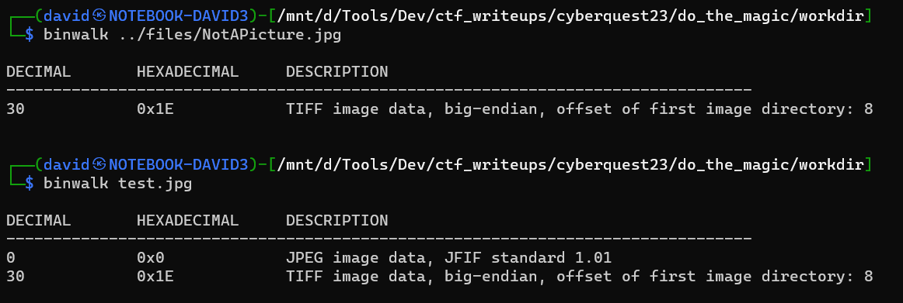
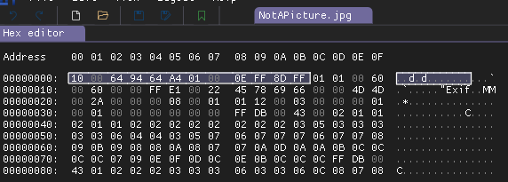
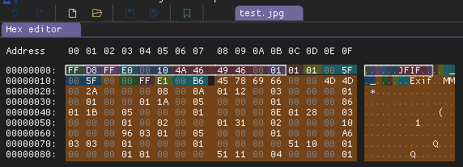
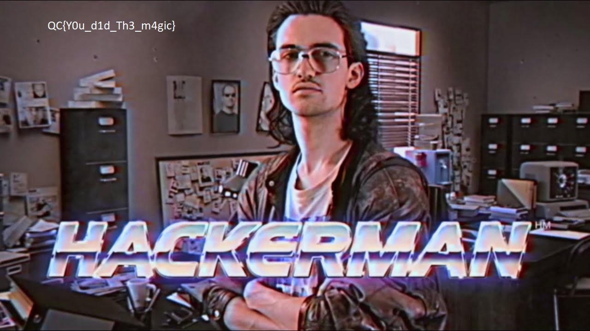

# Checking the file

It is not a valid image file, can not be opened with image viewers.

Binwalk reveals some TIFF data, at similar offset to a regular jpg.

# Comparing

Comparing the hex content with a valid jpg reveals high similarities apart from the header. The zeroes, the gaps, the Exif metadata at same offsets.

Upon closer look, you can also notice that the first 12 bytes are simply the hex representation reversed (10 -> 01).

# Stealing the header

Just replacing the bytes from the test donor is enough fixing the image.

# Flag

`QC{Y0u_d1d_Th3_m4gic}`