# Executable

The file is a windows executable that can be statically or dynamically analyzed.

Some files are zipped with a password to prevent antivirus programs instantly deleting them. Zip password is `infected`.

# Loading in a virtual machine

The binary was executed inside Windows Sandbox, but any other VM should suffice.

Upon running, it is missing `VCRUNTIME140.dll`. This can be fixed by installing [Microsoft Visual C++ 2015 Redistributable (x64) - 14.0.24123](https://www.microsoft.com/en-us/download/details.aspx?id=52685).

Running it outputs some base64 like string, but it varies from run to run and can not be decoded.

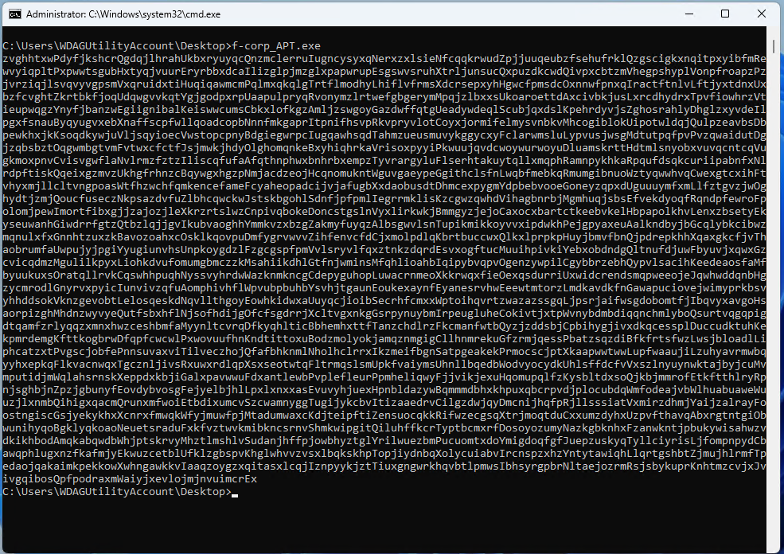

# Dynamic analysis

The binary was executed inside x64dbg debugger, similarly, any debugger can be used for the task.

## Anti debug

Running it in x64dbg terminates it quickly, without printing anything. It can detect the debugger. 

A common method is to use [IsDebuggerPresent](https://learn.microsoft.com/en-us/windows/win32/api/debugapi/nf-debugapi-isdebuggerpresent). Using a breakpoint on this Winapi call has a hit. Running back to user code reveals the check.

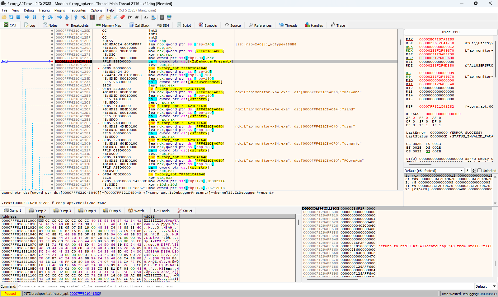

The check was patched out with a few nop instructions.

## Username

Stepping after the debug check reveals getting the username via [GetUserNameA](https://learn.microsoft.com/en-us/windows/win32/api/winbase/nf-winbase-getusernamea) and checking if it has certain substrings with [strstr](https://cplusplus.com/reference/cstring/strstr/).

The program is terminating if the username has any of the following: `malware`, `sand`, `user`, `dynamic`. Also terminating if it doesn't have `FCorpAdm`.

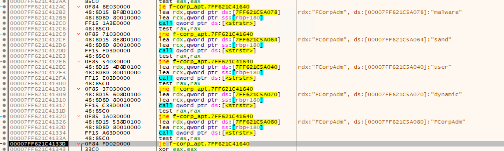

The check was patched out with a few nop instructions. Alternatively the user can be added.

```batch
net user /add FCorpAdm FCorpAdm
```

## Obfuscation and calling convention
A lot of string is xored with various strings, like `US`, `October` etc. These are used to rebuild various strings, load dlls via [LoadLibraryA](https://learn.microsoft.com/en-us/windows/win32/api/libloaderapi/nf-libloaderapi-loadlibrarya) and getting winapi functions with [GetProcAddress](https://learn.microsoft.com/en-us/windows/win32/api/libloaderapi/nf-libloaderapi-getprocaddress) int `rax` then calling it from there.

This is a reoccurring pattern later, so every `call rax` will be set as a breakpoint for easier debugging. See [Target system](#target-system) for example.

The anti-debug and anti-analysis checks are used multiple times in-between calls.

## Target system

The malware is checking for a Mutex called `Th1sisthet4rgetsystem`.

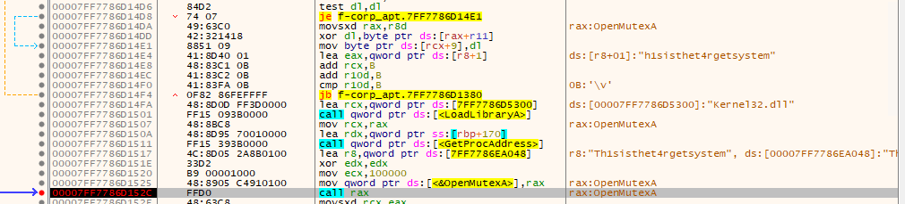

The check was patched out with a few nop instructions. Alternatively the mutex can be added.

```powershell
New-Object System.Threading.Mutex($false, "Th1sisthet4rgetsystem")
```

## Process detection

To prevent the analysis, the malware is checking various VM and tracing processes. Iterating through every process and comparing it to a blacklist.

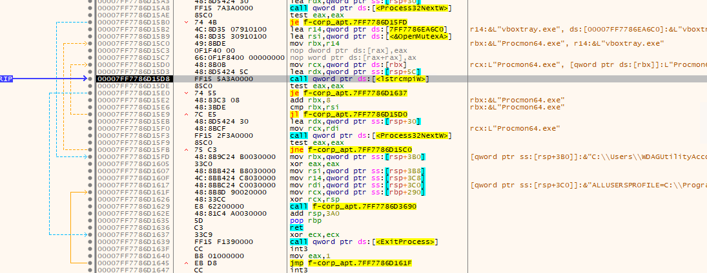

The check was patched out with a few nop instructions. Alternatively the blacklisted executable can be renamed or killed.

## Registry query

The next check is a registry key. The key at `HKCU\SoftwaRe\s3cr3ts\p4th` should have the value `public`.

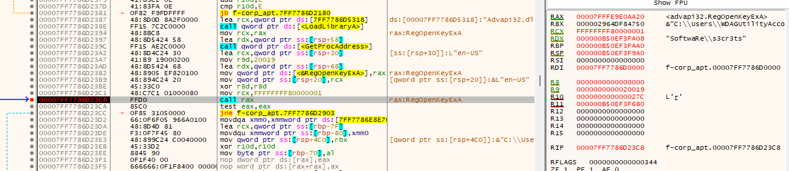

This was added.

```powershell
New-Item -Path HKCU:\Software\s3cr3ts | New-ItemProperty -Name 'p4th' -PropertyType String -Value "public"
```

## Dropping the payload

After passing all the checks, it is creating a file `public:leavemehere`. This is an [NTFS Alternate Data Stream](https://learn.microsoft.com/en-us/openspecs/windows_protocols/ms-fscc/c54dec26-1551-4d3a-a0ea-4fa40f848eb3) which is good for [hiding information](https://www.youtube.com/watch?v=S4MBzeni9Eo) as well. 

The initial filename can be patched to prevent creating alternate data stream, e.g. `public_leavemehere` if preferred.

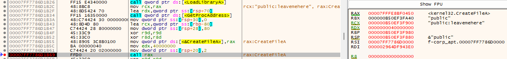

Decrypting a binary file in memory byte by byte with a xor key `memcpy` with a small twist. A decryptor is in [extract.py](workdir/extract.py).

Then dropping in the previously created alternate data stream. The parameter in `RDX` is the memory that is written out, and can be seen in the Dump.

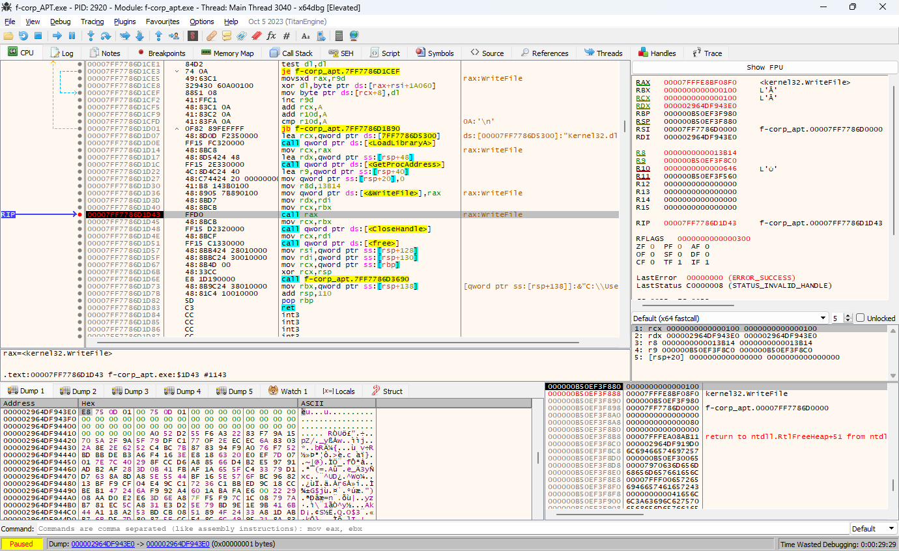

The file looks like an empty file named `public`.

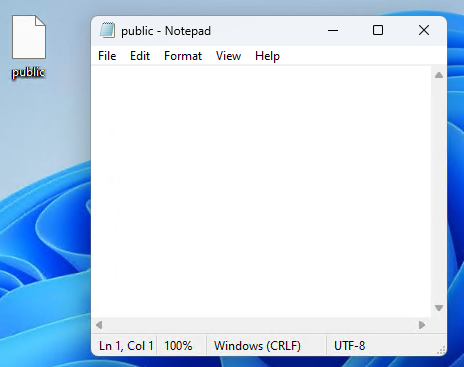

There are multiple ways to list and extract the alternate data streams.

```powershell
Get-ChildItem | Get-Item -Stream *
Get-Content public -Stream leavemehere -Encoding Byte | Set-Content public_leavemehere.dat -Encoding Byte
```

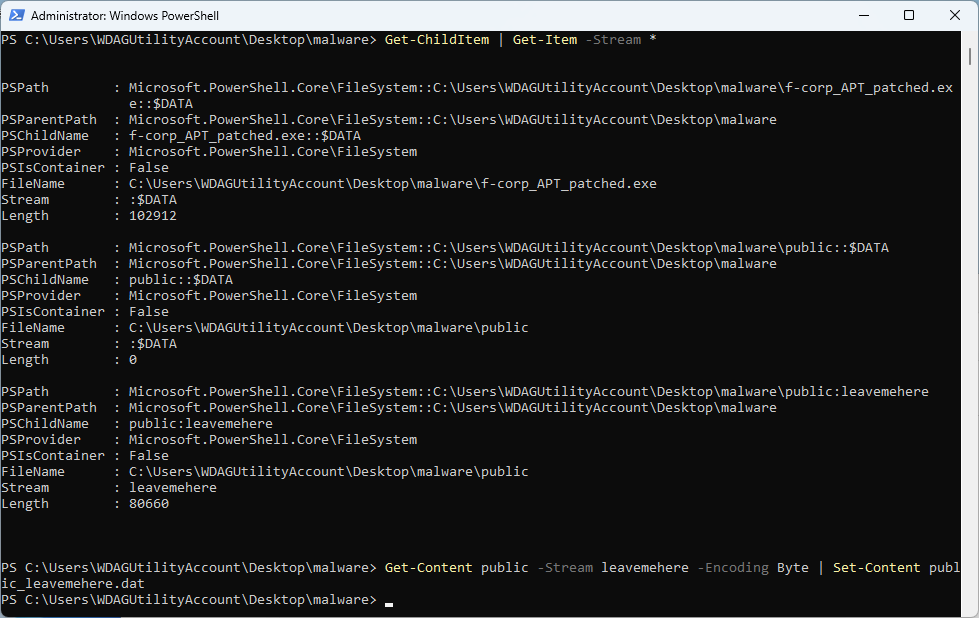

## Termination

The program is terminating after dropping this payload. There is no further action by this malware. A second stage might use the dropped payload, as it is not usable alone.

The patched file can be found at [f-corp_APT_patched.zip](workdir/f-corp_APT_patched.zip) 

## Console output

The printed string is entirely a decoy, it is just randomly generated.

# Figuring out the payload

The dropped payload doesn't have any well known magic header, `file` is not recognizing it either. 

Multiple segments are inside, separated with a couple of zeroes. 

Some strings are readable, like the following, in different segments.
 - ole32 oleaut32 wininet mscoree shell32
 - amsi clr wldp ntdll
 - WldpQueryDynamicCodeTrust WldpIsClassInApprovedList AmsiInitialize AmsiScanBuffer AmsiScanString  EtwEventWrite EtwEventUnregister

There is also a part that resembles an executable file, but not quite that. It is not starting with MZ, but M8Z and the `This program cannot be run in DOS mode.` text has a lot of difference as well. This usually looks like this with compression.

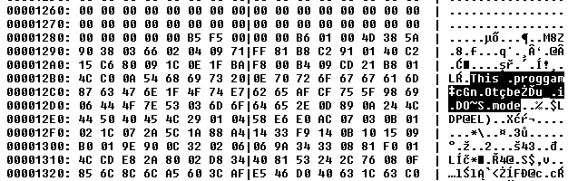

# Donut

Looking for the strings in google, the search has a definitive match with `WldpQueryDynamicCodeTrust WldpIsClassInApprovedList AmsiInitialize AmsiScanBuffer AmsiScanString EtwEventWrite EtwEventUnregister`: <https://github.com/TheWover/donut/blob/master/donut.c> .

Based on the description, this looks promising.

```
Donut is a position-independent code that enables in-memory execution of VBScript, JScript, EXE, DLL files and dotNET assemblies.
```

Experimenting with the tool and compression options, it results a very similar binary than the payload. Entropy level 0 and aPLib compression. The executable `hello.exe` is just a freshly compiled mingw hello world.

```batch
donut.exe -i hello.exe -e1 -z2
```

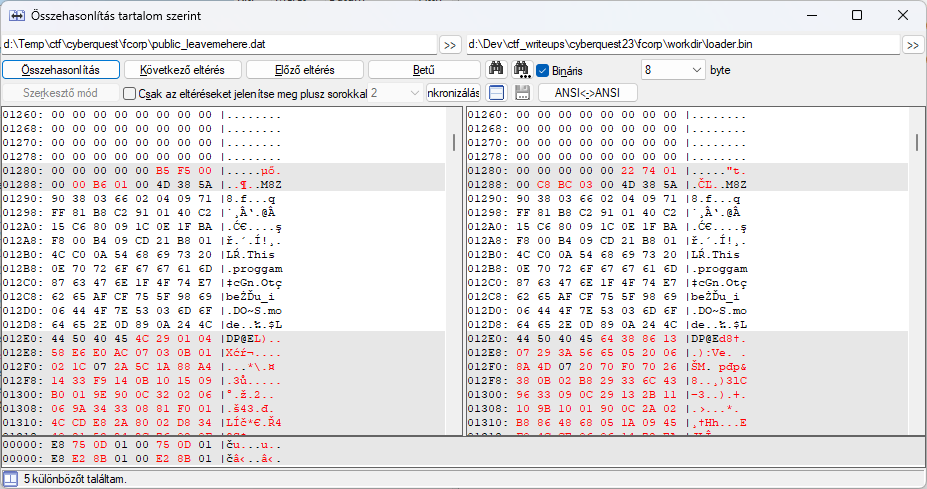

This can be executed/tested with the following.

```batch
test\inject_local.exe loader.bin
```

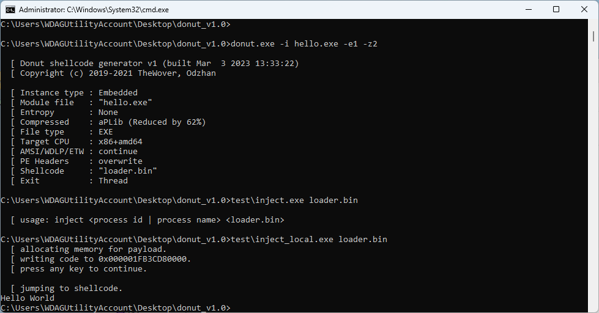

Unfortunately it is not running the `public:leavemehere` payload. Might be version difference, but the exact reason was not investigated.

# Unpacking the executable

Now that we know the compression algorithm, we can just extract the segment where the executable begins (`M8Z`) and decompress it.

There are various [aPLib](https://ibsensoftware.com/products_aPLib.html) implementations, like [this](https://github.com/svendahl/cap) in c#.

```bash
./appack d public_leavemehere.appack public_leavemehere.exe
```

This executable runs normally.

The payload and variants can be found at [public_leavemehere.zip](workdir/public_leavemehere.zip) 

# Process Exploration

Process explorer can reveal some logic what the program is doing. One such is the network connection to port 12345.

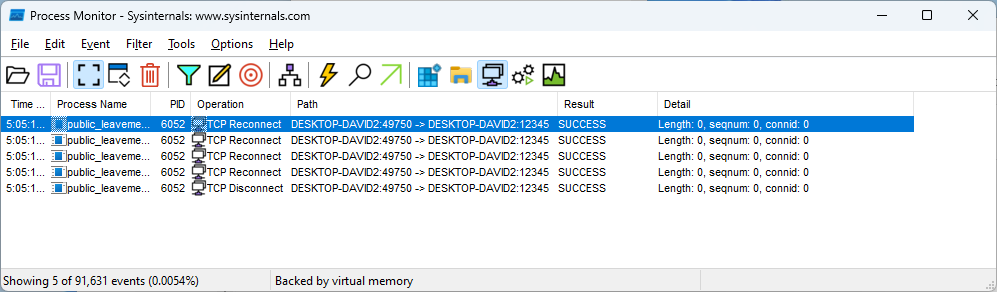

Netcat or similar can be used to listen on the `12345` port.

```powershell
$listener = [System.Net.Sockets.TcpListener]12345
$listener.Start()
$client = $listener.AcceptTcpClient()
$stream = $client.GetStream()
$buffer = New-Object System.Byte[] 1024
$i = $stream.Read($buffer, 0, $buffer.Length)
$data = $EncodedText.GetString($buffer, 0, $i)
Write-Host $data
$stream.Close()
$client.Close()
$listener.Stop()
```

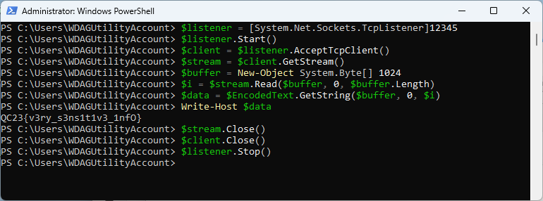

# Flag
`QC23{v3ry_s3ns1t1v3_1nfO}`