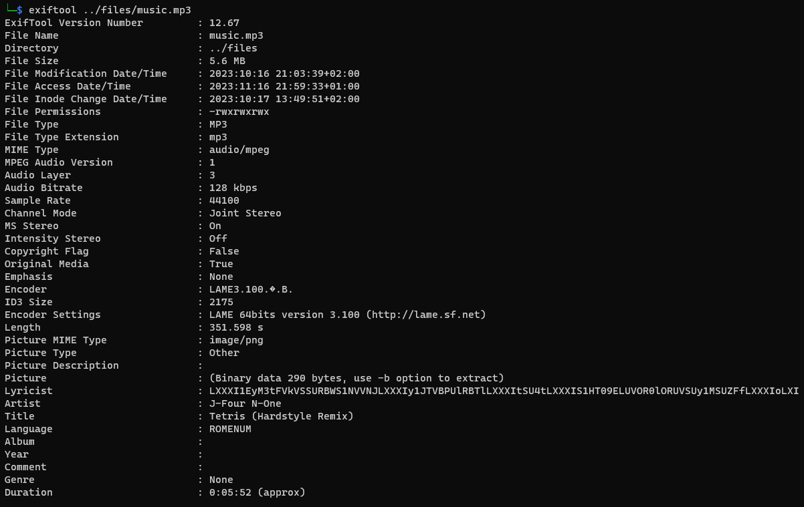
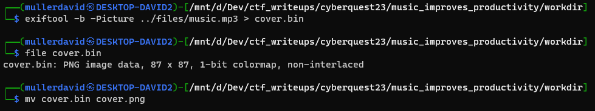

# Checking the site

The website has an empty looking index page.

Viewing the source reveals the [music.mp3](files/music.mp3) file.

# Checking the mp3 file

The mp3 file has various metadata.

```bash
exiftool music.mp3
```



# Album art

Exiftool can extract the embedded `Picture`.

```bash
exiftool -b -Picture music.mp3 > cover.bin
file cover.bin
mv cover.bin cover.png
```



It is a png, a QR code.


Reading it has the text `BEHIND THE MP3`.

```
zbarimg cover.png
```

# Other metadata

The `Lyricist` has a text that might be a base64 text. 

```
LXXXI1EyM3tFVkVSSURBWS1NVVNJLXXXIy1JTVBPUlRBTlLXXXItSU4tLXXXIS1HT09ELUVOR0lORUVSUy1MSUZFfLXXXIoLXI
```

The `Language` has text `ROMENUM` that is a reference to roman numerals. Substituting the parts in the text with the ASCII representation of that roman number.

 - LXXXI -> 81 -> `Q`
 - LXI -> 61 -> `=`

```
Q1EyM3tFVkVSSURBWS1NVVNJQy1JTVBPUlRBTlQtSU4tQS1HT09ELUVOR0lORUVSUy1MSUZFfQo=
```

This is decoded to the flag.

# Flag
CQ23{EVERIDAY-MUSIC-IMPORTANT-IN-A-GOOD-ENGINEERS-LIFE}