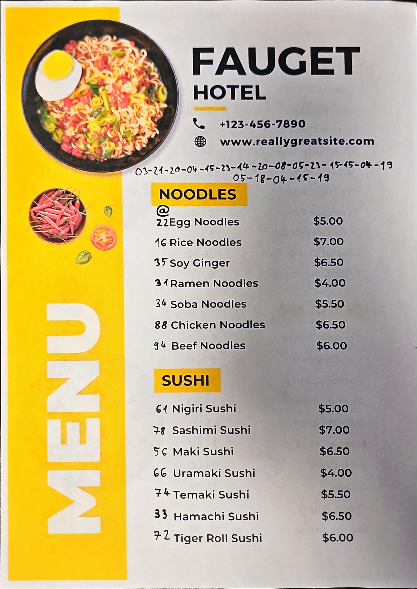
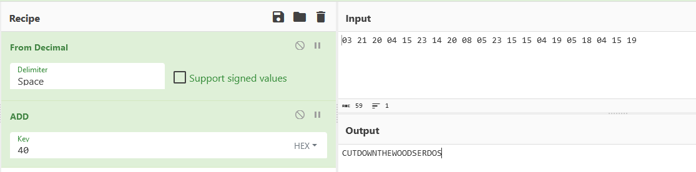
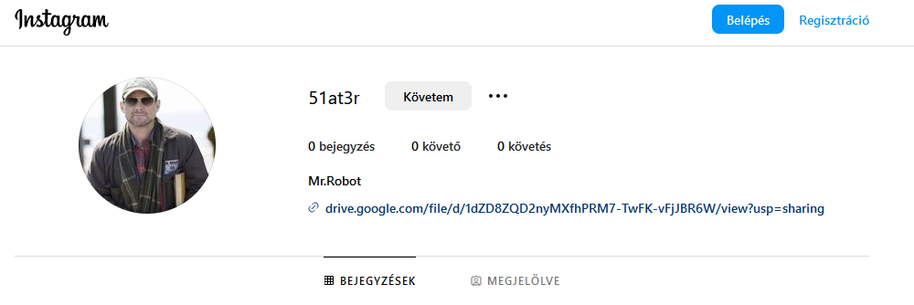

# Checking the pdf

It has a single page. The metadata has nothing.



```
03-21-20-04-15-23-14-20-08-05-23-15-15-04-19-05-18-04-15-19
Noodles
@
22 Egg Noodles $5.00
16 Rice Noodles $7.00
35 Soy Ginger $6.50
31 Ramen Noodles $4.00
34 Soba Noodles $5.50
88 Chicken Noodles $6.50
94 Beef Noodles $6.00
Sushi
61 Nigiri Sushi $5.00
78 Sashimi Sushi $7.00
56 Maki Sushi $6.50
66 Uramaki Sushi $4.00
74 Temaki Sushi $5.50
33 Hamachi Sushi $6.50
72 Tiger Roll Sushi $6.00
```

The original image can be found, see [original.png](workdir/original.png). The difference is the written numbers.

# Numbers

## Horizontal

The numbers on top with dash encode letters, based on their index in the alphabet starting from 1.



```
CUT DOWN THE WOODS ERDOS
```

[Erdős-Woods number](https://en.wikipedia.org/wiki/Erd%C5%91s%E2%80%93Woods_number).


## Vertical

After solving the horizontal ones, we have to just remove every number that is Erdős-Woods (`16, 22, 34, 36, 46, 56, 64, 66, 70, 76, 78, 86, 88, 92, 94, 96, 100, 106, 112, 116`). For the leftover, convert to ASCII representation from hex.


```
22 -
16 -
35 5
31 1
34 -
88 -
94 -
61 a
78 -
56 -
66 -
74 t
33 3
72 r

51at3r
```

# References

This part is a stripped variant of the [Defcon 22 Badge Challenge](https://potatohatsecurity.tumblr.com/post/94565729529/defcon-22-badge-challenge-walkthrough) that is also used in the [Mr.Robot](https://www.youtube.com/watch?v=i9CBKGLVCME).

# Instagram

There is an instagram user with [51at3r](https://www.instagram.com/51at3r/) name. The `@` on the menu supposed to point to this direction. Duckduckgo can also find it.



With a Mr.Robot profile picture and a link to a [caesar.zip](drive.google.com/file/d/1dZD8ZQD2nyMXfhPRM7-TwFK-vFjJBR6W/view?usp=sharing).

# caesar.zip

There are 2 unencrypted files and an encrypted zip file inside the zip.

## Synopsys.txt

```
Caesar’s assassination is just the halfway point of Julius Caesar. The
first part of the play leads to his death; the second portrays the
consequences. As the action begins, Rome prepares for Caesar’s
triumphal entrance. Brutus, Caesar’s friend and ally, fears that
Caesar will become king, destroying the republic. Cassius and others
convince Brutus to join a conspiracy to kill Caesar.
```

## map.txt

```
To unlock the password: you must solve this cypher:
Ps: Watch out for the rotations

1 4
4 38
3 29
2 7
6 4
2 57
5 35
6 43
```

## Password

The synopsis has 6 lines. The first column of the map has index ranging 1 to 6. It was a common cipher method to use page and letter indexes from books. Using the row number and the character at position yields the following: `sfbpvrgl`. Using rot13, as the ps suggests: `fsociety`.

The password unpacks [key.wav](workdir/key.wav).

# key.wav

The wav file has some morse code.

```bash
morse2ascii key.wav
```

The decoded morse data is `ev1lc0rp`.

# Flag

cq23{ev1lc0rp}
