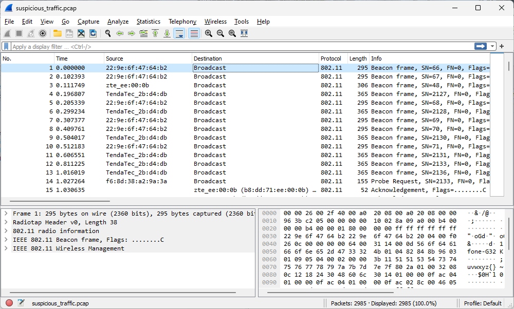
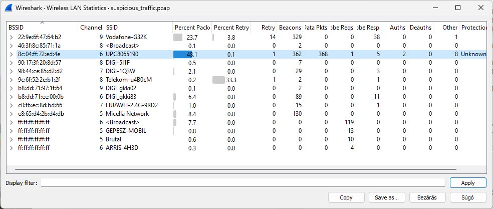
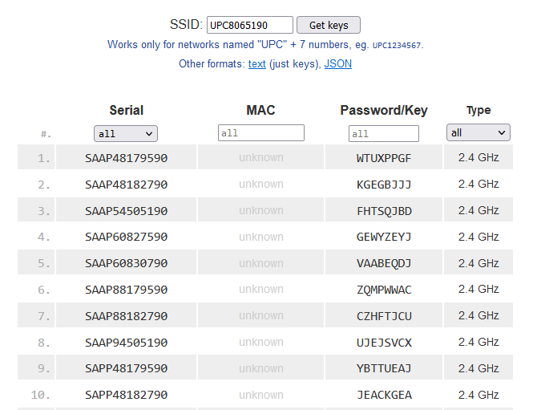
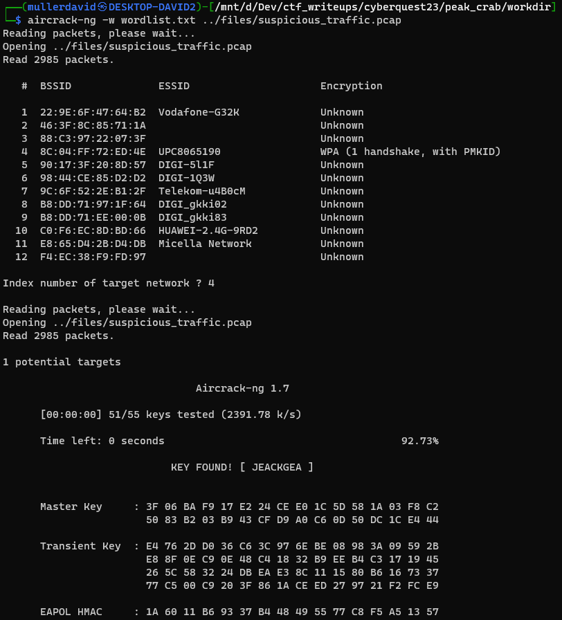
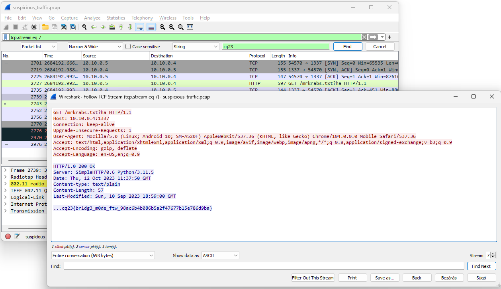

# Pcap

The pcap has wireless packets captured.



# Wlan traffic

Under Wireless -> WLAN Traffic the different networks can be seen.



The network with `UPC8065190` SSID has the most traffic and the only one with a WPA handshake.

# UPC8065190

There was a vulnerability in certain Technicolor TC7200 or Ubee EVW3226 routers provided by UPC. The SSID could be used to calculate the default password.

There is a website that can be used to calculate the possible passwords from the SSID.

<https://upcwifikeys.com/UPC8065190>



The list can be used as a password list do decrypt the packages.

# Cracking the password

Using the passwordlist above.

```bash
aircrack-ng -w wordlist.txt -e UPC8065190 suspicious_traffic.pcap
```



KEY FOUND! [ `JEACKGEA` ]

# Decrypting the traffic

The IEEE 802.11 wifi traffic can be [decrypted in wireshark](https://wiki.wireshark.org/HowToDecrypt802.11).

Filtering for TCP, it only has a small number of decrypted packets. 

# HTTP plain text

Amongst the streams, there is a HTTP stream with the flag inside.



# Flag
cq23{br1dg3_m0de_ftw_98ac6b4b086b5a2f47677b15e786d9ba}
