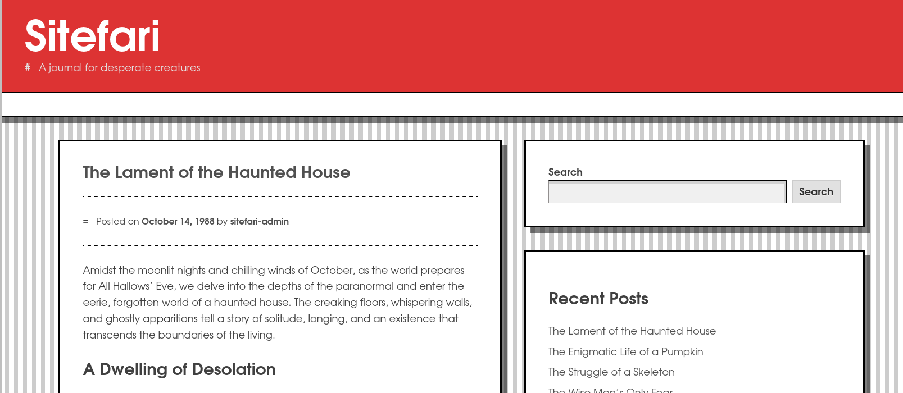
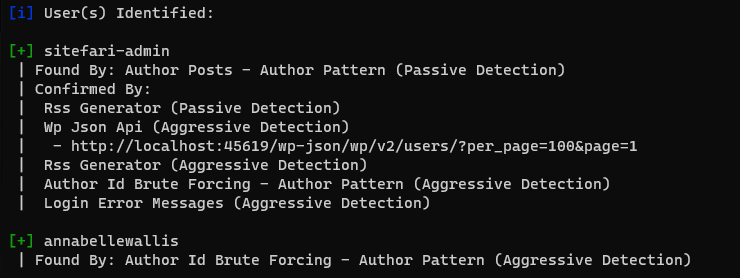
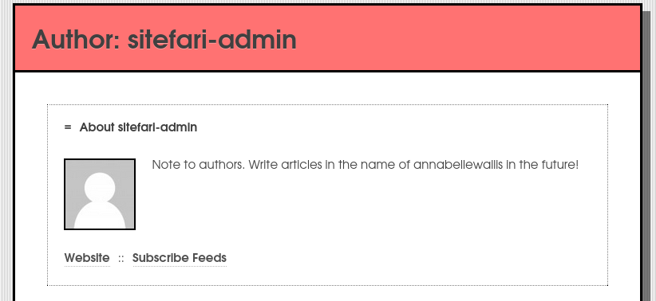
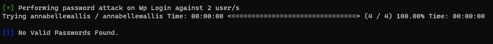
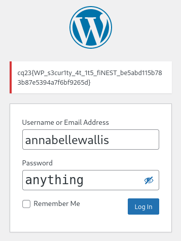

# Checking the site

The site is always redirecting to `localhost:45619` with 301 Moved Permanently.

# Reverse proxy

Changing the hostname to the above solves the issue.

```bash
curl -v -H 'Host: localhost:45619' sitefari:8080
```

Alternatively a reverse proxy on localhost also solves the issue.

```bash
socat TCP-LISTEN:45619,reuseaddr,fork TCP:sitefari:8080
```

# Checking the site (again)

Simple news/blog site.



Based on the source, it looks like a wordpress site.

```xml
<meta name="generator" content="WordPress 6.4.1" />
```

The robots.txt has the following content.

```
User-agent: *
Disallow: /wp-admin/
Allow: /wp-admin/admin-ajax.php

Sitemap: http://localhost:45619/wp-sitemap.xml
```

# WPScan

WPScan doesn't find too many information.

```bash
wpscan --url http://localhost:45619
```

Some more endpoints:
 - xmlrpc.php
 - wp-cron.php


```bash
wpscan --url http://localhost:45619 --enumerate 'u'
```

Two users:
 - sitefari-admin
 - annabellewallis



## sitefari-admin

The admin has some description.



```
Note to authors. Write articles in the name of annabellewallis in the future!
```

Also referencing the other user.

## annabellewallis

Nothing can be seen from this user.

# Credential stuffing

Trying the usernames as password for both yield nothing.

```
(echo sitefari-admin; echo annabellewallis) > wordlist.txt
wpscan --url http://localhost:45619 --enumerate 'u' --passwords wordlist.txt
```



# Manual login attempts

Trying the username manually reveals the flag though without logging in. It is in the [locked user's message](https://wordpress.org/plugins/lock-user-account/). 



# Flag
cq23{WP_s3cur1ty_4t_1t5_fiNEST_be5abd115b783b87e5394a7f6bf9265d}