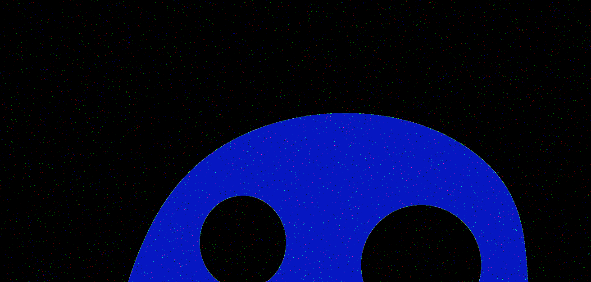
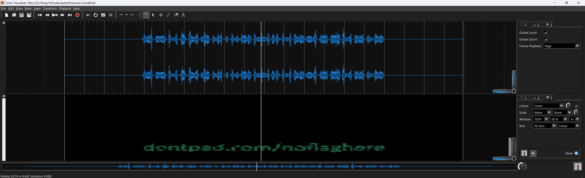

# Inspecting the image

The file was a big bmp file, 8000x4500 pixels.


# Checking the image

Running image manipulation tools (like brightness etc) doesn't reveal anything.

Running [zsteg](https://github.com/zed-0xff/zsteg) is also not showing anything.

Fiddling with the bits show something on the LSB plane, while the pure black on uncompressed bmp shouldn't.

```python
from PIL import Image 
import numpy as np

def reverse_mask(b):
    b = (b & 0xF0) >> 4 | (b & 0x0F) << 4
    b = (b & 0xCC) >> 2 | (b & 0x33) << 2
    b = (b & 0xAA) >> 1 | (b & 0x55) << 1
    return b
  
img = Image.open("Ghosts.bmp")  
npImg = np.array(img)

LUT=np.zeros(256,dtype=np.uint8)
for i in range(256):
    LUT[i]=reverse_mask(i)

Image.fromarray(LUT[npImg]).save('Ghosts_flip.png')
```



This looks like the artifacts [steghide](https://steghide.sourceforge.net/) produces. Sparse, using all channels and not too periodic.

# Steghide

Empty passphrase or combinations with the letters on the ghosts can't extract the hidden file.

Using the dimensions added together, 8000+4500=12500 is the passphrase and can extract [Halloween.zip](workdir/Halloween.zip).

Alternatively [stegseek](https://github.com/RickdeJager/StegSeek) can be used to get the file with rockyou password list for example.


# Extracting the zip

It has [final.wav](workdir/final.wav) and a text file with `Visualize the fear!` inside.

# Visualizing it

[Sonic Visualiser](https://www.sonicvisualiser.org/) is free and can do various visualizations on sound files.

Adding a spectogram reveals a text: `dontpad.com/noflaghere`.



# Visiting the site

Actually there is a flag at <https://dontpad.com/noflaghere> with some ASCII art.


# Flag
QC23{1t_iS_Sp00ky_M0ntH}