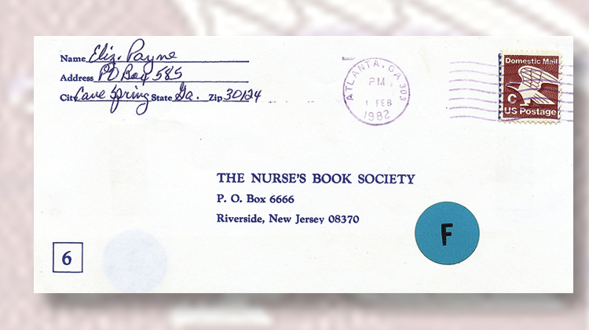

# Finding the letter


Based on the strings on the letter, the original can be found on the internet.



This is almost the same, except there is an extra barcode and the blue sticker is moved.

# Barcode

The barcode is an [Intelligent Mail Barcode](https://en.wikipedia.org/wiki/Intelligent_Mail_barcode).

```
AAFFAFFTFTDDTTTDTFATTFDDAFFAFDFFDTTDFDDDDADADFTFFDAFFDFTFFATFFDAT
```

There are various decoders. Some can decode images as well.

<https://www.dynamsoft.com/barcode-reader/barcode-types/usps-intelligent-mail/>

This decodes to `8269505112390886590103666680125`.

# Aligning the numbers

After some trial and error, the numbers can be split based on the decimal value of them making an ascii character.

```
82 69 50 51 123 90 88 65 90 103 66 66 80 125
RE23{ZXAZgBBP}
```

This is not quite the flag, but the numbers and special chars are correct.

# Vigenère

Might be a Vigenère cipher, as only the letters are encoded and `C->R` is not same distance as `Q->E`. 

With `POST` key, the flag is decoded.

# Flag
`CQ23{HELLoIMB}`