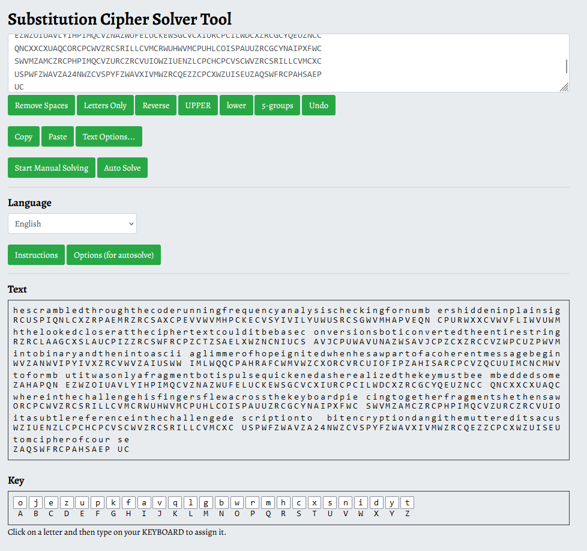

# Krytwos

Kryptos is a sculpture with some encrypted messages inside, in 4 blocks, similar to the challenge.

<https://en.wikipedia.org/wiki/Kryptos>

How to decypher the knwon parts of the original.

<https://isaaclyman.com/blog/posts/kryptos-1/>
<https://isaaclyman.com/blog/posts/kryptos-2/>


# Utils

The [utils.py](workdir/utils.py) can be used in python for basic utilities.

```python
from utils import *
```

The [Boxentriq Cryptogram Solver](https://www.boxentriq.com/code-breaking/cryptogram) or similar tool can be used for (semi) automatic substitution solves.




Chatgpt or another LLM can be used to beautify the plaintexts by inserting whitespace and punctuation, fixing small errors/typos.

# K1

```
Pgdzhthrllrasvfttkzsjatdlygiasqcmltjydiasctptxbbvdaxqlseebbrzqmw
joutrskZraovpwoeipcnrwhgaxtcmvwtpnihgTRUqzkcjtguwjrpkhwnycwlrzqh
bwnyhrjsmgczzsdbtrDyckgbxfkkiasdfnhtdycioyoadnbloushkfkudvgeiqes
xdFtvsnagtqcouhhawfdmvwvyhbsjqzkcjtguwcyakssnpqnhdyghzsckdgsSklt
gkzttglHzoawtzdoeetrwctpxihayeltgmiwemwuFlarlrvlhflrplbzdllahqck
fthjekfMvwesbusjcfxwsfcjorwtbifsmvaxbIasmznwxfloorfcuuvbawerhmfa
xxdykovkxgudippgrgwawtfsmkcglsxuxlkqxfkEmvzmojchzserhxmckukikdiy
ibcf
```

Only a few uppercase letter, probably same case in plain and cyphertext, no numbers, no special characters.

3 consecutive uppercase letters `TRU`.


`qzkcjtguw` is repeaed twice (117=3^2*13 distance), once right after `TRU`

```
sorted(freq(k1).keys())
38, ['D', 'E', 'F', 'H', 'I', 'M', 'P', 'R', 'S', 'T', 'U', 'Z', 'a', 'b', 'c', 'd', 'e', 'f', 'g', 'h', 'i', 'j', 'k', 'l', 'm', 'n', 'o', 'p', 'q', 'r', 's', 't', 'u', 'v', 'w', 'x', 'y', 'z']

sorted(freq(k1.upper()).keys())
26, ['A', 'B', 'C', 'D', 'E', 'F', 'G', 'H', 'I', 'J', 'K', 'L', 'M', 'N', 'O', 'P', 'Q', 'R', 'S', 'T', 'U', 'V', 'W', 'X', 'Y', 'Z']

freq(k1)
{'t': 5.752, 's': 5.53, 'k': 5.309, 'c': 4.867, 'w': 4.867, 'h': 4.646, 'a': 4.646, 'l': 4.424, 'g': 4.203, 'r': 4.203, 'd': 3.982, 'f': 3.761, 'z': 3.539, 'x': 3.539, 'b': 3.318, 'i': 3.097, 'm': 3.097, 'v': 3.097, 'o': 3.097, 'e': 2.876, 'u': 2.876, 'y': 2.876, 'j': 2.654, 'q': 2.433, 'p': 2.212, 'n': 2.212, 'F': 0.442, 'E': 0.221, 'I': 0.221, 'Z': 0.221, 'T': 0.221, 'R': 0.221, 'U': 0.221, 'D': 0.221, 'S': 0.221, 'H': 0.221, 'M': 0.221, 'P': 0.221}

freq(k1.upper())
{'T': 5.973, 'S': 5.752, 'K': 5.309, 'H': 4.867, 'W': 4.867, 'C': 4.867, 'A': 4.646, 'R': 4.424, 'L': 4.424, 'F': 4.203, 'G': 4.203, 'D': 4.203, 'Z': 3.761, 'X': 3.539, 'I': 3.318, 'M': 3.318, 'B': 3.318, 'U': 3.097, 'V': 3.097, 'E': 3.097, 'O': 3.097, 'Y': 2.876, 'J': 2.654, 'P': 2.433, 'Q': 2.433, 'N': 2.212}
```

From the frequencies, it is probably not a simple substition cypher, might be Viginere. 


It turned out that the this part was broken, see Details below.

<details>
  <summary>Details</summary>
  
The author submitted the original plaintext and the algorithm.

```python
def encryptK1(plaintext, key):
    ciphertext = ''
    key_repeated = (key * (len(plaintext) // len(key))) + key[:len(plaintext) % len(key)]
    for i in range(len(plaintext)):
        if plaintext[i].isalpha():
            shift = ord(key_repeated[i].upper()) - ord('A')
            if plaintext[i].isupper():
                ciphertext += chr((ord(plaintext[i]) + shift - ord('A')) % 26 + ord('A'))
            else:
                ciphertext += chr((ord(plaintext[i]) + shift - ord('a')) % 26 + ord('a'))
        else:
            ciphertext += plaintext[i]
    return ciphertext
    
p1 = '''
Boti sat hunched over his laptop the glow from the screen reflecting in his tired eyes It had
been two days since the crypto CTF challenge started and this one was driving him mad The
timer at the top of the page counted down two hours left He had cracked some of the easier
challenges already but this last one It was a beast
The challenge description was cryptic Only the worthy will unlock the truth The numbers hide
more than you think The ciphertext mocked him a string of seemingly random characters and
numbers No clues no hints just frustration
'''[:-1]
```

The algorithm was indeed Viginere.

After some tinkering, the key looked like this: `oskrptokryptosryptskrptoskrptokryposkrptokryptokryptoskrytokrytoskrptosrytososkrptokryposkrytosryptosryposkryptosr...`

Looks like randomly omitting parts of `kryptos`.

Cross checking with the plaintext, it looks like the spaces were removed AFTER the encryption not before, which makes the decryption impossible.

```python
encryptK1(p1.replace("\n","     "), "kryptos").replace(" ","")
```

Returns the cyphertext in the challenge.
  
</details>
<br>

# K2

Message with only symbols.

```
sorted(freq(k2).keys())
26: ['!', '#', '$', '%', '&', '(', ')', '*', '+', ',', '-', '.', '/', ':', ';', '<', '=', '>', '?', '@', '[', ']', '^', '_', '`', '|']

```

Using substitutions.

```python
k2 = '''
*$&`#`-<$`#,?<*$#`--?&$!`>*@>#`$>`<@*[&$<;*^$=$<$,[>$:$=>?!++?&*
=^_`#$>$=>$*$<`=?&<+/^&_+<$+!>@/<$@<,[?+^<`[&*@`-^+<*?&_>&*>!<`*
=!/..*=^;*?&?$<_>-*)$!%%*=$@*[&$<%=*^_``=#]+-,!*/>?]/`<$??*--=+?
&*=^@+?*>?`<$#`??&$@*[&$<?$|?/&$<$&`>?+!$>+_$?&*=^(__*>>*=^&$_/?
?$<$#?+&*_>$-%</!!*=^&*>?$_[-$>*$+[$=$#/[`=$;],?&+=>@<*[?`=#>?`<
?$#`=`-,.*=^[`??$<=>*=?&$?$|?>$`<@&*=^%+<>+_$&*##$=>?</@?/<$(?;`
>=?/=?*-&$^-`=@$#`??&$@&`--$=^$#$>@<*[?*+=`^`*=?&`?`;+<#[+[[$#+/
?`?&*_=/_!$<>**>_*=#@-*@)$##+/-#?&*>!$`=/_!$<!`>$#@*[&$<
'''.replace("\n","")
sub = {
	'$': "E",
	'?': "T",
	'*': "I",
	'`': "A",
	'=': "N",
	'<': "R",
	'>': "S",
	'&': "H",
	'#': "D",
	'+': "O",
	'@': "C",
	'-': "L",
	'[': "P",
	'^': "G",
	'_': "M",
	'/': "U",
	'!': "B",
	',': "Y",
	';': "W",
	'%': "F",
	'.': "Z",
	']': "J",
	'|': "X",
	')': "K",
	'(': "Q",
	':': "V",
}
substitute(sub, k2)
```

The results are:

```
IEHADALREADYTRIEDALLTHEBASICSDAESARCIPHERWIGENEREYPSEVENSTBOOTHINGMADESENSEIERANTHROUGHMOREOBSCURECRYPTOGRAPHICALGORITHMSHISBRAINBUZZINGWITHTERMSLIKEBFFINECIPHERFNIGMAANDJOLYBIUSTJUARETTILLNOTHINGCOTISTAREDATTHECIPHERTEXTUHEREHASTOBESOMETHINGQMMISSINGHEMUTTEREDTOHIMSELFRUBBINGHISTEMPLESIEOPENEDUPANEWJYTHONSCRIPTANDSTARTEDANALYZINGPATTERNSINTHETEXTSEARCHINGFORSOMEHIDDENSTRUCTUREQTWASNTUNTILHEGLANCEDATTHECHALLENGEDESCRIPTIONAGAINTHATAWORDPOPPEDOUTATHIMNUMBERSIISMINDCLICKEDDOULDTHISBEANUMBERBASEDCIPHER
```

After some cosmetics:

```
He had already tried all the basics: Caesar cipher, Vigenère, XOR, even RSA, nothing made sense. He ran through more obscure cryptographic algorithms, his brain buzzing with terms like affine cipher, Enigma, and Polybius square. Still, nothing. Boti stared at the ciphertext. “There has to be something I’m missing,” he muttered to himself, rubbing his temples. He opened up a new Python script and started analyzing patterns in the text, searching for some hidden structure. It wasn’t until he glanced at the challenge description again that a word popped out at him: “numbers.” His mind clicked. “Could this be a number-based cipher?”
```

# K3

All capital, 2 numbers, no special characters.

```
sorted(freq(k3).keys())
27: ['2', '4', 'A', 'C', 'D', 'E', 'F', 'G', 'H', 'I', 'J', 'K', 'L', 'M', 'N', 'O', 'P', 'Q', 'R', 'S', 'T', 'U', 'V', 'W', 'X', 'Y', 'Z']
```

Using substitutions.


```python
k3 = '''
RCUSPIQNLCXZRPAEMRZRCSAXCPEVVWVMHPCKECVSYIVILYUWUSRCSGWVMHAPVEQN
CPURWXXCVWVFLIWVUWMRZRCLAAGCXSLAUCPIZZRCSWFRCPZCTZSAELXWZNCNIUCS
AVJCPUWAVUNAZWSAVJCPZCXZRCCVZWPCUZPWVMWVZANWVIPYIVXZRCVWVZAIUSWW
IMLWQQCPAHRAFCWMVWZCXORCVRCUIOFIPZAHISARCPCVZQCUUIMCNCMWVZAHAPQN
EZWZOIUAVLYIHPIMQCVZNAZWUFELUCKEWSGCVCXIURCPCILWDCXZRCGCYQEUZNCC
QNCXXCXUAQCORCPCWVZRCSRILLCVMCRWUHWVMCPUHLCOISPAUUZRCGCYNAIPXFWC
SWVMZAMCZRCPHPIMQCVZURCZRCVUIOWZIUENZLCPCHCPCVSCWVZRCSRILLCVMCXC
USPWFZWAVZA24NWZCVSPYFZWAVXIVMWZRCQEZZCPCXWZUISEUZAQSWFRCPAHSAEP
UC
'''.replace("\n","")

sub = {
	"A": "O",
	"B": "J",
	"C": "E",
	"D": "Z",
	"E": "U",
	"F": "P",
	"G": "K",
	"H": "F",
	"I": "A",
	"J": "V",
	"K": "Q",
	"L": "L",
	"M": "G",
	"N": "B",
	"O": "W",
	"P": "R",
	"Q": "M",
	"R": "H",
	"S": "C",
	"T": "X",
	"U": "S",
	"V": "N",
	"W": "I",
	"X": "D",
	"Y": "Y",
	"Z": "T",
	"2": "2",
	"4": "4",
}
substitute(sub, k3)
```

The results are:

```
HESCRAMBLEDTHROUGHTHECODERUNNINGFREQUENCYANALYSISCHECKINGFORNUMBERSHIDDENINPLAINSIGHTHELOOKEDCLOSERATTHECIPHERTEXTCOULDITBEBASECONVERSIONSBOTICONVERTEDTHEENTIRESTRINGINTOBINARYANDTHENINTOASCIIAGLIMMEROFHOPEIGNITEDWHENHESAWPARTOFACOHERENTMESSAGEBEGINTOFORMBUTITWASONLYAFRAGMENTBOTISPULSEQUICKENEDASHEREALIZEDTHEKEYMUSTBEEMBEDDEDSOMEWHEREINTHECHALLENGEHISFINGERSFLEWACROSSTHEKEYBOARDPIECINGTOGETHERFRAGMENTSHETHENSAWITASUBTLEREFERENCEINTHECHALLENGEDESCRIPTIONTO24BITENCRYPTIONDANGITHEMUTTEREDITSACUSTOMCIPHEROFCOURSE
```

After some cosmetics:

```
He scrambled through the code, running frequency analysis, checking for numbers hidden in plain sight. He looked closer at the cipher text. Could it be base conversions? Boti converted the entire string into binary and then into ASCII. A glimmer of hope ignited when he saw part of a coherent message begin to form, but it was only a fragment. Boti's pulse quickened as he realized the key must be embedded somewhere in the challenge. His fingers flew across the keyboard, piecing together fragments. He then saw it, a subtle reference in the challenge description to 24 bit encryption. “Dang it,” he muttered, “it’s a custom cipher, of course.
```

# K4

Symbols and letters mixed.

```
sorted(freq(k4).keys())
41 [' ', "'", '*', ',', '9', ':', ';', '<', '>', 'I', 'J', 'L', 'N', 'O', 'U', 'Z', '[', '\\', '^', '`', 'b', 'd', 'f', 'h', 'i', 'k', 'l', 'm', 'n', 'o', 'p', 'q', 'r', 's', 't', 'u', 'v', 'w', 'y', '{', '}']

sorted(freq(k4.upper()).keys())
36 [' ', "'", '*', ',', '9', ':', ';', '<', '>', 'B', 'D', 'F', 'H', 'I', 'J', 'K', 'L', 'M', 'N', 'O', 'P', 'Q', 'R', 'S', 'T', 'U', 'V', 'W', 'Y', 'Z', '[', '\\', '^', '`', '{', '}']

freq(k4)
{"'": 19.662, '^': 10.906, '{': 8.141, 'y': 5.222, 'Z': 5.222, 'u': 5.069, 'b': 5.069, 'o': 4.454, 'k': 3.84, 'l': 3.686, 'h': 3.533, 's': 3.225, 'p': 2.611, '`': 2.611, '\\': 2.15, 'n': 1.843, 'm': 1.689, 'i': 1.382, 'w': 1.382, 'f': 1.228, 'O': 0.921, 'r': 0.921, ';': 0.768, ' ': 0.614, 'd': 0.614, '}': 0.46, '<': 0.307, ',': 0.307, '[': 0.307, 'v': 0.153, '*': 0.153, 'I': 0.153, ':': 0.153, 'U': 0.153, 'L': 0.153, 'N': 0.153, '>': 0.153, 't': 0.153, '9': 0.153, 'J': 0.153, 'q': 0.153}

freq(k4.upper())
{"'": 19.662, '^': 10.906, '{': 8.141, 'O': 5.376, 'Y': 5.222, 'Z': 5.222, 'U': 5.222, 'B': 5.069, 'K': 3.84, 'L': 3.84, 'H': 3.533, 'S': 3.225, 'P': 2.611, '`': 2.611, '\\': 2.15, 'N': 1.996, 'M': 1.689, 'I': 1.536, 'W': 1.382, 'F': 1.228, 'R': 0.921, ';': 0.768, ' ': 0.614, 'D': 0.614, '}': 0.46, '<': 0.307, ',': 0.307, '[': 0.307, ':': 0.153, 'T': 0.153, 'J': 0.153, '9': 0.153, '*': 0.153, '>': 0.153, 'V': 0.153, 'Q': 0.153}
```

Using substitutions on the reverse of the cyphertext. Using reverse, `^o{` is repeated multiple times, and might match `the`, but based on the frequencies, it would be `eht`, in reverse. Thanks DRAL3N for the solution for this part.

The `'` character has an excessively large frequency, so it is probably a space, not a letter.

After an initial attempt, there are a few things to fix.
1. Replacing `w    ` after decryption as it looks like some whitespace/newline.
1. Fixing it at the flag format.
1. The uppercase letters are selected based on the sentences and other letters that already had substitution just with lowercase.
1. The letter `[` and `:` is also substituted with based on the nearby characters.

```python
sub = {
	"'": " ",
	'^': "e",
	'{': "t",
	'y': "r",
	'Z': "a",
	'u': "n",
	'b': "i",
	'o': "h",
	'k': "d",
	'l': "s",
	'h': "o",
	's': "l",
	'p': "w",
	'`': "g",
	'\\':"c",
	'n': "u",
	'm': "f",
	'i': "b",
	'w': "p",
	'f': "m",
	'O': "H",
	'r': "y",
	' ': "x",
	'd': "k",
	'}': "v",
	'q': "j",
	'<': "C",
	'J': "Q",
	'9': "2",
	';': "4",
	't': "{",
	'v': "}",
	#',': ",", # 2
	'[': "T",
	#'*': "*", # 1
	'I': "B",
	':': "A",
	'U': "N",
	'L': "S",
	'N': "U",
	#'>': ">", # 1
}
p4_part = substitute(sub, k4[::-1]).replace("w    ","\n")
print(p4_part)
```

```
He started tweaking his code aligning bits and pieces converting them back and forth between
formats His brain was racing trying to balance the pressure of time and the thrill of the
challenge He stumbled upon a hidden shift just enough to rearrange the ciphertext He
tweaked his code again and ran the decryption script for what felt like the hundredth time
The decrypted text began to emerge slowly on his screen letter by letter His heart pounded as
the flag revealed itself CQ24{4r>USm4rt,rTh4NtH,C*4}
Boti couldnt help but grin exhaustion mixed with a surge of adrenaline After two grueling
days he had solved it
```

After that, only a few characters remain: `,*>`, but they can be only found in the flag: `CQ24{4r>USm4rt,rTh4NtH,C*4}`. They are either numbers or uppercase variants of the characters that were symbols before decryption.

1. Uppercase variants:
    * `{` -> `t` => `[` -> `T`
    * `\` -> `c` => `<` -> `C`
    * The difference is usually the same, `ord('{')-ord('[')` = `aord('\\')-ord('<')` = `ord('A')-ord('a')` = 32
    * Based on that, the next ones are probably the following
    * `^` -> `e` => ? => `>` -> `E`
    * `` ` `` -> `g` => ? => `@` -> `G` 
    * ` ` -> `x` => ? => `\x00` -> `X`
    * `}` -> `v` => ? => `]` -> `V`
1. Numbers:
    * `,` is probably `3`, `smarter then the` makes sense.
    * `*` should be one of `0156789`, probably `1`, `CIA` makes sense (Kryptos is there), the others don't


```python
sub = {
	',': "3",
	'*': "1",
	'>': "E",
}
substitute(sub, p4_part)
```

# Flag

`CQ24{4rEUSm4rt3rTh4NtH3C14}`


