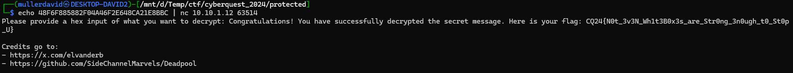

# Whitebox AES

The [challenge.py](workdir/challenge.py) has a whitebox AES implementation. It is doing the regular AES encryption but with precomputed lookup tables (for the given key), without directly exposing the actual key.

The tables are stored inside the `wb` variable.

Checking the backend side, it's a simple AES CBC.

# Papers

A lot of useful information can be found in these articles.

<https://summerschool-croatia.cs.ru.nl/2016/slides/JoppeBos.pdf>

<http://bo.blackowl.org/s/papers/waes.pdf>

<https://github.com/ph4r05/Whitebox-crypto-AES/>

<https://github.com/SideChannelMarvels/Deadpool/tree/master/wbs_aes_grehack2019>

# BlueGalaxyEnergy

The [BlueGalaxyEnergy](https://github.com/SideChannelMarvels/BlueGalaxyEnergy) is a tool to perform the so-called BGE attack. 

The given whitebox implementation need to be transformed to a slightly different format for the tool to access the states. The [whitebox.py](workdir/whitebox.py) and [challenge_mod.py](workdir/challenge_mod.py) is an implementation of this.

It also contains now the key encrypted with itself so the backend could exchange it for the flag.

```
encrypted key: 48F6F885882F04A46F2E648CA21E8BBC
key: 7365637265743a496c30566564306735
```

```bash
echo "48F6F885882F04A46F2E648CA21E8BBC" | nc 10.10.1.12 63514
```




# Flag
`CQ24{N0t_3v3N_Wh1t3B0x3s_are_Str0ng_3n0ugh_t0_St0p_U}`
