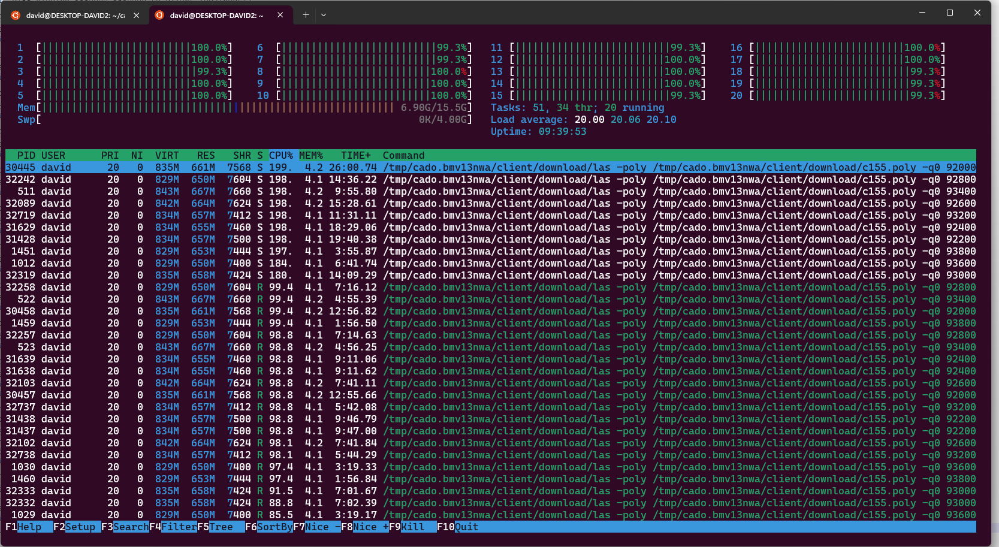

# RSA

The input looks like values for an RSA encrypted `c` cyphertext, with public key `n` and exponent `e`.

# RsaCtfTool

The [RsaCtfTool](https://github.com/RsaCtfTool/RsaCtfTool) can automatically try various attacks on given parameters.


```bash
python3 ./RsaCtfTool.py -n 35390004486354300347521848565413257959442624589297688131017877221807025004928966206454752329594506530598099849274956709610488234955109039874355077958460196991750855650029096905451 -e 65537 --uncipher 34976328528100445602888072790831380493399287679380757676967266152942525578548886648293955777757882335796410272725253490310142371251759362170135820927390507970457244397459500624458
```

Unfortunately it had no results.

<details>
  <summary>FactorDB</summary>
  
The [FactorDB]() had no results during the competition, I added the factors afterwards.
  
</details>

# Incorrect usage

Some options where the encryption can go wrong was considered, like to decrypt with `N`, in case the message was encrpyted with the wrong key accidently. No result with this approach either.

# Factorizing

It was a 512 bit key, which can be factorized in a reasonable timeframe on consumer hardware. It took 41 hours on a few years old 12th gen i7 using [cado-nfs](https://cado-nfs.gitlabpages.inria.fr/), see [cado-nfs.txt](workdir/cado-nfs.txt). It requires 32GB memory as well on the last step.




After the 2 factors, the message can be decrypted.

```python
from Crypto.Util.number import long_to_bytes

def egcd(a, b):
    x,y, u,v = 0,1, 1,0
    while a != 0:
        q, r = b//a, b%a
        m, n = x-u*q, y-v*q
        b,a, x,y, u,v = a,r, u,v, m,n
        gcd = b
    return gcd, x, y

p = 94388822268733810401932168190848212468780960919169564678589038795551536041749
q = 60568278736076176289012869854077571522794996656490440310777379446843782797079
e = 65537
n = 5716968496742623516416331228722528605661927120792310987666258525574498830284283198836430550352603645400219292989985250503580573632834390794855851339251171
c = 1197050362562425809194168610992474572655648346565650289347694280900334333591569620938463679357389188065755581341607617632838824749892067214155896127335676

phi = (p - 1) * (q - 1)

gcd, a, b = egcd(e, phi)
d = a

pt = pow(c, d, n)
print( "pt:", long_to_bytes(pt) )
```

Based on the actual factors, there seems to be no other option. Not an environment friendly challenge.

# Flag

`CQ24{I_don't_even_like_crypto_lol}`