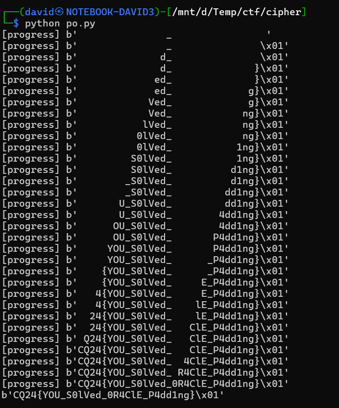

# Description

The goal is to somehow decypher the given cyphertext: `6b426e696672564b6b426e696672564b255e2f03d52a6ee76c91fd5b49844620189f51392e3e0a82224de98b50fc43c2`.

There are names in the challenge description. The initials are hints.

* Alexander Edward Smith - `AES` encryption
* Christopher Benjamin Clar - `CBC` mode
* Paul Oliver Vaughn - `PO` - Padding Oracle, `V` is unknown and took me some rabbit holes to realise that it is not important.


# Website

The port given is a webserver, with some specification how to submit in a cyphertext. It was quite vague what to send in, but after figuring out what `POV` was, sending a cyphertext resulted with `NO PADDING ERROR` while sending in a bogus one with `PADDING ERROR`.

```bash
curl -v -X POST http://10.10.1.12:22119/ --data "ciphertext=6b426e696672564b6b426e696672564b255e2f03d52a6ee76c91fd5b49844620189f51392e3e0a82224de98b50fc43c2"
curl -v -X POST http://10.10.1.12:22119/ --data "ciphertext=6b426e696672564b6b426e696672564b255e2f03d52a6ee76c91fd5b49844620189f51392e3e0a82224de98b50fc43c1"
```

# Padding Oracle

With the [padding oracle attack](https://en.wikipedia.org/wiki/Padding_oracle_attack), we can essentially ask the server to decrypt an encrypted message byte by byte, bruteforcing only 256 chars at each step.

Using the [padding-oracle](https://pypi.org/project/padding-oracle/) pip packege, it's easy to implement. The implemented script is in [po.py](workdir/po.py).



# Flag
`CQ24{YOU_S0lVed_0R4ClE_P4dd1ng}`