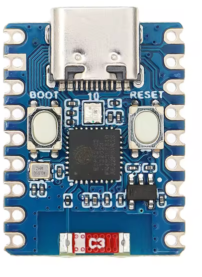

# It will Just Work

The company hired a new developer named Average Joe. While Joe is just your average programmer, he tries his best to keep things secure. Unfortunately, the device he is developing doesn’t have a screen or a keyboard.

Your mission? Find and exploit Average Joe’s oversight to send the right BLE packet and unlock the device.

Use gatttool, bluetoothctl, an ESP32-C3 board (on the table), a bluetooth dongle (if needed on the table) and the provided [1st_ble_ctf.pcapng](files/1st_ble_ctf.pcapng) file.

> You can redeem your flag by showing it to us, the device should light up and the characteristic with UUID beb5483e-36e1-4688-b7f5-ea07361b26a8 should change to "Score: 1/2".

[1st_ble_ctf.pcapng](files/1st_ble_ctf.pcapng)

# Writeup

[Writeup](WRITEUP.md)

# Self hosting

The dumped firmware from the challenge devices can be found in [flash_contents.zip](workdir/flash_contents.zip).

This can be installed on compatible boards. Such board is a Tenstar ESP32-C3 Zero, with 4 MB of flash. The led might not work, but the challenge itself does.

