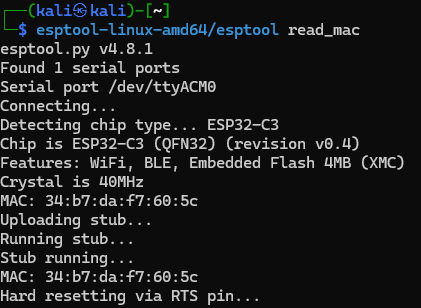
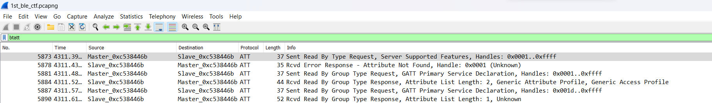
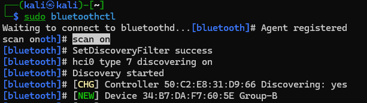
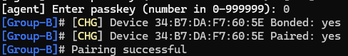
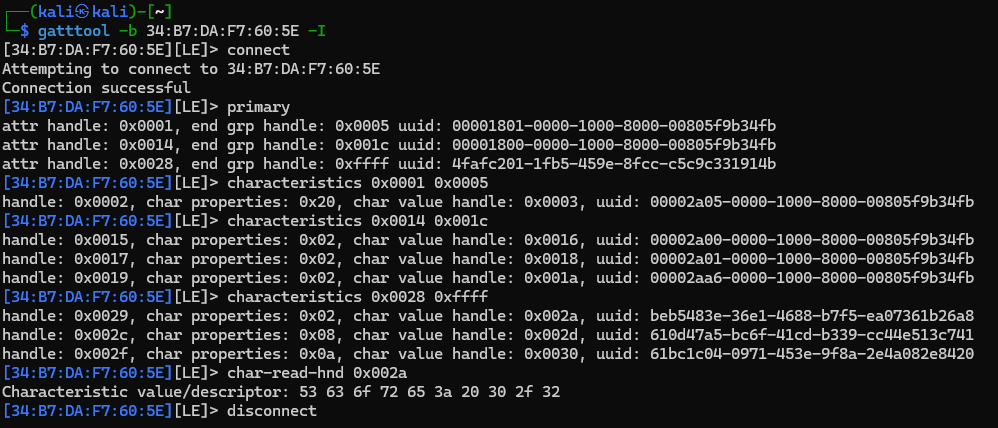

# Tools

The challenge is suggesting `gatttool`, `bluetoothctl` for crafting BLE packets. To use these, a linux machine is required.

# ESPtool

Using the [esptool](https://github.com/espressif/esptool) utility, we can grab a lot of information. The mac address (for the wifi, usually bt is very close to it), the [firmware](workdir/flash_contents.zip) itself, or the [partitions](workdir/flash_partitions.txt).

```bash
TODO: esptool
```

TODO: screenshot for mac address



# Pcap

The pcap has a lot of packets for basic BT operations. Opening in Wireshark and filtering for Attribute Protocol (`btatt`) and Security Manager (`btsmp`) shows the relevant communication.



# Scanning and Pairing

The title suggests pairing method just works (no codes/verification). We can indeed find and pair to the device in question.

```bash
bluetoothctl
pair 58:cf:79:e3:5d:82
```

TODO: screenshot after pairing



# Gatttool

Various commands can be sent with the `gatttool`. Copying a few requests results in similar/same replies from the device as in the pcap.

TODO: screenshot with some characteristcs and Score.




# Replay

Replaying the write commands unlocks the challenge.

```
TODO: relevant parts from pcap as text
```

```bash
gatttool -b 58:CF:79:E3:5D:82 -I
connect
primary
TODO: finish

```

This made the LED blinking on the board with a certain pattern as well as now replying with the score for reading the `beb5483e-36e1-4688-b7f5-ea07361b26a8` characteristic.

```bash
TODO: finish
```

TODO: screenshot



# Flag

There was no flag, the check was manual inspection.
