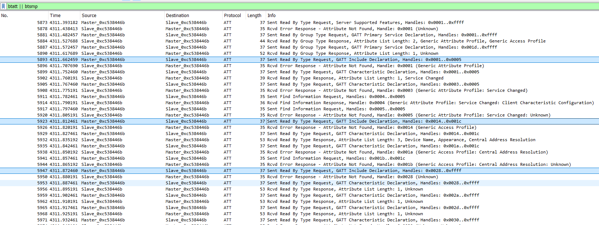

# Tools

The challenge is suggesting `gatttool`, `bluetoothctl` for crafting BLE packets. To use these, a linux machine is required.

# ESPtool

Using the [esptool](https://github.com/espressif/esptool) utility, we can grab a lot of information. The mac address (for the wifi, usually bt is very close to it), the [firmware](workdir/flash_contents.zip) itself, or the [partitions](workdir/flash_partitions.txt).

```bash
esptool read_mac
```


# Pcap

The pcap has a lot of packets for basic BT operations. Opening in Wireshark and filtering for Attribute Protocol (`btatt`) and Security Manager (`btsmp`) shows the relevant communication.



The filter `btatt.opcode == 0x12` can be used for the writes.

# Scanning and Pairing

The title suggests pairing method just works (no codes/verification). We can indeed find and pair (with any passcode) to the device in question.

```bash
sudo bluetoothctl
scan on
scan off
```


```bash
sudo bluetoothctl
pair 34:B7:DA:F7:60:5E
0
disconnect 34:B7:DA:F7:60:5E
remove 34:B7:DA:F7:60:5E
```


# Gatttool

Various commands can be sent with the `gatttool`. Copying a few requests results in similar/same replies from the device as in the pcap.

```bash
gatttool -b 34:B7:DA:F7:60:5E -I
connect
primary
characteristics 0x01 0x05
characteristics 0x14 0x1c
characteristics 0x28 0xffff
char-read-hnd 0x2a
disconnect
```


One thing to keep in mind is that the _values_ are in hex, and they should not be prefixed with `0x`. See ˛[gatt_attr_data_from_string](https://github.com/pauloborges/bluez/blob/bc704506e69ae30b0770aac32504e89cf2dc9ddf/attrib/utils.c#L117).

# Replay

Replaying the write command(s) unlocks the challenge.

Relevant parts:
```
No.	Time	Source	Destination	Protocol	Length	Info
6849	4330.157627	Master_0xc538446b	Slave_0xc538446b	ATT	34	Sent Write Request, Handle: 0x002d (Unknown: Unknown)
6852	4330.202858	Slave_0xc538446b	Master_0xc538446b	ATT	31	Rcvd Write Response, Handle: 0x002d (Unknown: Unknown)
```
- Write into handle 0x2d, value 0x31


```bash
gatttool -b 34:B7:DA:F7:60:5E --char-write-req --handle=0x2d --value=31
```

This made the LED blinking on the board with a certain pattern as well as now replying with the score for reading the `beb5483e-36e1-4688-b7f5-ea07361b26a8` characteristic.

```bash
gatttool -b 34:B7:DA:F7:60:5E --char-read --handle=0x2a | cut -d' ' -f 3- | xxd -r -p
```


# Flag

There was no flag, the check was manual inspection.
