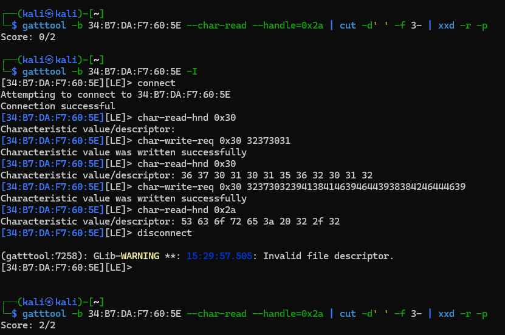

# Random

The title suggests some issue with the random generator, but as the hardware had no RTC clock or any proper source of entropy before connecting to it, it was ignored. Power cycling the device would reset it to the original state anyways.

# Replay

The challenge is practically identical to the first BLE challenge ([writeup](../Finals_Hardware_It_will_Just_Work/WRITEUP.md)), replaying the write command(s) unlocks the challnge.

```
No.	Time	Source	Destination	Protocol	Length	Info
3201	37.929795	Master_0xa4736926	Slave_0xa4736926	ATT	37	Sent Write Request, Handle: 0x0030 (Unknown: Unknown)
3204	37.975026	Slave_0xa4736926	Master_0xa4736926	ATT	31	Rcvd Write Response, Handle: 0x0030 (Unknown: Unknown)
3519	44.904888	Master_0xa4736926	Slave_0xa4736926	ATT	33	Sent Read Request, Handle: 0x0030 (Unknown: Unknown)
3522	44.950119	Slave_0xa4736926	Master_0xa4736926	ATT	43	Rcvd Read Response, Handle: 0x0030 (Unknown: Unknown)
5908	99.220493	Master_0xa4736926	Slave_0xa4736926	ATT	53	Sent Write Request, Handle: 0x0030 (Unknown: Unknown)
5911	99.265725	Slave_0xa4736926	Master_0xa4736926	ATT	31	Rcvd Write Response, Handle: 0x0030 (Unknown: Unknown)
```


- Write into handle 0x30, value `32 37 30 31`
- Read from handle 0x30 value `36 37 30 31 30 31 35 36 32 30 31 32`
- Write into handle 0x30 value `32 37 30 32 39 41 38 41 46 39 46 44 39 38 38 42 46 44 46 39`

Write the value into 0x30 until we receive the value above (every second time, first time after reset), then write the next value.

```bash
gatttool -b 34:B7:DA:F7:60:5E -I
connect
char-read-hnd 0x30
char-write-req 0x30 32373031
char-write-req 0x30 3237303239413841463946443938384246444639
char-read-hnd 0x2a
disconnect
```

This made the LED blinking on the board with a certain pattern (different from previous challenge) as well as now replying with the score for reading the `beb5483e-36e1-4688-b7f5-ea07361b26a8` characteristic.

```bash
gatttool -b 34:B7:DA:F7:60:5E --char-read --handle=0x2a | cut -d' ' -f 3- | xxd -r -p
```



# Flag

There was no flag, the check was manual inspection.

# Extra

Writing `32 37 30 31` into handle 0x30 gives the read value on every second write, giving `36 37 30 31 31 32 33 33 34 37 38 35` otherwise. Writing the unlock value at that state results no unlock.


TODO: Reverse the firmware for the key generation algorithm (and fixing LED).