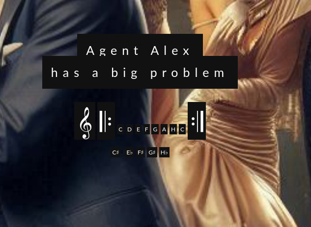

# Checking the site

There is a webserver with a strange message on the given address.

With some commented out parts. Uncommenting the `<span>`s don't really help.



There is also some message in the comments.


```
Music scales wiki: https://en.wikipedia.org/wiki/Scale_(music)

use this line play on virtual piano app
G A H E C A H E G F♯ D E F♯ G A H E G F♯ D E F♯ G F♯ D E H G A
virtual piano application here: https://virtualpiano.net/>

Toccata and Fugue in D minor, BWV 565 
https://en.wikipedia.org/wiki/Toccata_and_Fugue_in_D_minor,_BWV_565

A törzshangok szemléltetése zongorán a legegyszerűbb, hiszen ezek egybeesnek a fehér billentyűkkel
It is easiest to illustrate the basic notes on the piano, since they coincide with the white keys
C D E F G A H C

MINOR SCALE ON PIANO
C D Eb F G Ab Hb C 


G A B C D E F G♯ A H C D E F G♯ A H C D E F G♯ A H C D E F G♯
A B C D E F G# A H C D E F G# A H C# D# E F G# A H C D E F G# A
C D E F G# A H C D E F G# A H C D E F G# A H C D E F G# A H C
D E F G# A H C D E F G# A H C D E F G# A H C D E F G# A H C D
F G# A H C D E F G# A H C D E F# G# A H C D E F G# A H C D E F
G# A H C D E F G# A H C D E F G# A H C D E F G# A H C D E F G#
A H C# D E F# G# A H C# D E F G# A H C# D E F G# A H C# D E F G#

```

# Hidden images

There are various images found on the webserver, after visiting a subfolder corresponding to a note.

* `/A/`
* `/C/`
* `/D/`

All of them only has an image from the `virtualpiano.net` link from earlier.


# Discrepancies

There are some strange things in the message:

* The `#` is different in the first line: `♯`
* `B` is used instead of `H` at the beginning of 2 lines
* The lines consist of `ABCDEFG` repeated (with optional `#`), except a few line endings (2nd, 4th)

# Normalized message

```
            G 
A B C D E F G# 
A B C D E F G# 
A B C D E F G# 
A B C D E F G#
A B C D E F G# 
A B C D E F G# 
A B C#D#E F G# 
A B C D E F G# 
A   C D E F G# 
A B C D E F G# 
A B C D E F G# 
A B C D E F G# 
A B C D E F G# 
A B C D E F G# 
A B C D E F G# 
A B C D E F G# 
A B C D   F G# 
A B C D E F G# 
A B C D E F#G# 
A B C D E F G# 
A B C D E F G#
A B C D E F G#
A B C D E F G#
A B C D E F G#
A B C D E F G#
A B C#D E F#G# 
A B C#D E F G# 
A B C#D E F G# 
A B C#D E F G#
```

# Unsolved

It looks like there is barely any entropy to extract a valid message from this and I found no more clue.

