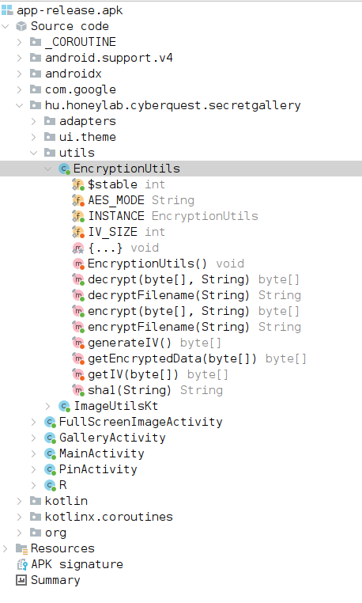
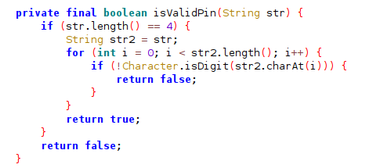
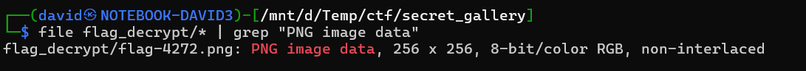

# Gallery

The gallery dump is just a simple zip file as the extension suggests.

After extracting, the filenames and files are encrypted. They are in [files](workdir/files/).

# APK

Opening/decompiling the APK (with [jadx](https://github.com/skylot/jadx) for example) reveals the app logic. It is not obfuscated.



The `hu.honeylab.cyberquest.secretgallery.utils.EncryptionUtils` ([EncryptionUtils.java](workdir/EncryptionUtils.java)) has the encryption/decryption logic.

There is also a PIN screen in `hu.honeylab.cyberquest.secretgallery.PinActivity` which is basically just a 4 digit PIN.



# Filenames

The filenames are encrypted with AES CBC with a fixed key `cyberquest` and iv `0123456789ABCDEF` with padding.

~~Writing~~ Copy-pasting the logic into [Main.java](workdir/Main.java) can decrypt the files. A python alternative is in [decrypt_filenames.py](workdir/decrypt_filenames.py).

There are a bunch of images, but the following one is the important.

```
UVDouhjrRQ0LWNXDPUDWSQ== b'flag.png'
```

[flag.png](workdir/flag.png).

# flag.png

The file encryption is using a PIN as well for the encryption. AES CTR with the `sha1(PIN)` as key and random iv. 

The PIN was 4 digits, so it can be bruteforced quite easily. Military grade encryption.

The decryption is implemented in [decrypt_files.py](workdir/decrypt_files.py).

It is generating a decrypted file for every possible pin. File can be used to get the correct one.

```bash
file flag_decrypt/* | grep "PNG image data"
```

The PIN `4272` is the only one with a valid PNG.




# Flag
`CQ24{Based_On_A_True_Story}`