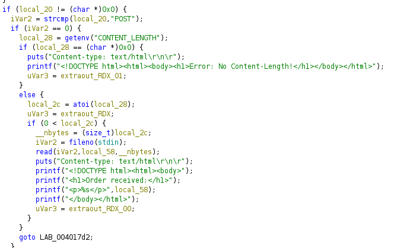
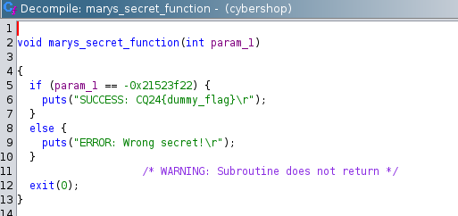
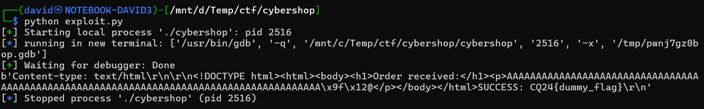
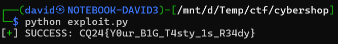

# CGI

The backend is a small go cgi server running the [cybershop](workdir/src/cybershop) executable.

It is basically setting the important environment variables and passing the stdio between the http stream and the binary. 

It is also doing some size filtering (max 36+32 chars) and compression handling (from Content-Encoding header) in [decodeHandler](workdir/src/main.go) as a middleware.

The filter can be bypassed using deflate or gzip, it is only present on the default case.

# Binary

The binary is processing the input through the CGI spec. Checking the `REQUEST_METHOD` and `CONTENT_LENGTH` environment variables.

Displaying a simple form and processing the POST on submit.

On form submit, it is using the header for the length and `read` to read the name itself.

There is a function `marys_secret_function` that prints the flag.

# Buffer Overflow

There is a buffer overflow in the name parameter, as the target buffer is fixed size, and the size check was done on the webserver size.

Developing the [exploit](workdir/exploit.py) locally can be done by emulating the CGI interface. Setting the `REQUEST_METHOD` and `CONTENT_LENGTH` env variables.

Running the exploit remotely is just sending the payload to the http endpoint correctly. The flag is in the http response.

# Flag
`CQ24{Y0ur_B1G_T4sty_1s_R34dy}`