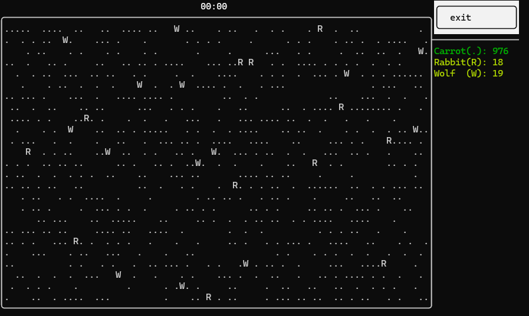
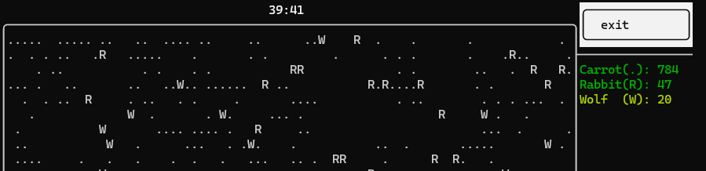
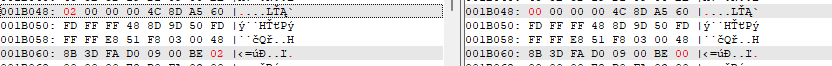
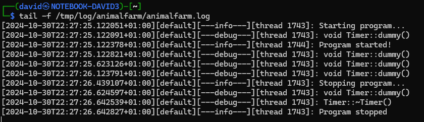
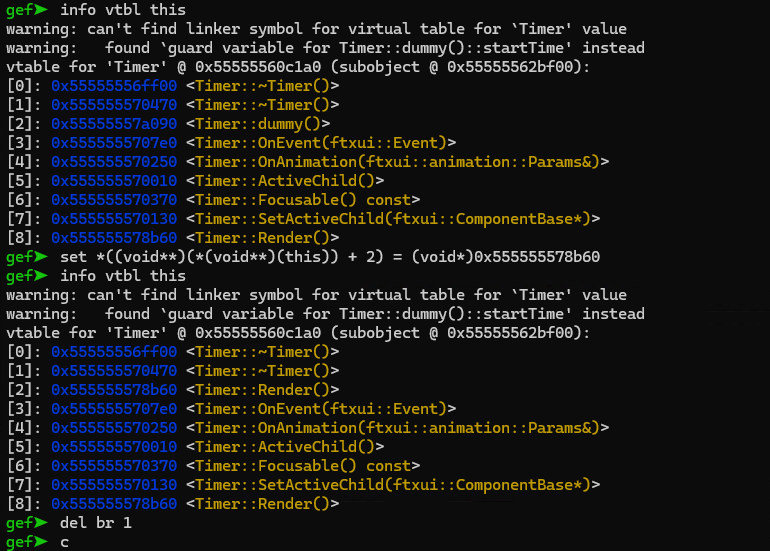

# Simulator

Running the simulator has a Carrots, Rabbits, Wolves.



Something is broken with the timer, glitching out on certain key/mouse presses, or just on it's own. Also has issues when the timer would reach a minute.



# Logging

Opening the binary in a disassembler, there are is a logging facility.

<https://github.com/gabime/spdlog>

```c
af::logging::initialize_logger();
plVar1 = spdlog::default_logger_raw();
af::logging::initialize_logger();
spdlog::logger::log<char_[20]>(plVar1,info,(char (*) [20])"Starting program...");
```

Checking the logging with `strace` identifies the log file.

```bash
strace -e trace=open,openat -o strace.txt ./animalfarm
cat strace.txt
```

```
...
openat(AT_FDCWD, "/tmp/log/animalfarm/animalfarm.log", O_WRONLY|O_CREAT|O_APPEND, 0666) = 3
...
```

Checking the `af::logging::initialize_logger` has a setlevel info. Patching from info to trace (also for flush).

```
#define SPDLOG_LEVEL_TRACE 0
#define SPDLOG_LEVEL_DEBUG 1
#define SPDLOG_LEVEL_INFO 2
```



Running the patched program has a more verbose log, with a reference to the timer.



# Timer::dummy

The time is rendered with `Timer::dummy`. There is a check if a random number is divisible by 9 and a different timer logic. There is also an incorrect calculation for minutes. Code is using hours instead.

There is a `Timer::render` that should be used instead. Fixing the dummy function is a rabbit hole.

It is easy to patch out the vtables during runtime with gdb.

```bash
gdb ./animalfarm
br Timer::dummy
r
info vtbl this
set *((void**)(*(void**)(this)) + 2) = (void*)0x555555578b60 # Timer::Render()
info vtbl this
del br 1
c
```



# Flag
`cq24{c0ngr4ts_y0ure_4_vt4ble_pr0} `
