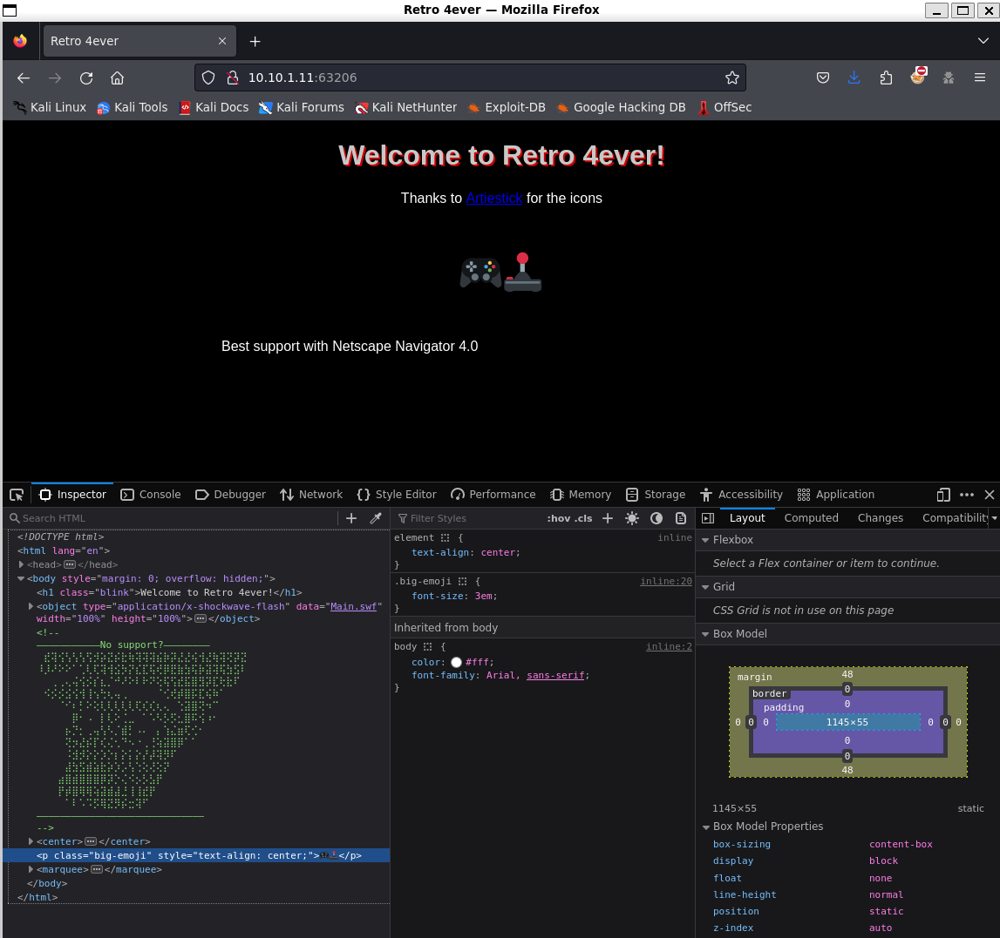
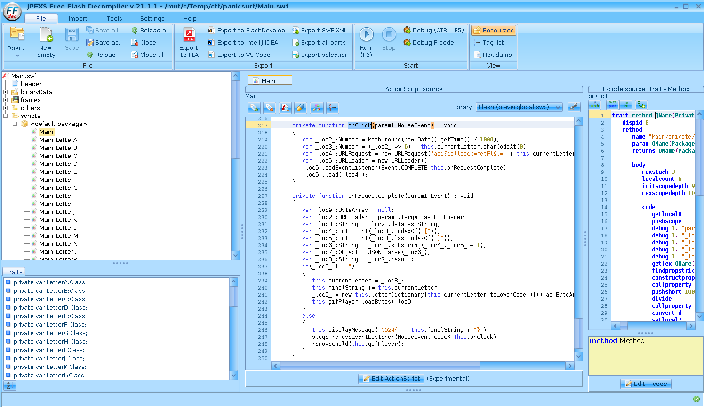
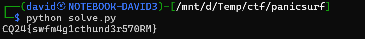

# Visiting the site

There is a retro site with some flash content.



# SWF

There is a [Main.swf](workdir/Main.swf) flash file. As flash content is deprecated, there are 2 choices.

## Dynamic analysis

There is an ascii art suggesting making support work.

The [Ruffle emulator](https://ruffle.rs/) can be used to get something out.

Unfortunately it has some compatibility checks preventing running it properly.

```
Error: Error #2067: The ExternalInterface is not available in this container. ExternalInterface requires Internet Explorer ActiveX, Firefox, Mozilla 1.7.5 and greater, or other browsers that support NPRuntime.
```

## Static analysis

The [ffdec](https://github.com/jindrapetrik/jpexs-decompiler) flash decompiler can be used to check (and modify) the code.



# Logic

On clicking, there is an api endpoint that reveals the next character in the flag one by one. It has a timestamp and a simple checksum parameter to protect it.

Reimplementing the logic in python ([solve.py](workdir/solve.py)) reveals the flag.



# Flag
`CQ24{swfm4g1cthund3r570RM}`

# Patching

As an alternative, patching the support checks ([Main_patched.swf](workdir/Main_patched.swf)) out reveals the first letter of the flag, and the subsequent ones can be also catched in the traffic.

