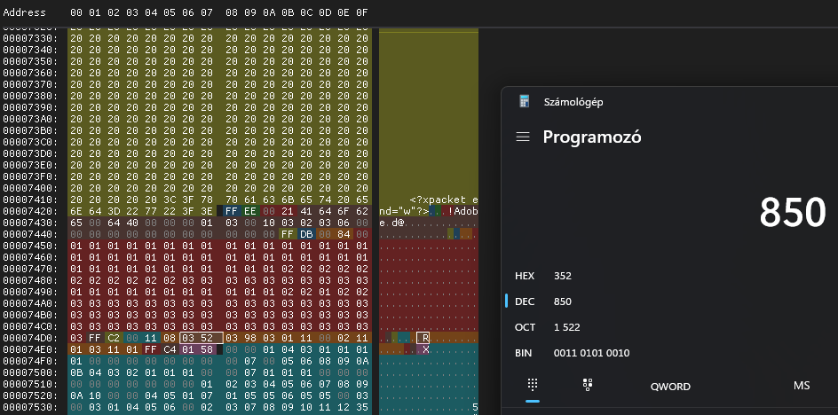

# Zip

There are a lot of files in the zip, mainly images and some text files in `.config` hidden directory.

# Reminder

There is a [reminder.jpg](workdir/reminder.jpg) inside the hidden directory and it has a mismatching thumbnail embedded and actual image. Other image tools also report the image as corrupt.

```bash
exiftool -b -ThumbnailImage BiCycle_EN/.config/reminder.jpg > reminder_thumb.jpg
```

 


Missing the text part on the actual image. The resolution is too small to make anything out of it. It seems that the height of the image was edited/corrupted. Using the thumbnail aspect ratio, the original image should be `920/139*160 = 1059 = 0x0423` tall instead of the `850 = 0x0352` that is currently.

Using ImHex (or any hexeditor), the image can be fixed at the correct part, inside the SOF [marker](https://web.archive.org/web/20220314032823/http://lad.dsc.ufcg.edu.br/multimidia/jpegmarker.pdf ).




After fixing the image, the message is visible.


# Passphrase

The image contains a reference for `V0OnB`. Looking for the string reveals [BiCycle_EN/.config/secret/74/ToSj7z1fkLrM4YBg6K1YAGUHK.txt](workdir/ToSj7z1fkLrM4YBg6K1YAGUHK.txt).

```bash
grep -r 'V0OnB' BiCycle_EN
```

With the content `U3VwM3JfczNjUmV0OnBhcyR3MHJkMQ==` which is a base64 encoded string, `Sup3r_s3cRet:pas$w0rd1`.

# DS Store

Checking the [tree](workdir/tree.txt) of the files, there are also some `.DS_Store` made by MacOS that was unintentionally marking the file with the passphrase. This was the only directory that had this, and all the other secret files had the same content as filename, so finding the file this way would be also viable.

# Stegseek

There are a bunch of images in the folders. Composing a [wordlist.txt](workdir/wordlist.txt) and running `zsteg` on the png files and `stegseek` on the jpg files with various combination of the passphrase. 

```bash
find BiCycle_EN -name '*.png' -exec zsteg {} \;
find . -name '*.jpg' -exec stegseek --crack {} wordlist.txt \;
```

This had no result. After closer look of the zsteg output, there was a png file which was actually not a png. Running stegseek on the png files as well will mostly result in errors, but on the renamed fiile it was able to extract the flag.

```bash
find BiCycle_EN/badfiles -name '*.png' -exec stegseek --crack {} wordlist.txt \;
```

```
[i] Found passphrase: "Sup3r_s3cRet:pas$w0rd1"
[i] Original filename: "flag_EN.txt".
[i] Extracting to "cG5nLXRyYW5zcGFyZW50LWludGVybmV0LW1lbWUtY2FybmV2YWwtZW4tY3V0ZS1kb2cuanBn.png.out".
the file "cG5nLXRyYW5zcGFyZW50LWludGVybmV0LW1lbWUtY2FybmV2YWwtZW4tY3V0ZS1kb2cuanBn.png.out" does already exist. overwrite ? (y/n)
```

Checking the extracted [file](workdir/cG5nLXRyYW5zcGFyZW50LWludGVybmV0LW1lbWUtY2FybmV2YWwtZW4tY3V0ZS1kb2cuanBn.png.out) has the flag.

```bash
cat *.png.out
```

# Flag
`CQ24{Rep3aΓ_ΠntiL_tHe_coИdit!0n_1s_tЯuЭ!}`
