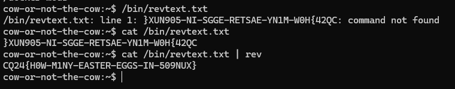

# SSH

Scanning the port reveals an SSH server running on the port.

# Cowsay

Animals and them making sound probably refers to [cowsay](https://en.wikipedia.org/wiki/Cowsay). What does the cow say? The credentials for the SSH is `moo:moo`.

```bash
ssh moo@10.10.9.12 -p 21999
```

# Flag location

Running all kind of commands to look for suspicious setuid binaries, cron jobs, even running the linpeas script results nothing.

Going through all the executable files.

```bash
find / -type f -executable
```

There is a `revtext.txt` standing out in `/bin` that is not an actual executable, but it contains the flag in reverse instead.


# Flag

`CQ24{H0W-M1NY-EASTER-EGGS-IN-509NUX}`