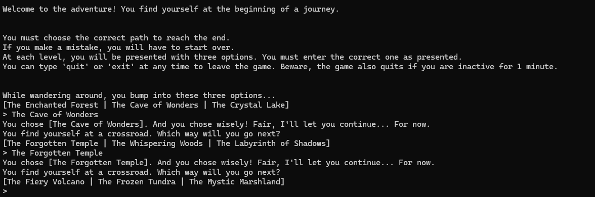
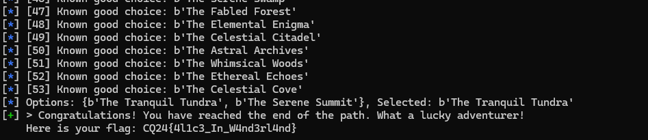

# Service enumeration

Checking the port with netcat, it has an adventure game.

A specific path needs to be followed. At every step there are 3 options where to go and only 1 is correct.

# Automation

Fortunatelly the path and options are always the same. It can be automated to automatically track the correct steps and redo them on failure.

Implemented in [wander.py](workdir/wander.py).

# Flag

CQ24{4l1c3_In_W4nd3rl4nd}