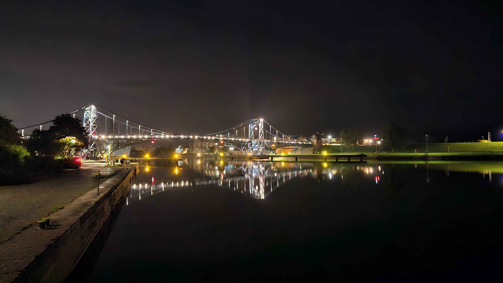
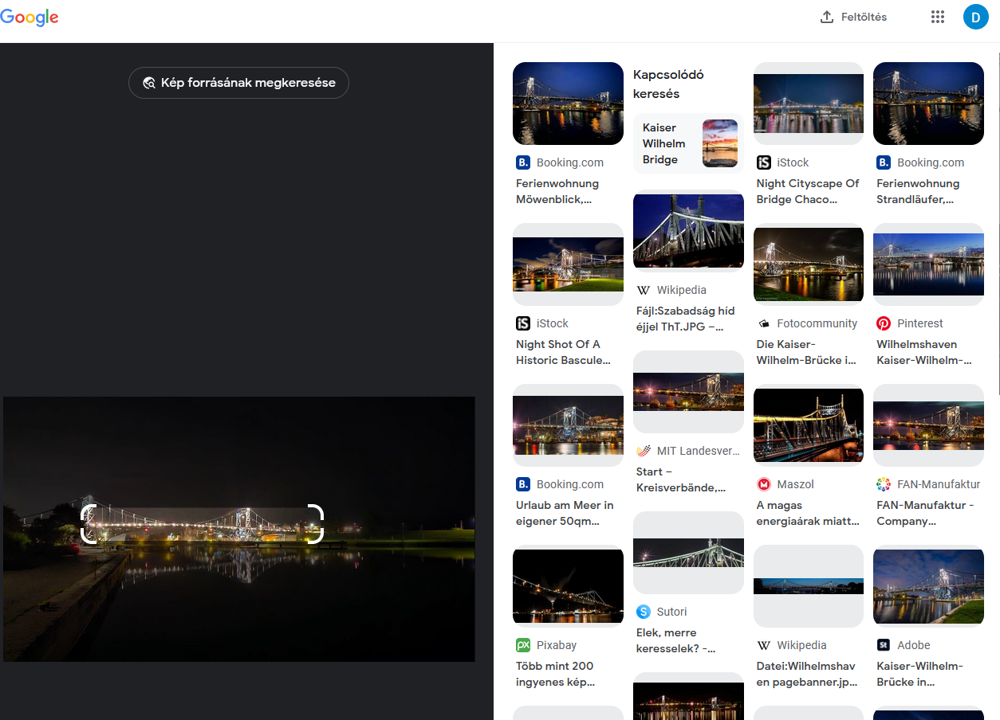
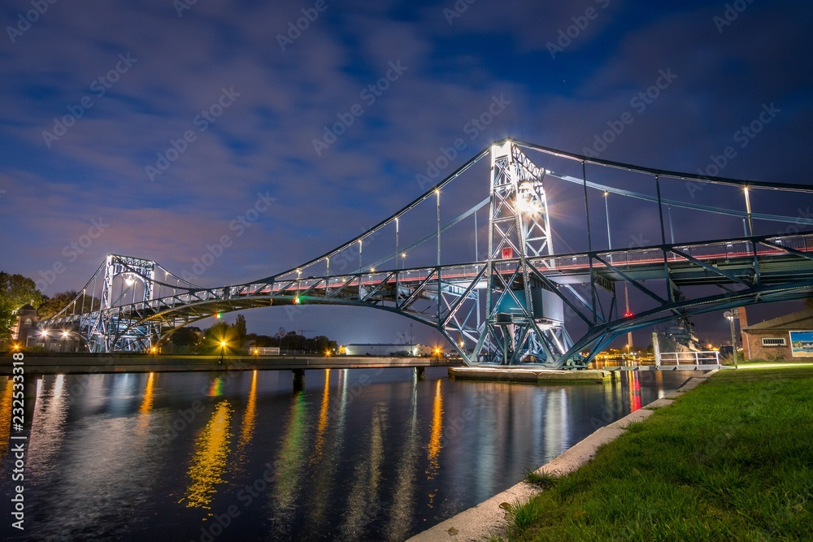

# The place

# Reverse image search

Using <images.google.com> to look for similar or same images immediatly finds the location.

With the same bridge on a stock photo.

And the description with the city name (in german), `Kaiser-Wilhelm-Brücke in Wilhelmshaven bei Nacht`.

# Flag

`CQ24{Wilhelmshaven}`