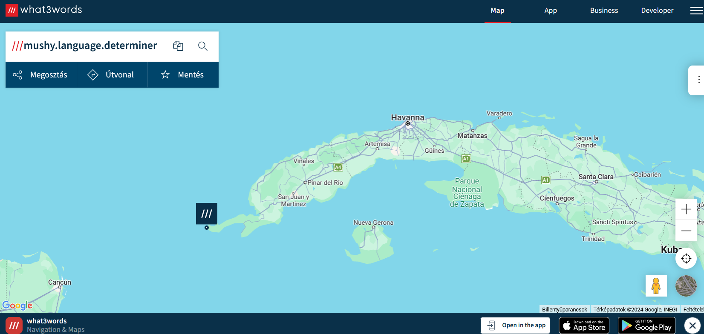

# The file

The wav file is about some numbers.

The speech can be trascribed with the [openai-whisper](https://pypi.org/project/openai-whisper/) module.

```bash
whisper notes.wav --model medium
```

```
Ascension 13, 21, 19, 8, 25, 12, 1, 14, 7, 21, 1, 7, 5, 4, 5, 20, 5, 18, 13, 9, 14, 5, 18.
```

# Decoding

The range of the numbers suggests the english alphabet. Decoding them in python for example.

```python
"".join([chr(0x40+i) for i in [13, 21, 19, 8, 25, 12, 1, 14, 7, 21, 1, 7, 5, 4, 5, 20, 5, 18, 13, 9, 14, 5, 18]])

```

Gives the text: `mushylanguagedeterminer`.

# Rabbit hole(s)

The Call of Duty references and similar numbers lead to a rabbit hole.

So is looking for the text as username on [whatsmyname](https://whatsmyname.app/).


# What3words

There is a website that can mark places on earth by 3 words: [mushi.language.determiner](https://what3words.com/mushy.language.determiner).

This marks a place in Cuba.





# Flag

CQ24{Cuba}