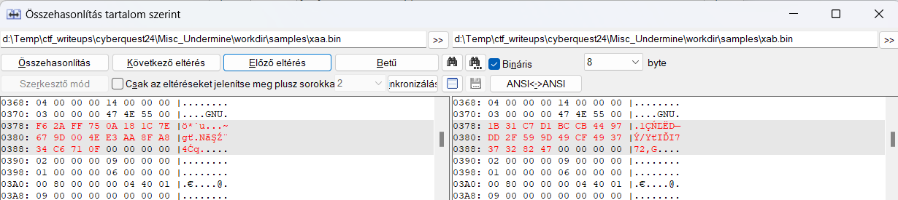
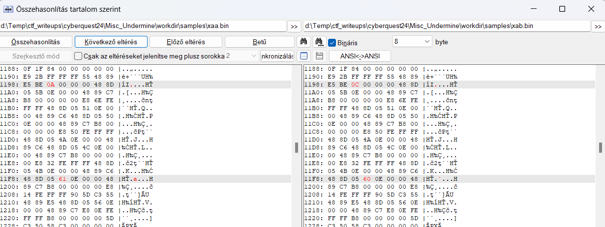
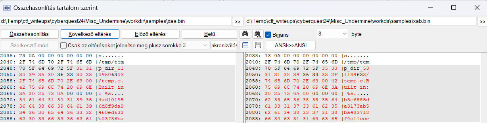
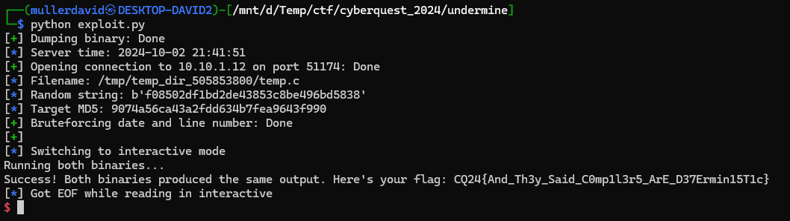

# Source code

The complete source is provided as a dockerfile. The backend is written in go and compiling a `C` file with some random things producing a binary. Random things like random number of new lines, random string, random temp file, date and time, etc.

It is printing the temporary name of the file and arbitrary byte range (maximum size is 40 bytes) from the compiled binary requested by the user.

Comparing the original binary with an other given by the user, comparing them by md5 and giving out the flag if they match and running them gives the same output.

# Samples

After generating a bunch of [samples](workdir/samples/) locally, they mainly differ at 3 parts.



```
[ 3] .note.gnu.build-id NOTE            0000000000000368 000368 000024 00   A  0   0  4
0x378,+20 
	build-id (sha1)
```



```
[11] .text             PROGBITS        0000000000001050 001050 0001d9 00  AX  0   0 16
0x119a,+1
	line number, 1-10 random
0x11fb,+1
	filename length difference
```


```
[13] .rodata           PROGBITS        0000000000002000 002000 000091 00   A  0   0  8
0x200a,+8
	time (hh:mm:ss)
0x200a,+8
	date (day without leading zeroes, short month name, year)
0x2040,+48
	random dir (+builtin string)
0x2070,+32
	random 16 bytes hex string
```

# Randoms

The differences above can be fixed. 

* The build-id. Calculated after the other parts are fixed, see [Build-id](#build-id).
* The line number is changing based on the random number of new lines. 1-10, so it is bruteforcable.
* The temporary filename is leaked on the communication automatically.
* Time and date has precision of seconds. It can be predicted, and a few seconds difference bruteforced.
* Crypto random 16 bytes string as hex. Too big to bruteforce.

The binary can be checked before sending to server based on the md5 provided, generating until it matches.

Only the random string is nor bruteforcable nor predictable, but we can leak that many bytes.

# Build-id

The default build-id is the same for same sourcecode. 
It is a 160-bit SHA1 string computed over the elf header bits and section contents in the file. It is bundled in the elf file as an entry in the notes section.

The corresponding parts in the `binutils` source code.
* <https://github.com/bminor/binutils-gdb/tree/master/ld>
* <https://github.com/bminor/binutils-gdb/blob/2754d75a11556577fcddf23718bfbff7d0489a3f/ld/ldelf.c#L1480>
* <https://github.com/bminor/binutils-gdb/blob/2754d75a11556577fcddf23718bfbff7d0489a3f/ld/ldbuildid.c#L119>
* <https://github.com/bminor/binutils-gdb/blob/2754d75a11556577fcddf23718bfbff7d0489a3f/bfd/elfcode.h#L1165>

A calculation for an existing binary can be found in [build_id.py](workdir/build_id.py).

# Exploit

The basic idea follows:

1. Get current full binary in 40 or smaller sized chunks. The chunks are from different binaries, but the differences are quite small, and it can match if the temp directory offsets are the same. (repeat on error, or load local variant)
1. Get offsets for differences.
1. Time sync. Get data at time offset and use that instead of local.
1. Start exploit session, leak the temp file and random string.
1. Generate new variants, 1-10 new lines and +- few seconds. Regenerate build-id.
1. MD5 them, select and send correct.

Implemented in [exploit.py](workdir/exploit.py).

This approach requires no compilation, but more complex.




# Alternative solution

Just generate the source fixing the randomized parts and compile in the same environment (via docker for example). Compare the binary and repeat.

# Flag

`CQ24{And_Th3y_Said_C0mp1l3r5_ArE_D37Ermin15T1c}`

# DOS

There is an incorrect check for the position and length for the random leak.

Fail if:
 * position+numBytes > len(binaryContent)
 * position < 0
 * numBytes < 0
 * maxReadSize < numBytes

Giving something like position `9223372036854775807` and numBytes `40` satisfies all the above by overflowing on the addition and makes the main binary panic.