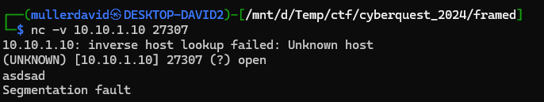
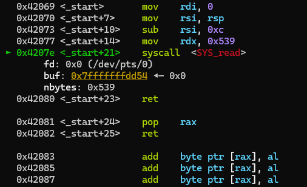
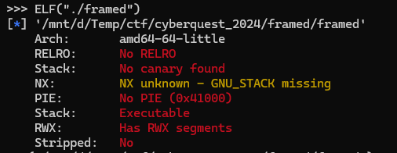
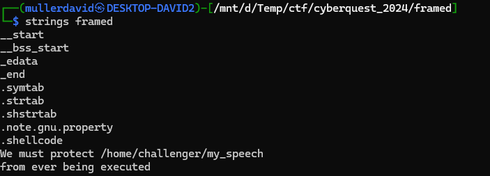
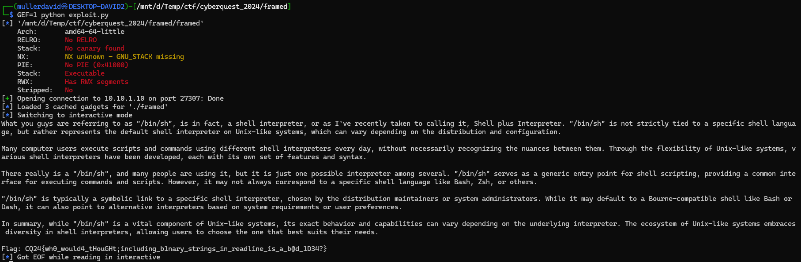

# Scanning

Scanning the host reveals multiple ports. The service on port 27307 reveals a service that behaves like the description.




# Vulnerability

The binary is quite minimal, disassembled in [framed.disas.txt](workdir/framed.disas.txt). Analysing with gdb running, it is just using the syscall read, reading `0x539` to the stack, overflowing.



There is no protection on the binary.



While the stack is executable, ASLR is randomising it's address.

# ROP

As the binary is minimal, there are not too many rop gadgets inside.

```bash
ropper --file ./framed --nocolor > rop.txt
```

There is a gadget for `pop rax` and `syscall` though.

```
0x0000000000042081: pop rax; ret; 
0x000000000004207e: syscall; ret; 
```

This control allows [Sigreturn oriented](https://en.wikipedia.org/wiki/Sigreturn-oriented_programming) method, as `rax` is controlled and the `sigreturn` syscall (`15` in `rax` without anything else controlled) can be triggered.

# Exploit basic

The binary has a suspicious string included, hinting we should execute `/home/challenger/my_speech`.



Calling this executable with `execve` syscall after sigreturn.

The implementation is inside [exploit.py](workdir/exploit.py).



# Flag

`CQ24{wh0_would4_tHouGHt;including_b1nary_strings_in_readline_is_a_b@d_1D34?}`

# Exploit RCE

The binary has RWE sections. Mapping some new stack after a sigreturn solves the unknown stack address problem. At `0x42800` for example there is a big part that is not used at all, with all zeroes. This part is also `RWE`, we can put a stage2 shellcode there.

```
(gdb) info proc mappings
process 3969
Mapped address spaces:

          Start Addr           End Addr       Size     Offset  Perms  objfile
             0x41000            0x42000     0x1000        0x0  r--p   ./framed
             0x42000            0x43000     0x1000     0x1000  rwxp   ./framed
            0x400000           0x401000     0x1000     0x1000  r--p   ./framed
      0x7ffff7ff9000     0x7ffff7ffd000     0x4000        0x0  r--p   [vvar]
      0x7ffff7ffd000     0x7ffff7fff000     0x2000        0x0  r-xp   [vdso]
      0x7ffffffde000     0x7ffffffff000    0x21000        0x0  rwxp   [stack]
```

The implementation is inside [exploit_mod.py](workdir/exploit_mod.py).