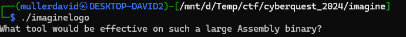
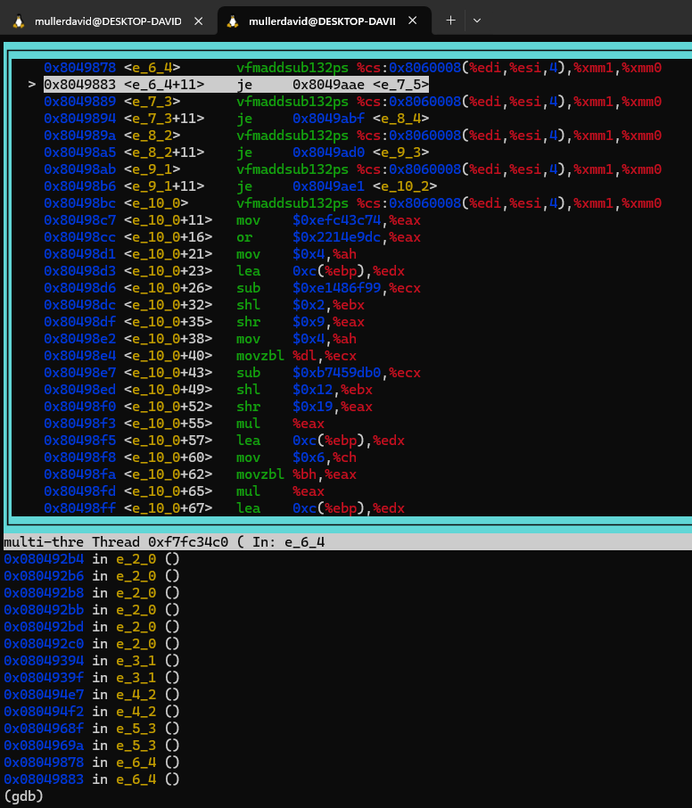
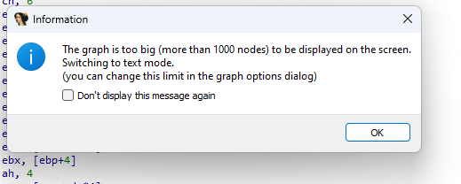
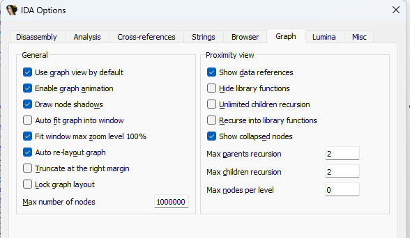
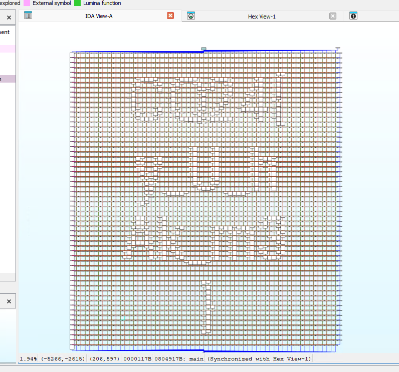

# Binary

Running the binary prints a message.

# REpsych

Opening the binary in a disassembler or debugger results nothing useful.

It is full of `vfmaddsub132ps` instructions. 

Googling `vfmaddsub132ps reverse engineering` reveals the whitepaper [REpsych](https://media.defcon.org/DEF%20CON%2023/DEF%20CON%2023%20presentations/DEF%20CON%2023%20-%20Chris-Domas-REpsych.pdf) from Defcon 2023. 

It is basically just mocking the reverser, making an image in IDA graph view with these instructions.

There is also a reference to this in the binary.

# IDA

Using IDA (free), there is a popup on load that the graph is too big. 

Increasing the `Max number of nodes` in the options.

Reveals the flag.

# Flag

`CQ24{y_U_hAk_m3}`