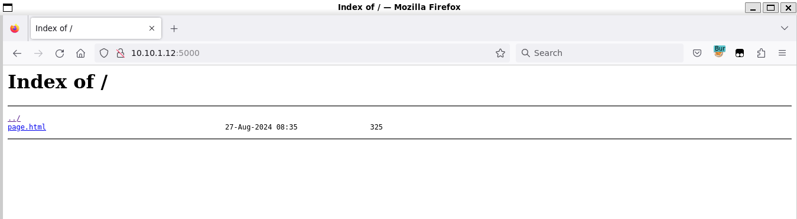

# Scan

After scanning the host, there is a webserver listening on port `5000`. 

There is barely anything on the website. 

There is a directory listing at the [index.html](workdir/index.html).




Has a flag like string and a comment on [page.html](workdir/page.html).

```
<!-- "Tudja, fiam, a dolgok többnyire nem azok, amiknek látszanak. De néha igen." -->
<h2>CQ24_{SAME-OR-NOT-SAME}_</h2>
```

The comment means nothing useful. The flag like string is not pointing anywhere.

# SSH

There is no mention of port or only a single port is used by the challenge like the other challenges. There is also an ssh listening on port `5022`. There is no reference to the SSH nor credentials on the website, but based on the port it might be related.

This challenge should not be in the web category.

The service discovery and information gatherer scripts result nothing immediate.

```
PORT     STATE SERVICE VERSION
5022/tcp open  ssh     OpenSSH 9.7 (protocol 2.0)
| ssh-hostkey:
|   256 49:de:a0:ec:d6:0e:49:58:4b:13:94:5b:f7:d0:32:91 (ECDSA)
|_  256 c2:15:e4:42:48:c6:ae:2e:7e:e4:8a:05:c9:99:c1:dd (ED25519)
| ssh-auth-methods:
|   Supported authentication methods:
|     publickey
|     password
|_    keyboard-interactive
| ssh2-enum-algos:
|   kex_algorithms: (12)
|       sntrup761x25519-sha512@openssh.com
|       curve25519-sha256
|       curve25519-sha256@libssh.org
|       ecdh-sha2-nistp256
|       ecdh-sha2-nistp384
|       ecdh-sha2-nistp521
|       diffie-hellman-group-exchange-sha256
|       diffie-hellman-group16-sha512
|       diffie-hellman-group18-sha512
|       diffie-hellman-group14-sha256
|       ext-info-s
|       kex-strict-s-v00@openssh.com
|   server_host_key_algorithms: (4)
|       rsa-sha2-512
|       rsa-sha2-256
|       ecdsa-sha2-nistp256
|       ssh-ed25519
|   encryption_algorithms: (6)
|       chacha20-poly1305@openssh.com
|       aes128-ctr
|       aes192-ctr
|       aes256-ctr
|       aes128-gcm@openssh.com
|       aes256-gcm@openssh.com
|   mac_algorithms: (10)
|       umac-64-etm@openssh.com
|       umac-128-etm@openssh.com
|       hmac-sha2-256-etm@openssh.com
|       hmac-sha2-512-etm@openssh.com
|       hmac-sha1-etm@openssh.com
|       umac-64@openssh.com
|       umac-128@openssh.com
|       hmac-sha2-256
|       hmac-sha2-512
|       hmac-sha1
|   compression_algorithms: (2)
|       none
|_      zlib@openssh.com
| ssh-publickey-acceptance:
|_  Accepted Public Keys: No public keys accepted
```

There is no `.ssh/id_rsa` or similar on the webserver to use. There is no apparent vulnerability in the SSH server either.

While the challenge says no bruteforcing, the solution is to attack with a dictionary.

The credentials are `web:web123`.

The flag should be in the `htdocs` folder.

# Flag

TODO