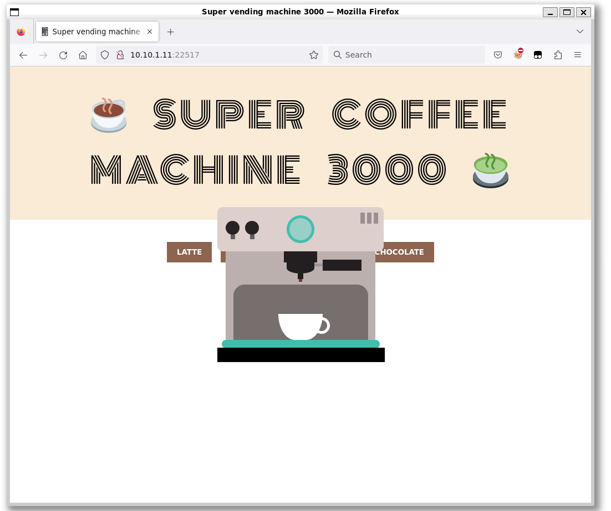
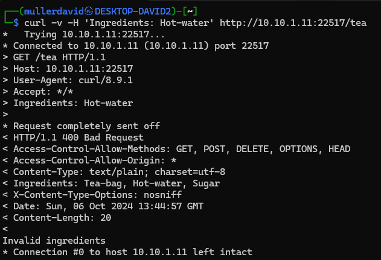
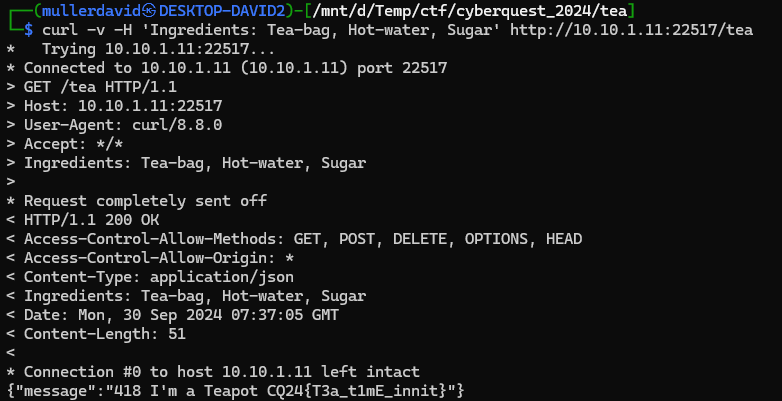

# Checking the site

The website is a coffee machine controller or sort of.



The challenge description suggests making a `tea` somehow.

# Client source

In the client side javascript [main.js](workdir/main.js), we can see the endpoints and the parameters.

```js
fetch("/americano", {
	method: "GET",
	headers: {
		Ingredients: "Espresso, Hot-water"
	}
})

fetch("/tea", {
	method: "GET"
})
```

The `tea` is missing the ingredients, unlike the other beverages.

# Headers

Attempting to send just `Hot-water` as ingredient doesn't solve the problem. 

```bash
curl -v -H 'Ingredients: Hot-water' http://10.10.1.11:22517/tea
```

Fortunatelly it leaks the ingredients on bad requests in the `Ingredients` headers.  



Adding the missing ingredients solves the problem.

```bash
curl -v -H 'Ingredients: Tea-bag, Hot-water, Sugar' http://10.10.1.11:22517/tea
```




# Flag

CQ24{T3a_t1mE_innit}