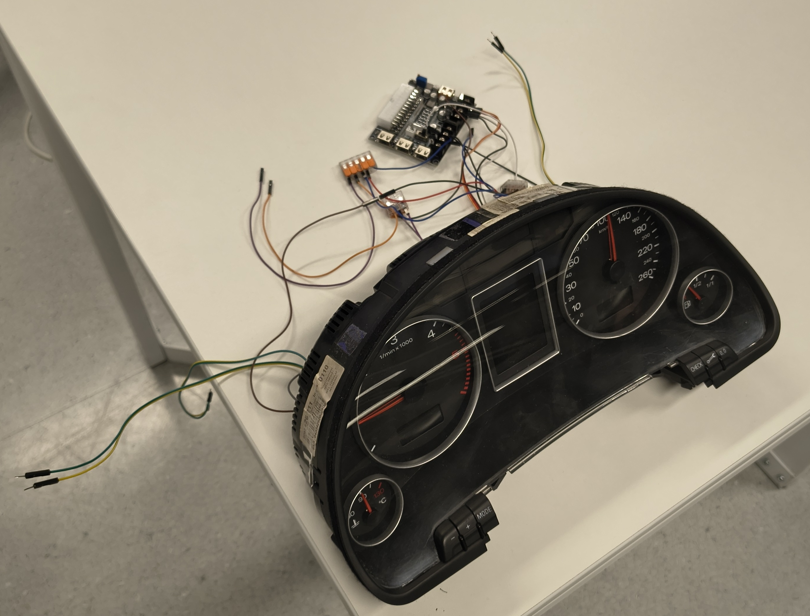
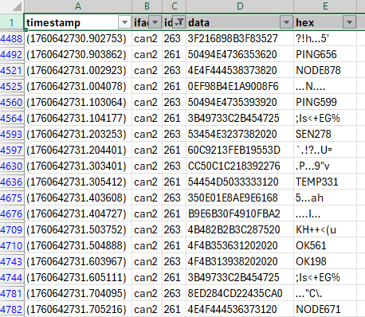
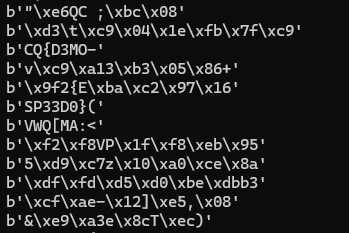

# Device

The device was a real automotive dashboard controlled via raspberry.

There were 8 clicks of turn lane indicator every 5-10 minutes.

<video src="workdir/device.mp4" controls ></video>

[Watch device.mp4](workdir/device.mp4)

*Thanks `baltazar` for the image/video.*

# CAN

There were 3 can interfaces continuously dumping on the 3 listed ports. The dumps can be found in [can0.dmp](workdir/dump.zip), [can1.dmp](workdir/dump.zip), [can2.dmp](workdir/dump.zip).

The flag is not in cleartext in the dumps.

# Display

The text on the display corresponds to the messages on id 0x261 and 0x263. Some texts are readable, some are not.

Fiddling with [process.py](workdir/process.py), if you add 8 to the display bytes, it reveals the flag.

# Flag
`CQ{D3MO-SP33D0}`
